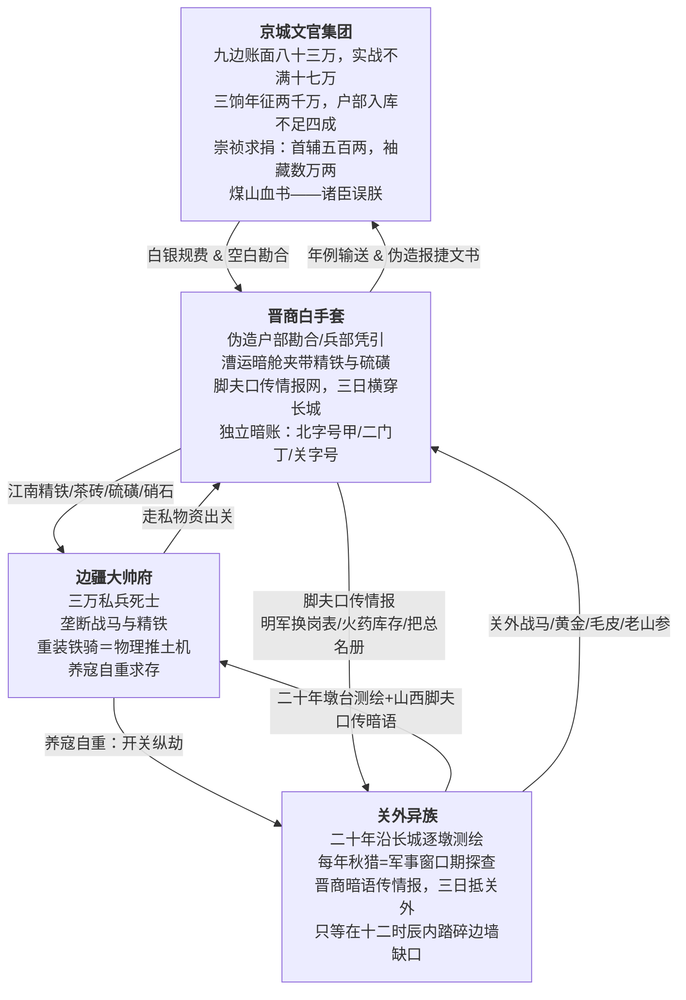

# 世界观与核心规则

## 核心铁律：去高武、硬核唯物、政治惊悚、悲剧宿命

这是一个**没有内力、没有仙人、没有奇迹**的世界。一切力量是物理的——重甲骑兵的冲击力来自披甲重量与战马速度的乘积，火器的射程来自硝石硫磺木炭的配比与炮管的精铁纯度，暴雪中的死亡来自零下三十度的失温与齐腰积雪的窒息。

一切悲剧是制度的，不是个人的道德缺陷。李承荫、顾韫、沈休言、李观照、李国勇、田逢吉——每个人都亲手做过在当时个人掌握的全部信息范围内唯一合理推演得出的自私选择。这些选择的乘积构成了一台不会停下来问任何人同不同意就自行碾压下去的绞肉机。

不写白衣飘飘的侠客仗剑江湖，不写"正义终将战胜邪恶"的道德寓言。只写铁甲马蹄碾过冻硬的黑土时发出的闷响，写墩台上烧光了最后一篓木炭后冻死在垛口边的无名守军，写晋商田逢吉那张补丁布袍下唯一没有打过补丁的东西是他锁在张家口秘密夹墙里的独立暗账。

---

## 三方底层冲突

### 一、京城文官集团："诸臣误朕"的制度性腐烂

京城文官集团不是一群脸谱化的"奸臣"。他们是一群在明朝晚期那套已经完全腐朽的官僚-士绅-商帮利益共同体里浸泡了几代人的精致利己主义者。他们的贪婪不是戏剧化的——是嵌入在每一道合法的行政手续里：户部签发的空白勘合在法理上没有任何问题，吏部对地方官"灾免"申请的批复在程序上完全合规，内阁把弹劾晋商通敌的奏疏"留中不发"在制度上是有先例可循的。每一刀下去都合法，每一刀都精准地从帝国和底层百姓的血管里抽出银子。

- **兵册虚空的真实数据**：杨嗣昌崇祯十年亲核，九边账面八十三万，实战不满十七万。京营三大营账面十万，崇祯十六年只剩不到一万——其余九万的军饷在崇祯最后十年里全部流入了各级将领和文官的私囊。
- **三饷毁灭**：辽饷、剿饷、练饷合计年征约两千万两，实收不足额定一半，户部入库更少——每一道中转都在合法截留。陕西一省在连续大旱十三年的绝收中，每年被逼交六十万两。
- **崇祯求捐的铁证**：首辅魏藻德捐五百两，家中被李自成拷出数万两。国丈周奎哭穷，被拷出白银黄金合计逾五十万两。京城全体官员家藏白银——大顺军拷饷所得——约七千万两。而崇祯帝死前，国库只剩不到二十万两。
- **架空皇权的手段**：东厂被废弛为仪仗队，锦衣卫北镇抚司"非奉旨不得擅拿"。六科给事中的封驳权被文官集团用来精准过滤一切触犯集团利益的奏疏——弹劾户部郎中勾结晋商的密折"留中不发"，弹劾边军空饷的奏章被退回要求"补证"。
- **行为的真正底色**：切断补给不是"通敌"，是傲慢——坐在兽炭通红的暖阁里真心以为九边二百年来不曾有失，区区几个月的饷银缺口不叫事。他们的罪恶不在于某一个邪恶的决定，而在于十五年间一个"对的事"都没有做成——因为对的事总有人要付代价，而他们绝不付。

### 二、边疆大帅府：必须在刀刃上站着的李成梁式困兽

大帅府不是叛国集团——它是在明朝九边制度的夹缝中被迫练成的一台自保机器。熊廷弼早在万历三十七年就用八个字定义了它的生存逻辑："全镇军额，亡失几半。"大帅李承荫完全明白自己是什么处境。他吃空饷吃到十万人名册上只剩三万私兵；他养寇自重养了三十年每年开关放劫掠换朝廷军饷；他把走私当成第二财政来源——都是因为如果他不做，他在万历四十六年就已经被朝廷撤藩清算了。

- **虎狼药方的代价**：大帅府秘传的"虎狼药方"（炮制附子提取物推高肾上腺素至极限，再以微量砒霜压制代谢）让干儿子们在战场上以一当百——但附子的乌头碱会永久性破坏曲细精管。每一个干儿子都丧失了生育能力。没有后代、没有退路，大帅府就是他们唯一的家。这是顾韫设计的制度——不是残忍，是算到了"没有退路的人永远不会投降"。
- **走私为生**：大帅府偏居边疆不产粮食、不产精铁、不产硝石硫磺。每一斤火药、每一块铁料——全部依赖晋商田逢吉从江南漕运夹带来。朝廷每年拨付的军饷被克扣到不足原额的两成，大帅府如果只靠朝廷军饷，连买马草料都不够。走私不是它的副业——是它存在下去的物理基础。
- **养寇自重的精确账本**：每年开关放异族劫掠三五个边村、死几十上百口人——换回来的朝廷军饷足够养活三万私兵。这笔账李承荫算了几十年。每一年秋天开关之前他都会站在大帅府的高处向北望——他知道关外异族骑兵每年秋天按时越过边墙劫掠边村——这是一个被精确计量了三十年的物理常数。他也知道一旦关外狼群被剿灭，京城会立刻停止拨付辽饷、派东厂缇骑来查抄吃空饷的铁证、把他全家押解进京凌迟。两个选择都不是好选择。但只有前者——开关放劫掠——给了李承荫一个他可以自己调控的刻度盘。"关外的狼要是死绝了，京城养我们这些看门狗还有什么用？"
- **配给制的底层铁幕**：大帅府对管辖下的几十万边民、马帮、编外军户实施绝对化的"粮盐配给制"——每天一勺陈米糊糊、指甲盖大小的盐巴。精准到刚够今天不饿死、也绝无余粮明天造反。配给制的物理逻辑：每天从堂口领那一碗清汤米糊的木牌子挂在地下蚁穴每一户棚屋的土墙上——只要大帅府的监工还在发米糊，这个蚁穴就不会死人。而一旦大帅府垮了——断粮只需要三到五天，整个蚁穴就是一片死寂。

### 三、关外异族：测绘者、屠夫、掠夺者——剥离一切游牧浪漫化滤镜

关外异族在这个世界里的角色不是"新兴的草原力量"、不是"与腐败明廷形成对比的勇武文明"、不是任何可以被浪漫化的"塞外英雄"。他们是测绘者——通过晋商田逢吉的脚夫口传情报网对长城防线进行了长达二十年的逐墩逐台精确军事测绘；他们是屠夫——《满文老档》以极其简略冷淡的文字记录了对辽东汉民的多次系统性灭绝，其中天命九年正月二十七日努尔哈赤汗谕仅六个字："杀了无谷之尼堪"（尼堪=汉人）；他们是奴隶贩子——在盛京南大门外的市场上，一个成年汉人阿哈的售价约十二至十五两银子，约等于三到四匹战马的价格。努尔哈赤亲口对诸贝勒说过："尼堪即为我等之粮仓。"——不是一个比喻，是一个冷冰冰的、被实践了几十年的将全体汉民视作可劫掠可再生资源的政治军事经济制度。

- **测绘的具体手段**：利用每年秋收季节开关放"小股劫掠"的窗口期，派出伪装成劫掠骑兵的测绘人员。他们不是来抢粮食的——是来数长城每一段垛口上的守军轮值表、测试每一处墩台火器是否真的能发射、记录每一条只能由当地人带路的走私山间小道的精确位置和雪季通行窗口。二十年间积累的测绘成果让皇太极在汗帐里指着地图就能说出"独石口守军实额不到百人，火药受潮已结块，守台把总好酒——就从那里入"。崇祯十三年——晋商范永斗有一份《宣大防务详图》夹藏于茶砖内运出张家口——这份地图标注了宣府大同两镇全部墩台的守军人数与火器配置。
- **掳掠的数目字**：崇祯十一年冬至十二年春，多尔衮部掳去汉民四十六万二千三百余人——这是《清太宗实录》的官方记录，不包含沿途被冻死饿死的损耗。崇祯十五冬至十六年夏，阿巴泰部俘获三十六万九千余人。皇太极五次入口之战合计掳走近百万人——每一个掳走的人都意味着燕山以南又少了一个种地的农民，盛京以北又多了一个被锁在托克索庄园里的阿哈。
- **阿哈制度**：被掳汉民在后金的正式名称是"包衣阿哈"——直译为"家里的牲畜"。天命五年努尔哈赤法令：逃亡阿哈一律斩杀，不必上报。《栅中日录》记录了朝鲜使臣在辽东亲眼看见女真贵族"用烧红的铁块烧灼女阿哈的阴户"。康熙初年八旗家丁每年仅登记在案的自杀人数即不下两千人——此时距清军入关已二十年，文明秩序"恢复"了二十年，汉人奴隶的自杀率依然高到八旗都统衙门必须设专人统计。
- **十二时辰内的精确一击**：第三幕暴雪中关外异族没有在"等大帅府内乱的消息传到"——他们的间谍在张家口私市里实时监视着大帅府的每一步动向。李国勇的软政变、李承荫的死亡、顾韫的服毒——晋商脚夫用押韵暗语在三天之内把这些情报传到了关外。二十年前已经测绘完毕的长城薄弱点精确地图摊在异族首领的案上。他知道坝上到坝下六百三十丈的海拔落差在暴雪之后冰面硬化到了马匹可以踏行的极限。十二个时辰内，蒙古矮脚马携带着不需要鲜草料、不需要补给、不需要任何额外指令的异族骑兵——从海拔一千四百五十丈的坝上草原越过封冻的冰面，沿着二十年测绘中被标记为"明军从来守不住"的那几个隘口，在彻底无声的状态下淹没了坝下。这不是入侵——这是二十年测绘成果加暴雪造成的物理封锁窗口期加六百三十丈海拔落差加零下三十度冻结冰面的四重物理暴击。长城沿线的守军甚至没有点燃烽火——因为木炭在大帅府内乱的两个月里早已烧光了，烽火台上只剩一层冰冷的灰。

### 四、晋商白手套：一张纵贯南北的吸血网

乾隆十年《万全县志》记载了八个名字：王登库、靳良玉、范永斗、王大宇、梁嘉宾、田生兰、翟堂、黄云发——"皆山右人，明末时以贸易来张家口，自本朝龙兴辽左，遣人来口市易，皆此八家主之。"这些人的商队遍布长城内外，他们向关外走私的物资包括：精铁（部分史料记录的走私量约为每年约八万斤）、火药原料（硫磺和硝石）、粮食（单次可输粮上万石）、茶砖——以及比所有这些物资加在一起都更致命的商品：明军长城沿线的全部布防情报。

- **物流的具体操作**：江南丝绸和茶叶在杭州装箱上船→漕运大运河底暗舱夹带到通州→转陆路伪装成"军需粮草"运至张家口→在张家口马市私市中与蒙古和后金商队交割→物资出关→战马、毛皮、黄金沿同一路线反向流回关内。全程每一道关卡的红色官印都在法理上完美无缺——因为空白勘合是户部郎中批的，漕运舱位是工部水利司默许的，兵部凭引上的大头印是真的。每一道关口都有收过"规费"的守关吏员在查货时"恰好去了一趟茅房"。
- **情报的口传网络**：田逢吉手下最值钱的不是驮茶叶的骡子——是分布在长城全部重要关口、扮装成脚夫、客栈跑堂和退役军户的眼线。他们每天从守关兵士喝酒吹牛中套出情报——编成押韵暗语由下一班商队脚夫反复背诵后，在三天之内传到关外。皇太极曾不止一次在汗王会议上对众贝勒说：商贾一句话，胜过三百探马。
- **暗账与代号的防反噬机制**：田逢吉在张家口家中的秘密夹墙里藏着一套独立暗账，使用了完全不依赖真实姓名的代号体系——"北字号甲""二门丁""关字号""北风客"。没有人知道自己是哪一个代号。但所有人都知道田逢吉夹墙里的暗账一旦曝光，法理上干净的每一页马市正常贸易流水下面将多出一整排看不见的脚注——脚注上的名字会让京城六部的一半红袍官员在同一天汗流浃背。

---

## 贯穿全文的"止血塞"与"刀"隐喻

| 概念 | 核心含义 |
|------|----------|
| **止血塞** | 一切暂时延缓大规模崩溃的人与物——顾韫给沈节的中和药方、李观照多给蚁穴的一成稠粥、田逢吉的暗账体系（确保所有人不敢先动手）、配给制每天那一碗清汤米糊（确保几十万边民不造反） |
| **刀** | 一切既在毁灭你又卡在你命脉上、拔出来你自己也死的东西——沈节胸口的辽东碎铁片、李承荫的"养寇自重"博弈、晋商走私网串联的整个腐败生态系统、顾韫每天晚上对着账本在心里刻下的那条计算线——"关外就是恶狼，但没了这头恶狼，京城当天就会宰了我们" |

---

## 底层运行法则

这份案卷定义的架空明末世界，三方均在同一套已经腐朽透骨的制度上维持平衡。平衡的精确度由三个物理量决定：

京城文官需要大帅府顶住北方防线——京营账面十万实不足一万，挡不住任何一次有组织的骑兵冲锋。大帅府需要异族存在以维持朝廷军饷——崇祯十年杨嗣昌实核九边战兵不满十七万，关外一旦太平，兵部第一件事是裁撤边镇、第二件事是查抄吃空饷的铁证。异族需要晋商商队获取情报和物资——后金本土不产精铁、不产硝石、不产茶叶。三方没有任何一方可以在不借助另外两方的前提下独立存活。这条互相依赖的链条中任何一个环节被拔出，其余两环不会"感到痛"——它们会直接物理崩溃。

沈节进入这座蛛网时不知道的每一个变量，都和李国勇被虎狼药方废掉的生育能力、田逢吉祖父在平遥县衙大牢里饿死的童年记忆、李观照每日用铜质量斗衬底多挤出的一成稠粥共享同一种底层属性：这台绞肉机的所有齿轮都在同一个速度上咬合，没有任何一个单体齿轮有能力自行降速。而陕甘的饥民、辽东的卫所军户、张家口的走私脚夫、宣大各个蚁穴里每天早晨拎着配给木牌去堂口排队领粥的人——他们的名字在任何一部正史的索引中都查不到。

终幕暴雪不是天灾。它是李国勇被信息不对称截断退路后的孤注一掷、顾韫在焚毁全部密档后灌下砒霜乌头复合剂时心率的倒数第二次收缩、田逢吉在暴雪中被底层流民砸开商号大门后徒步翻越野狐岭的第三天——靴底踩裂了被体温融化又结了冰的雪壳、发出干柴折断声的最后一声、以及关外异族利用二十年逐墩逐台军事测绘成果在十二个时辰之内从封冻的河面冰层上完成六百三十丈海拔俯冲的四重物理叠加。暴雪本身不站队。暴雪只是按时落下。而建立在"明天木牌上还能领到米糊"上的全部生存幻想——在暴雪落下后的第十七天全部归零。

---

## 创作禁区

1. 不赋予任何角色超自然力量。虎狼药方中附子的乌头碱阻断心肌细胞膜上的电压门控钠离子通道（Nav1.5），使动作电位上升支延迟，心率被强行压制在每分钟四十次以下。砒霜（三氧化二砷）与细胞质中巯基酶蛋白的硫原子形成共价结合，不可逆地破坏三羧酸循环和氧化磷酸化——心脏是全身线粒体密度最高的器官之一，砷化物的毒性富集效应在心肌细胞中最为显著。这两套化学通路互相制衡：乌头碱把心率往下拉，砷化物让被拉低的心肌组织在缺氧环境中缓慢坏死。七日中和药方中的含硫矿物（天然辉锑矿粉末）与砷离子形成可溶性络合物经尿液排出——但硫对乌头碱的钠通道阻断无解，乌头碱的半衰期比砷的排出速度快三天。停药后：第四天起乌头碱浓度塌陷→钠通道恢复→心率从四十急拉到九十以上→砷尚未排完→心肌在已有砷损伤的缺氧状态下被强迫加速收缩→内膜撕裂→碎铁片位移→主动脉破裂。没有一处依赖超自然解释。全部可查可追溯至当代毒理学文献。
2. 每一个政治决策必须同时包含利益和代价两个物理量。李承荫开关放劫掠：每年用三五十条底层边民的命换取朝廷拨付的九边辽饷约数万两——这个兑换率他反复核算了几十年。顾韫给沈节喂毒：用一套七日周期的毒理学时间表锁住一个锦衣卫暗桩的全部行动自由度——换算下来，一枚暗桩的市场价约等于田逢吉暗账上"关字号"一个季度的情报支出。李国勇叛变：十五年的军功投入加上丧失生育能力的沉没成本——换一个大帅府继承权，这在当时所有干儿子看来是一笔公平的期货。
3. 底层视角至少占整体叙事的五分之一。不在任何蚁穴边民的身上加注"怜悯""心疼""善良"等叙述者定调词。写他们的方式是记录他们每天从堂口领到的米糊的具体浓度、木牌上的霜层厚度、土墙的裂缝宽度、以及暴雪第四十四天他们还没有死的人数。
4. 悲剧的成因不是任何单个角色的道德失格。是三方在同一个制度框架内各自精确推演、各自用自己视角下的最优解互相抵消、共同锁死的零和博弈。皇太极没有"错"。顾韫没有"错"。李国勇——他的每一步棋在自己掌握的情报范围内都是理性的。悲剧落在他身上只有一个原因：他不知道晋商田逢吉的脚夫口传情报网比大帅府的信使快了整整三天。
5. 不写英明钦差从天而降破局。这个世界里没有任何一个人能靠个人品德或智慧来逆转制度的全面溃烂。崇祯帝十七年不建宫殿、不近女色、龙袍破了让皇后缝补、每天批奏疏到三更——在煤山上只换来一棵歪脖子槐树。
