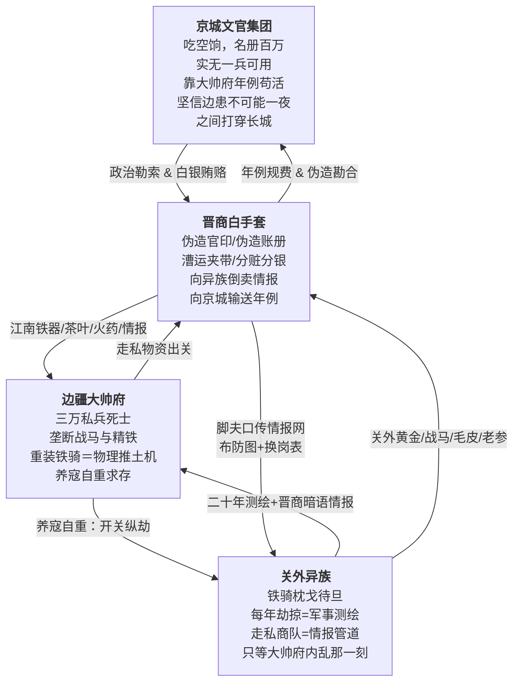

# 宏观故事线／大纲

## 核心基调：三重绞肉机

这是一个没有内力、没有仙人、没有奇迹的世界。重甲骑兵的冲击力由披甲重量与战马速度的乘积决定。红衣大炮的射程由硝石硫磺木炭的配比与炮管精铁纯度的公差带决定。暴雪造成的死亡由环境温度低于核心体温的温差幅度、风速导致的对流散热加速率、以及积雪深度对呼吸道的物理阻塞三重参数共同决定。一切悲剧是制度的。不写江湖儿女，写铁甲马蹄碾过冻硬的黑土时发出的闷响。不写忠奸分明，写每个人都做了在当时个人掌握的全部信息范围内唯一合理推演得出的自私选择——这些选择的乘积构成了一台巨大的、不会停下来问任何人同不同意就自行碾压下去的绞肉机。

### 三方底层冲突

- **京城文官集团**：兵部名册上九边八十三万战兵，杨嗣昌崇祯十年实核不过十七万——空饷率逼近八成。剩下的三成真兵，常年拿不到月饷（名义月饷一两五钱，实发不过四钱，且多为发霉陈米折色），沦为将领私田上的农奴。但这群文官的罪恶不是"通敌"——他们只是永远坐在燃着兽炭的暖阁里，真心实意地相信"九边重镇二百年来不曾有失，岂能一夜之间叫鞑子打穿"，相信自己凭借六科给事中的封驳权、内阁的票拟权、以及对大干儿子空口许下的承诺，就能在万里之外的棋盘上挪动棋子。他们的底色不是邪恶，是**贪腐利益共同体滋养出的傲慢与对物理现实的全然无知**。崇祯帝煤山自缢前以血书遗诏"诸臣误朕"——这四个字，就是这个阶层在整个晚明史上留下的最终评语。
- **边疆大帅府**：大帅仿李成梁旧制，把朝廷拨发给十万人的军饷吃下七成空额，用克扣下来的惊天财富豢养不足三万"家丁私兵"——顿顿有肉，人配双马，身披四十斤重的双层铁甲。一匹辽东战马驮着两百斤的铁甲骑士在平地上发起冲锋，其冲击力足以把任何一个没穿甲的流民连人带骨碾碎。但大帅不是不能荡平关外——是不敢。熊廷弼在万历三十七年就已经把辽东军阀的生存逻辑写成八个字："全镇军额，亡失几半"。李成梁用三十年的时间向所有边将证明了一个铁律：关外一旦太平，朝廷第一件事不是论功行赏，是撤藩、清算、罗织罪名赐死。于是养寇自重成了辽东将门唯一的生存之道。每年秋高马肥之际，开关放异族劫掠几座无关紧要的边村，用几百条底层人命换朝廷继续相信"边患未平、大帅不可轻动"。
- **关外异族**：他们不是配合大帅府演戏的演员。每一次"秋猎劫掠"都是军事测绘行动——通过晋商白手套在张家口私市中安插的谍报商人，他们比京城兵部更清楚长城沿线哪座墩台的守军已经八个月没领到饷银、哪座烽火台的火药受潮结块无法击发、哪段边墙的砖缝在去冬的冻融循环中崩开了三尺宽的豁口。皇太极在沈阳汗王会议上反复研究的不是"大帅愿不愿意开关放我们进来"，而是"京师文官分成几派、谁和谁不对付、崇祯最近又杀了哪个大臣"——他在找政治裂缝。《满文老档》中收录了天命三年努尔哈赤利用关内商人将"七大恨"传回中原的指令原文，这份四百年前的敌国一手文献至今仍在。异族等了二十年，等的不是大帅的恩赐——等的是一声脆响，那个叫"大帅府内乱"的瓷瓶在地上摔碎的声音。
- **晋商白手套（张家口网络）**：江南的茶叶和丝绸不可能凭空出现在塞外。真实历史上，乾隆十年《万全县志》记载了八个人的姓名——王登库、靳良玉、范永斗、王大宇、梁嘉宾、田生兰、翟堂、黄云发——"皆山右人，明末时以贸易来张家口，自本朝龙兴辽左，遣人来口市易，皆此八家主之。"这八家晋商以张家口堡（海拔七百二十丈）为枢纽，北接坝上蒙古高原（海拔一千四百五十丈），南通京师和江南漕运大动脉，在京城文官、江南商帮、边疆军阀、关外异族之间充当了最关键的灰色中介层。他们伪造户部勘合、把违禁精铁和硫磺夹带在漕运粮船的暗舱里、用"折子"（晋商钱铺自行发行的信用票据）把京城大佬的分红洗成"张家口正常马市收益"、同时通过脚夫口传情报网向关外实时传递明军布防动态。**没有这层中介，秀才和兵永远说不上话，账本里也永远不会出现真名实姓——每一条走私记录在账面上都干干净净，盖着兵部和户部的红印。**

### 贯穿全文的"止血塞"与"刀"隐喻

| 概念 | 含义 |
|------|------|
| **止血塞** | 一切暂时维持生命、延缓崩溃的人与物——主母给的解药、女主的陪伴、大帅府对边疆的威慑、京城文官从大帅府收的贿赂、晋商白手套维持的走私网络、底层蚁穴每天领到的那碗米糊 |
| **刀** | 一切同时造成伤害又卡在命脉上、拔出即死的事物——主角体内的砒霜余毒与心脉旧伤、他卧底的双重身份、大帅府的军事垄断、晋商网络串联的整个腐败生态系统、这份他知道得太多却无人可说的真相 |

---

## 故事主轴（一句话概括）

一个从陕甘白骨堆里爬出来的锦衣卫暗桩，被喂下慢性毒药钉在大帅府的军机文书位子上，在一层看不见的晋商白手套、两个女人、三方势力、一份永远查不到真名的走私账本之间，走完一场注定没有解药的倒计时。

---

## 三幕剧大纲

### 第一幕：废墟之上（初入蛛网）

**核心主题：信仰的绞杀与伪装的生存。**

#### 陕甘炼狱（序幕）

不写战争，写战争过后。

主角少年时从陕甘大旱与流贼过境后的万人坑里爬出来。那是崇祯十三年——整场小冰河期中最冷的一年，陕西全境八月降霜、九月大雪封山，延安府肤施县在册人丁八千九百口，十几年后清军入陕统计，全县仅存人丁一千二百口。他活下来靠的不是侠义传奇，不是高人授艺——是在腐尸堆里翻出半块发霉的干粮，在干涸见底的渭河河床底下用指甲刨出泥浆水，是在同官县县志记载的那种"一家八口，七日不举火，幼子先饿死，父母以幼子之肉喂其余子女"的绝境中，不知怎么没死的那个例外。

这段经历在他骨头上刻下了一种不可愈合的"废墟病"：他从此再也无法相信任何高高在上的口号。朝廷说"赈灾"——延安知府上报全府灾民八万口请赈粮三千石，朝廷拨粮后知府实发八百石，剩下两千二百石被层层扣尽流入黑市。流贼说"替天行道"——他们每打下一座县城先烧官府粮仓、再逼百姓亲手烧掉自家房子以断退路。将军说"保境安民"——边镇家丁吃着双饷去蒙古草原打秋风，把砍下来的平民人头当"流贼首级"回营报功，每颗人头换三两赏银。

他染上的废墟病只有一个症状：任何话，他不听人怎么说，他只看每句话背后那双手在摸什么东西。

被锦衣卫收编不是因为他有什么才能——纯粹是因为他在死人堆里活下来的那口气太长了，长得让北镇抚司负责挑人的百户觉得"这人耐杀，兴许能派上用场"。他没有正式官品，没有俸禄月粮，档案在北镇抚司的秘密名册上只有一个代号。像他这样的"暗桩"，明末锦衣卫在各地养了不知多少个——没有家世、没有派系、没有背景，唯一的身份证明就是单线联系的上线手中那份密令。上线一死、密令一烧，这个暗桩在法律上就不存在了。

他在锦衣卫的档案上还记着一道在辽东战场上留下的致命伤：一枚异族破甲箭的倒钩箭头，穿透护心镜后碎在了心包膜外侧。军医不敢开胸取箭——彼时没有能开胸的外科手术，只能靠金创药糊住伤口，让增生组织把碎铁裹死在血肉里。从此他成了半个废人——不能剧烈搏杀，不能纵马狂奔，稍微心率过快，那枚碎铁片就在胸腔里隐隐往主动脉方向推。北镇抚司把他派去大帅府当暗桩的时候根本没指望他能活着回来——他这样的暗桩是朝廷的"耗材"，派出去一个少一个，京城档案库里连他的名字都不会留。

#### 大帅府的算盘

京城要往大帅府安插监军（卧底）。大帅府早就通过晋商在京城的内线拿到了备选名单，故意挑中了主角——一个无根无底、身负致命旧伤、随时可能自己死掉的"废人"。大帅府的算盘是：满足朝廷的面子，收下这个监军。反正他进了府就是个聋子和瞎子。

然而，大帅府的主母不是普通人。

#### 主母的獠牙

主角进府后，第一个看穿他真实身份的，是这位把面部表情控制得如同账本上一行死数的大帅主母。

她没有杀主角。杀一个朝廷安插的人等于撕破脸。她用了更毒辣的手段。

在去高武的写实世界里，主母手上没有"水银"这种神话毒药（史实上液态汞口服几乎无效，古人赐水银致死者多为物理窒息而非毒性）。她用的是明末边镇真实存在的配方：**砒霜（砷化物）微量慢性摄入**，辅以**炮制过的乌头（附子）提取物**来严格控制主角的心率。

这套"毒-药共生"体系的生理逻辑如下：

- **旧伤是基础**：主角心包膜外侧本就卡着一枚箭头碎铁片。心率一旦失控飙升，碎铁片就被充血肿胀的组织推挤，向主动脉方向微微位移。位移一毫米就是死。
- **乌头提取物（降心率）**：主母在主角的日常饮水中掺入极微量的炮制附子——附子中的乌头碱能通过阻断心肌钠离子通道来强行抑制心率。主角的心跳被药物压在危险的低水平线上，碎铁片安静地待在原位。但这种长期低心率让他日常面色苍白、四肢冰冷、稍微快走几步就喘不上气。
- **砒霜微量摄入（慢性中毒）**：主母同时让他长期摄入极微量的砒霜。砒霜在体内与酶蛋白的巯基结合，缓慢破坏细胞代谢。如果没有定期服用解毒剂，砷会在七到十天内积累到致死浓度——先是剧烈腹痛呕吐，然后肝肾衰竭，最后血管麻痹、全身循环崩溃。
- **"解药"的真相**：主母手里的中和药方——以走私来的塞外老参、雪莲和含硫矿物为引——实际上起到两个作用：一是硫化物与砷结合促进排出（这是历史上真实存在过的砷解毒思路），二是人参皂苷强心以对抗乌头碱的过度抑制。但它不是"治愈"，它只是把两个相反方向的毒性暂时拉回一条钢丝般的平衡线上。主角每七天必须服用一次，否则平衡断裂，心率先是被乌头碱的残留效应拉到过低，随后在砒霜引发的血管麻痹和心脏应激中——大出血而死。

- **精神凌迟**：这套生理控制之外，主母还每天逼着主角用他"锦衣卫监军"的身份向京城传递大帅府精心编造的假情报。主角用自己的一支笔去欺骗当初派他来的人——每写一份奏报，都是对他精神上的"诛心"一刀。

这套体系比"水银断肠毒"更冷硬、更唯物：它不依赖任何神奇毒理，只依赖明末边镇真实存在的药材、主角体内那块物理存在的碎铁片、以及砒霜的半衰期与解毒剂之间的精密时间窗口。主角不是被魔法控制——他是被一套精确算计的化学时间表囚禁了。

#### 军机文书：不贴身的风暴眼

主母给主角安排的位置，不是贴身护卫（她不需要让一个随时可能发病的废人保护女儿）。而是把主角塞进了大帅府的**军机文书和走私账目总管**的位置。

大帅府治下的边疆是一个由"干儿子体系"维系的军事集团。大帅收了几十个干儿子——这不是什么武林门派的浪漫化收徒，而是明末军阀最赤裸的生存逻辑：大帅府秘传的战技（虎狼药方+呼吸自残发力法）会让习练者丧失生育能力，干儿子们没有子嗣、没有退路，只能把大帅当成唯一的"义父"，把大帅府当成唯一的家。而其中最得势的几个——尤其是那个被称作"大干儿子"的——掌管着最精锐的重装铁骑营。

干儿子们是纯粹的战兽：悍不畏死、只认特权和利益、在战场上靠药物和铁甲以一当百。但他们对文书工作毫无兴趣——账本和公文在他们眼里是"娘们和阉人干的活"。这也正是主母的精明之处：她把主角钉在一个干儿子们既看不起、又无法质疑的位置上。

军机文书这个位置的致命之处在于：
- 主角每天经手各营的人马实数、粮草库存、走私明细、以及大帅府与晋商白手套之间往来的全部账册
- 但他碰不到一兵一卒。他每天看着那些足以颠覆朝廷的权力秘密，身体却连一把刀都挥不动
- 干儿子们嘲笑他是"大帅府里最懂字的活死人"，没人拿他当竞争对手

#### 女主的清醒

女主是大帅的独女，从小在主母的窒息式控制下长大。主母是一个将"家族存续"置于一切之上的怪物。

但女主不是傻白甜。她清醒得可怕。

在这个去高武、满是铁甲马蹄和配给米糊的血色炼狱里，一个智商正常的大帅千金不可能对底层的哀嚎视而不见。她每天在府里看到来领配给的骨瘦如柴的流民，看到因为走私出了差错被干儿子们吊在大门前抽死的马帮脚夫，看到母亲用冰冷的眼神把一个个活人当成耗材算计。

正因为她看得见，所以她痛苦。她改变不了母亲的军阀体制，也挡不住干儿子的马蹄。她只能在自己能力的极限里偷偷去当那个"止血塞"——瞒着母亲让丫鬟把米糊熬得浓一些，在马帮脚夫挨打时用大小姐的身份去喝退监工，深夜在自己的院子里偷偷给快饿死的卫所军户孩子塞半块干粮。

主母把解药故意让女主每天亲手送过去——她要同时驯化两个人：让女儿习惯"这个男人是我赐给你的"，让主角习惯"你的命扣在我女儿手里"。但她唯一没算到的是，在这个全是算计的泥潭里，这两个被迫每天相见的人，真的产生了东西。

女主在一片黑暗里看到了主角眼中的光——一个同样被这座府邸嚼碎了骨头、咽了下去、还在胃里慢慢消化的将死之人。主角在她身上看到了这个烂透的天下里唯一还没死绝的干净。

#### 信仰绞杀

主角开始接触大帅府的账本和军务文书。他查得越深，就越接近一个让他彻底崩溃的真相。

首先，他发现了大帅府与晋商白手套之间的往来记录。账本里写着"某月某日，张家口马市，收晋商王某茶砖三千担，折银若干"——但永远不写这些茶砖是在哪里、用谁的官印通关的。

然后他开始拼凑。他把账本上的日期与朝廷驿报上的官员调任日期对照。他发现了那个让他手脚冰凉的模式：每次京城吏部有高官外放或升迁，大帅府对张家口的"特别支出"就会在三个月后出现一笔精准到诡异的增量。

最后他拼出了最致命的那块拼图：

**大帅府是汉奸。但如果拔掉大帅府，朝廷根本没有能力挡住关外的铁骑。**

更荒诞的是：他效忠的朝廷、他背后代表的文官大义，和眼前这个他奉命要摧毁的军阀大帅府，根本就是趴在陕甘百姓尸体上分食人肉的同一个怪物的两颗脑袋。江南的茶叶、京城的官印、张家口的商队、大帅府的骑兵——这四样东西合在一起，才构成了那条纵贯长城内外的血色走私大动脉。

他陷入了终极困境：他如果完成任务，他保护的一切都会被摧毁；他如果放弃任务，砒霜的倒计时走完，他会惨死。而他在账本里永远查不到京城大佬的真名实姓——晋商白手套的存在确保了每一笔交易在法律上都是"边境正常贸易"。

主母知道他在查。她甚至故意把某些账册放在他能够到的地方。她享受这场"精神驯化"的每一秒。

#### 双向救赎

主角和女主在这座钢铁坟墓里互为对方唯一的活人。

女主借主角的眼睛，看到了牢笼之外的世界——那个陕甘的万人坑、京城的朽木朝堂、边墙外冰天雪地里快要饿死的底层流民。

主角借女主的庇护，在这个特务密布、干儿子环伺的杀机之地活了下来。女主用她大小姐的身份，一次次替他挡下来自干儿子们的试探和暗算。

他们之间不是一见钟情的浪漫。是两个被同一座机器碾压的人，在齿轮缝里互相闻到了对方还活着的体温。

---

### 第二幕：风暴升级（南北断线）

**核心主题：棋盘掀翻，各方极限施压。**

#### 联姻的最后通牒

大帅府利用女主的婚姻向京城发动了一场"极限施压"。

大帅通过京城的晋商内线和东厂受贿太监，向皇帝递上了一份看似恭顺的联姻提案——将独女嫁给京城某权贵之子，换取大帅府在边疆的合法世袭权。实际上，这是一份措辞优雅的宣战书：

> 如果朝廷拒绝联姻，大帅府就切断对京城的一切"年例"（贿赂），同时不再拦截关外的"小股劫掠"——让京城自己感受一下边疆的寒风。

京城文官集团炸了锅。大帅府的"年例银子"养活了半个京城的权贵。但如果同意了联姻，等于朝廷在法理上承认了大帅府的独立王国——这就不是"边将跋扈"的问题了，而是"裂土封王"。

#### 朝廷掀桌

文官集团做出了一个在他们看来"精明"的决策：与其被大帅府慢慢勒死，不如利用大帅府内部的裂缝来解决问题。

他们找到的突破口是那位"大干儿子"。

大干儿子是干儿子体系中最能打、也最狡猾的一个。他掌管着半数的重骑兵营，在边军中威望仅次于大帅本人。但他有一个致命的不满：他在这套"绝嗣体系"里付出了身体的代价——没有子嗣、没有退路——而大帅却有自己的亲生女儿。在主母的规划里，大帅府未来是要传给女主和她的夫婿的。干儿子们再能打，也只是"干"的。

朝廷密使（通过晋商白手套的秘密渠道接触，不留下官方痕迹）给大干儿子开出了条件：京城承认他为边疆新帅，朝廷拨发的军饷翻倍，允许他"自筹粮饷"——条件只有一个：搞掉大帅。

但这里的关键是：**大干儿子不是一个无脑莽夫。**

他是一线将领。他太清楚"皮之不存，毛将焉附"的道理。大帅死了，国门开了，异族第一个要碾碎的就是他。所以他没有立刻答应。他提了三个条件：

1. 朝廷必须先补发拖欠的全部军饷（验证朝廷的诚意和财政能力）
2. 事成后，关内必须增派至少五万实兵（不是空饷名额）驻防长城各口
3. 他要求朝廷派一个够分量的文官亲自来张家口密谈（留下把柄，确保事后不被灭口）

大干儿子的算计是精密的：他不是要毁掉边疆防线——他是要在旧的权力结构垮塌后，由自己来当新的权力核心。他相信凭自己对边军的掌控力和对异族作战的经验，交接过程中的混乱是可控的。

他唯一算错的东西是：**异族等这一刻已经等了二十年。**

#### 断粮封锁

第二幕的中段，朝廷使出了更狠的一招：以"清查空饷"为名，切断了所有拨往大帅府辖区的粮饷和火药补给。表面上这是对"吃空饷"的惩处，实际上是逼大帅府在断粮压力下内爆。

请注意朝廷的动机：文官们不是在"通敌"，他们是基于傲慢的盲目自信。他们坐在京城的暖阁里拿着兵部名册，真心实意地相信关内还有"百万可调之兵"。他们以为大干儿子反水之后，新帅能在几天内就稳住局面。他们以为异族不可能这么快就收到消息并组织大规模进攻。他们的罪恶不是叛国——在刑法上他们无懈可击。他们的罪恶是**将军事决策建立在政治账本而非物理现实之上**。

大帅府内部开始出现裂痕。大干儿子暗中煽动："大帅为了女儿一个女人的婚事，要拉着全军几十万弟兄陪葬。"

#### 女主的抉择

女主在这一幕面临了她人生中第一个真正属于自己的选择。

主母找到她，平心静气地说了一段话：

> "你知道你爹为什么每年秋天要开关放鞑子进来劫掠几个村子吗？不是因为他不心疼那些百姓。是因为他如果不这么做，京城就不会给他拨军饷。他不拨军饷，这三万铁骑就养不住。三万铁骑散了，关外那几十万真鞑子就会踏破边墙，死的人会比每年劫掠多出一百倍。你告诉我，你爹是坏人，还是好人？"

女主回答不上来。这也是整个世界的终极困境：没有好人坏人，只有代价和谁来付代价。

#### 主角的夹缝

主角在这一幕被撕裂到了极限。

朝廷（通过晋商秘密渠道）重新联系上了他，给他的新指令是：利用联姻的混乱期，盗出大帅府与关外异族私通的铁证，配合大干儿子的内应。

主角拿着这道指令，手指在发抖。他知道这本账册交出去意味着什么。但他也开始发现一个更深的秘密：**异族的间谍网络。**

通过对比大帅府的走私出关记录和晋商账本中的异常条目，主角隐隐约约地察觉——关外的异族一直在通过晋商商队收集明军布防情报。每年秋天的"小股劫掠"看似是配合大帅"养寇自重"的演出，实际上每次来袭的路线都精准地绕开了有实战能力的营寨，专门攻击那些配给最薄弱、指挥官最腐败的烽火台。这根本不是在演戏——这是在用十几年时间做最精密的军事测绘。

但他没有证据。账本里只有货物流转记录，没有情报交易记录。

他做出了一个第三者看不懂的决定：开始同时欺骗两边。对京城，传递"进展顺利"的假消息拖延时间。对大帅府，如实汇报京城动向。他开始偷偷修改大帅府送往京城的部分假账册——故意留下足够明显的漏洞。

主母注意到了这些"漏洞"。她没有揭穿。她微不可察地点了点头——她知道主角在赌什么。她也需要一张能在最后关头反制京城的牌。

---

### 第三幕：雪崩溃灭（大出血落幕）

**核心主题：一切止血塞同时失效。**

#### 暴雪：物理法则的介入

这一幕发生在一场百年不遇的大暴雪中。在去高武的写实世界里，暴雪是物理法则。零下三十度的空气密度、积雪的单位面积荷载、白毛风中能见度降到两步以内的光衰减系数——这些量不区分敌我，不站队，不回应任何人的祈祷。

明末正值小冰河期极冷时段，张家口以北坝上高原（海拔一千四百五十丈）冬季极端低温可降至零下四十度，"白毛风"（风吹雪）天气每年至少二十到三十天，能见度降至不足两步，人在风雪中三到五分钟即完全迷失方向。万历四十七年（1619年）萨尔浒之战早已为这种天气提供了血淋淋的军事教材——明军在暴雪中损失四万五千兵、两万八千匹马，杜松部在深雪中行军延误数日，火器受潮后十支有八支打不响，后金骑兵利用封冻的浑河冰面绕过明军防线，如入无人之境。

这一次，暴雪同样不留情面地切断了大帅府各营寨之间的一切通讯和补给。坝上与坝下之间的唯一军马道——从海拔一千四百丈的骑兵大营到海拔八百丈的大帅府，六十里隘道，积雪深达两米以上并且白毛风持续不断。骑兵无法在及膝深的雪中奔驰——战马在雪坑里跌断腿的事故每小时都有。任何形式的人力清雪在持续降雪面前都是徒劳。各营之间的信使在雪地里迷路，传令兵冻死在半道上——和崇祯十一年宣府镇独石口"巡卒五人出堡，归来者仅二，余三人不知所终"的记录如出一辙。

大干儿子等的就是这个窗口。但他不是要发起骑兵冲锋——**在暴雪中冲锋等于自杀**，萨尔浒的血还没干。他要的是一个所有人视线都被切断的、信息真空的封闭空间。在这种天气里，谁都看不见谁在干什么，这才是他真正需要的。

#### 软政变：控制粮仓而非冲锋陷阵

暴雪第三夜，大干儿子的行动开始。他做的不是带兵冲击大帅中军——在暴雪中，他的王牌（重装铁骑）全被困在坝上大营，积雪深及马腹，战马已经两天没有吃到足量豆料（极寒中一匹战马每天至少需要豆料十二至十五斤维持体温，而坝上存料已不到正常的三成）。但他的步兵——那些没有战马、不需要马料、穿着厚毡靴能在深雪中艰难步行的底层营兵——在暴雪中反而比骑兵有更强的行动力。

这是一个被几乎所有军事教科书忽略的物理事实：在深达两米的积雪中，四条腿的战马是累赘，两条腿的人虽然也走得艰难，但至少不会在雪坑里跌断腿。

大干儿子利用自己对各营粮草配给节点的熟悉——他掌管这些节点已经十年以上——派出手下可靠的步兵营队，在暴雪的掩护下逐一控制了**粮仓、火药库、水源和马厩**。

这不叫反水，这叫"接管"。他对外发布的口径是"大帅身体抱恙，由我临时代行帅令"。暴雪让任何核实命令的尝试都变得不可能——从大干儿子控制的粮仓到大帅所在的中军，正常天气下骑马只需半日，此时步行送信至少需要两到三天，而且信使在高及腰际的雪地中走一夜就可能冻死在半道上。没有人知道帅帐究竟发生了什么。各营只能根据大干儿子单方面发出的命令行事——因为没有粮的营寨，三天后就必须向他派出的"发粮队"下跪。

他的计划是缜密的：先把大帅架空，以"稳定局势"的名义向京城报捷，拿到朝廷承诺的新帅印信，然后在对异族的防线上不做任何变动——他甚至提前准备了一封措辞极其强硬的给异族首领的信："大帅已退，新帅上任，一切照旧。若敢趁火打劫，我亲率铁骑踏平你的王庭。"

这封信能不能起作用，他不知道。但他不是疯子。他在赌自己作为一线老将对异族的威慑力。

#### 大帅之死

大帅没有束手就擒，但也没有上演英雄式的铁骑冲锋——在暴雪中他调不动任何成建制的骑兵。坝上的重骑兵营全陷在雪里，坝下的马厩已经被大干儿子控制了。他能做的只是带着最后百来个贴身家丁，穿着厚毡靴、裹着皮袄，在暴雪中一脚深一脚浅地摸向大干儿子的据点，试图面对面亲手解决这个十年前自己从战场上捡回来的干儿子。

这不是决战。这是一场在齐腰深的雪地里、在能见度不足三步的白毛风中、靠刀鞘和拳头进行的混乱近身械斗。两拨人在及腰的雪窝里翻滚、厮打、互相叫骂着被风雪吞噬的名字。谁也无法保持站立——每一脚踩下去都不知道下面是实地还是雪覆盖的沟坑。大帅年过五十，身体早就被"虎狼药方"和几十年的征战掏空了——那种用药物将肾上腺素推到极限、再靠呼吸法强行压制心率的古沙场杀人术，每用一次就在心脉上多刻一道裂痕。他在混战中被一柄短刀刺穿了肝脏——刺他的人可能是大干儿子的亲兵，也可能是自己人在风雪中敌我不分时的误伤——没有人能看清楚。

大帅倒下去的时候没有留下任何豪言壮语。他侧躺在雪窝里，一手还攥着帅印，一手捂着腹部往外涌的血。风雪在几分钟内就把他的体温带走了——暴露在零下三十度的暴雪中，失血加上失温，死亡来得干脆而沉默，没有任何戏剧性。等大干儿子的人找到他时，尸体已经被半埋在新雪下面，帅印冻在了僵硬的手指上，掰都掰不下来。

大干儿子发现大帅的尸体时，脸色比他预想的还要白。他计划的是软禁，不是击杀。大帅活着，他手里还有筹码。大帅死了，他就得独自扛住接下来的一切——包括随时可能冲过来的异族。

但来不及了。

#### 主母服毒与晋商网络的断裂

主母在大帅死讯确认的同夜，召见了女主。她没有哭，没有煽情。她把大帅府外粮仓的钥匙交给女儿，告诉她里面够边民吃半个月。

然后她服下了自己多年调制的那种乌头砒霜复合毒——比主角的剂量大得多，没有中和药方，只求速死。

但她死前做的最后一件事不是服药——是烧掉了大帅府与张家口晋商往来的全部密档。她不是要替京城文官掩盖罪证。她是要确保，在大帅府倒塌之后，这条横贯南北的血色走私线不会落在异族手里成为刺向关内的第二把刀。

大火烧了整整一夜。晋商白手套在塞外的据点、账册、联系人名单——全部化为灰烬。

对京城来说，这意味着与大帅府串联的走私证据链断了。对那些文官来说是好消息。

对异族来说，这意味着他们布局二十年的情报枢纽也断了。但这已经不重要了——因为大帅府已经内乱，他们没有枢纽也看得到缺口。

#### 配给制的崩溃

主母和大帅双双死亡的消息，让配给制这座在几十万人头顶上勉强维持了十几年的空中楼阁，彻底垮了下来。大帅府的配给逻辑一直很简单，简单到像一把尺子：每天去堂口，按你那张盖着红印的木牌，领当天分量的陈米糊糊和指甲盖大小的盐巴。不多不少——刚好够你今天不饿死，也绝不会有半粒余粮让你明天有力气逃跑或者造反。这套制度运行了十几年，把几十万人钉在同一个刻度上。现在刻度碎了。

各个营寨开始哄抢粮仓。有人发现粮仓里根本没有那么多存粮——账面上一座粮仓储粮五千石，实际打开只有一千二百石，剩下的数字只在主母的账本上存在过。干儿子们各自为战——有人带着整营骑兵连夜不知去向，有人守在空粮仓前抡着刀逼农奴不准跑，然后回头发现没人守马厩，战马被农奴偷了个精光。卫所军户偷战马不是为了骑马——是为了杀马吃肉。一匹战马杀了能出肉三百来斤，够一小队人撑过半个月。

但真正的恐怖从来不发生在能抢到刀和马的强者身上。真正的恐怖发生在那些连偷一匹马都不敢的弱者身上。

边疆各处前沿蚁穴——半地下夯土窝棚里蜷着的几十万马帮脚夫、走私线上的编外苦力、在主母铁矿山里服了半辈子苦役的军户家属——这些地方在暴雪中断了粮、断了柴、断了药。长城沿线烽火台额定每月每台领木炭五十斤，经层层克扣实发不足十斤，暴雪来了不到两天就全部烧光了。这些底层的边民一辈子不知道大帅府到底是"汉奸"还是"国之柱石"，不知道"养寇自重"这四个字怎么写，不知道朝堂上那些穿红袍的大学士讨论他们的命运时用什么措辞。他们只知道大帅府的监工今天没带着皮鞭来堂口发那碗米糊。然后昨天那碗米糊也没发。然后已经记不清是第四天还是第五天没发了。

他们在暴雪中蜷缩在透风的土墙里，用冻僵的手指捏着那张已经作废的木牌，抱着已经没有体温的孩子，最后连哭的力气都没有了。七八天之后，整个蚁穴就只剩一片被新雪覆盖的、寂静无声的灰黑色土包。来年春雪化了以后，这一带方圆几十里全是白骨。

#### 异族的入场：测绘者不需要等门开——他们手里有所有门锁的钥匙

关外的异族首领不是接到"大帅已死"的加急密报才开始行动的。这片被小冰河期冻硬了二十年的草原上，坐着一个用二十年时间把长城防线从头到脚扒光了的测绘者。他手里那张由晋商脚夫口传暗语逐年逐月拼凑出来的长城布防图上，每一座墩台的守军人数、火药库存、把总名字、乃至把总好赌还是好酒——全部标注得比京城兵部的塘报更准确。他甚至不需要等大帅府内乱的烽火信号——他的间谍在田逢吉的私市商队里混了二十年，李承荫还没咽气之前，大帅府被李国勇架空的消息就已经经由脚夫的押韵暗语在路上跑了三天。

他不需要等到国门大开。他在大帅府内乱的消息传到的同一个时辰内就下了全军推进的命令。他的蒙古矮脚马不需要关内战马那种每日十余斤的精细豆料——零下三十度的坝上草原把这些矮脚马从出生起就磨成了不需要补给、不怕冻土、能在白毛风中靠闻雪找路的活体兵器。从坝上高原（海拔约一千四百五十丈）到坝下（海拔约七百二十丈），六百三十丈的海拔落差——他的先头骑兵在十二个时辰内就完成了这条他和他的父亲花了两代人用二十年时间测绘出来的俯冲路线。他们不是"发现了一个缺口"然后涌进去的——他们在十二个时辰之内同时从六个常年被标记为"明军从未守住过"的隘口,沿着封冻三尺的河面冰层和多条只有晋商走私马帮才知道的山间密道，在坝下防线完全没有反应过来的情况下把它从内部撕开了六道口子。

此刻坝下的明军还在暴雪中试图用冻裂的手从雪里刨出补给线——他们连烽火都点不燃。木炭在长达两个月的封锁中早已烧光，烽火台上只剩一层冰冷的灰和被遗忘了多日的冻硬尸体。皇太极在汗王会议上曾不止一次对众贝勒说过："商贾一句话，胜过三百探马。"——他说的就是这一刻。一个商人用脚夫口传暗语网络在三天之内完成的军情接力，抵得上十个烽火台半年报上去又被兵部压下来的全部塘报。

这不是战争。这是二十年的逐墩逐台军事测绘、加一个用商人暗语体系替代了烽火传讯的情报网络、加十二个时辰的闪电俯冲、再加六百三十丈的海拔落差——四重叠加后，物理法则对一个被自己人从内部蛀空了二十年、又被暴雪剥掉了最后一层防御外壳的防线签下的死亡证明。异族首领骑在那匹矮脚马上从坝上俯视坝下燃烧的大帅府——他不是英雄，他不是征服者。他是一个蹲在濒死的猎物旁边等了二十年、等到它终于自己倒下之后才开始撕咬的食腐者。

#### 终极一幕：回光返照

大帅府已经是一座死府。叛军、异族、暴雪、饥荒——四重打击同时砸下。

女主没有逃。她跪在主母服毒的那间暗室里，在焦黑的泥土和碎瓦中翻找。她记得母亲放药的地方——但火已经烧过一遍了。药匣子碎了。她用指甲在废墟里一寸寸地抠，抠出了一小团混着炭灰和泥土的东西——那是残留在陶罐底部的最后一点药渣。

完整的解毒剂包含含硫矿物（促进排砷）和人参皂苷（对抗乌头碱的过度心律抑制）。但这撮药渣已经在火灾中失去了大部分有效成分。它只能让主角的砷代谢勉强撑住——也许半个时辰。然后乌头碱的残留效应会把他的心率压到危险的低水平，接着砒霜堆积引发的血管麻痹会让血压垮掉，最后心包膜外侧那枚碎铁片在组织肿胀和心率紊乱的双重夹击下——刺破主动脉。

药渣不是解药。药渣在物理上只是推迟了崩溃的顺序。

女主把这包连泥带灰的药渣塞进主角嘴里。她不是什么医术高手。她只是觉得——与其让他在昏迷中悄无声息地流干血，不如让他清醒地走完最后一段路。

**药渣起效了**：主角从濒死的昏迷中醒了过来，瞳孔重新有了焦距。这是物理层面的最后一个"止血塞"——用最简陋的材料，做最暂时的事。

#### 坦白与宽恕（精神之刀与灵魂止血塞）

主角在回光返照的半个时辰里，做出了他这一生唯一一次彻底的诚实。

他坦白了一切。

他是锦衣卫的暗桩。他被安插进大帅府的目的。他这些年送出的每一份假奏报、真密折。他在第二幕时同时欺骗两边、拖延时间的全部真相。他没有求她原谅。他只是觉得，她有权失去一切之后，至少知道她面前这个人是谁。

女主听完后沉默了很久。然后她发出了一阵荒诞的笑声。

不是因为可笑。是因为她觉得这个世界荒谬到了极致——她父亲养寇自重几十年，在一场暴雪的混战中被人捅死在雪地里，连凶手都不知道是谁；她母亲用毒药控制了一个人一辈子，最后用同样的毒药了结了自己；张家口的晋商白手套在母亲临死前被一把火烧光了全部密档；她面前这个将死的男人骗了她好几年，却在最后半个时辰选了说实话。

她抱住主角，轻声说了一句话：

> "我知道。"

这三个字——是她在很久以前就已经察觉到蛛丝马迹，却选择不问、不说、不去查证的——是她的"灵魂止血塞"：在这个所有人都对她说谎的世界里，她选择了不去拆穿唯一一个让她觉得自己还是人的人。

#### 主角之死

主角的死不是英雄式的牺牲。是一个被毒药、旧伤、谎言和忠诚撕扯了整个后半生的男人，终于放弃了挣扎。

他对女主说的最后一句话是他的真名——不是锦衣卫档案里的那个代号，不是大帅府里被安排的假身份，是他从陕甘万人坑里爬出来时的那个名字。

然后崩坏按顺序发生。先是乌头碱把他的心率压到三十以下——他感到冷。接着砒霜堆积引发的血管麻痹让血压垮掉——他感到晕。然后心包膜外那枚碎铁片，在他此生最后一次心跳紊乱的痉挛中，向前位移了致命的一毫米。

主动脉破裂。胸腔内大出血。他死得很快，很安静。嘴角带着一丝他自己也不知道的笑意。

#### 女主孤身入长夜

女主从主角的尸体旁站起来。她从他怀里摸出了一卷纸——不是大帅府与晋商往来的原始账册（那些已经被主母烧了）。而是主角在这几年里，用他锦衣卫暗桩的侦察本能，一点一滴拼凑出来的**私人笔记**：每一笔他能确证的走私交易、他从各路蛛丝马迹中推理出的京城文官分红名单、以及关外异族利用晋商商队进行军事测绘的证据。

这份手稿在法律上不能作为证据。晋商白手套保证了所有的罪证在法律上都是"合法边境贸易"。但这份手稿里记录的逻辑链条，只要落到任何一个稍微懂行的御史手里，就足以在朝堂上掀起一场大地震。

她把这份手稿塞进怀中。

转过身，背对燃烧的大帅府，面朝风雪中正在被铁蹄碾碎的边疆防线——

走入了天崩地裂的乱世长夜。

她没有回头。

---

## 开放式终局：几条未完成的时间线

故事在女主走入风雪后结束。以下几条线不作交代，留给读者：

1. **女主与手稿**：她会带着那份手稿去哪里？京城？关外？还是找一个没人知道的地方把它和主角一起埋了？如果她选择去京城，这份手稿能不能在朝堂上撕开口子——还是会被文官集团捂在袖子里变成又一份被烧掉的密档？
2. **大干儿子的结局**：他以为的剧本是"软禁大帅→接管权力→以新帅身份威吓异族→京城封赏"。实际发生的剧本是"大帅意外死亡→异族利用二十年测绘的情报在十二个时辰内踏破边墙→他面对的不是朝廷的封赏，而是组织度远超他预料的全面入侵"。他现在是什么处境？他会死战，还是逃跑，还是投降？
3. **京城的反应**：边墙告破的消息传到京城需要几天。朝堂上会在"追封大帅"和"声讨汉奸"之间反复横跳。没有人会承认自己收了晋商的年例银子。没有人会承认自己支持过大干儿子的政变。那些坐在暖阁里的文官，会发现他们引以为傲的政治牌局，在异族的铁骑面前连纸糊的盾牌都算不上。
4. **晋商白手套**：张家口的据点被主母烧了，但晋商网络没有死。他们会继续在京城和异族之间寻找新的平衡。历史上真实的范永斗们，在清兵入关后成了新朝的"皇商"。
5. **底层的幸存者**：大帅府配给制垮塌后，蚁穴那些侥幸没冻死的人手里只剩两样东西——一张作废了的配给木牌，和一双冻裂后握不住任何东西的手。没有布衣，没有长矛，没有任何可以换成下一顿饭的物资。坝上的雪还在下。关外的马蹄声已经能从垛口的裂缝里听见了。

最后一幕：李观照带着沈节留下的私人手稿，背对燃烧的大帅府，面朝坝上方向走入风雪。手稿里的推理链在法律上不能翻案。她在走入风雪之前已经知道这点了。她走——不是因为它能翻案。是因为它是这个烂透的世界上最后一件不是谎言的东西。

---

## 伏笔与回收追踪

| 伏笔 | 安置位置 | 计划回收节点 |
|------|----------|---------------|
| 主角心包膜外的箭头碎铁片（辽东旧伤） | 序幕 | 终幕：心率紊乱+组织肿胀→碎铁片物理位移一毫米→刺破主动脉→大出血 |
| 砒霜+乌头复合毒的作用机制 | 第一幕 | 终幕：停药后两个毒性的平衡同时崩溃→先心律过低→再血管麻痹→最终主动脉破裂 |
| 晋商白手套的独立账外记录 | 第一幕 | 第二幕主角拼凑推理的基础；终幕：主母烧掉了原始账册但主角保留了自己的私人手稿 |
| 异族二十年利用走私商队进行军事测绘 | 第一幕/第二幕 | 第三幕：异族在十二个时辰内精准穿越边墙薄弱点 |
| 大干儿子的软政变计划 vs 实际连锁反应 | 第二幕 | 第三幕：计划是软禁→接管→威吓；实际是大帅意外死亡→异族闪电入侵→全线崩溃 |
| 吃空饷与真实兵力 | 第一幕 | 终幕：关内"百万大军"没有任何一支援军出现 |
| 女主觉察主角身份 | 第一幕/第二幕 | 终幕："我知道" |
| 配给制体系的脆弱性 | 贯穿 | 第三幕暴雪中断配送→边疆蚁穴雪崩式崩溃 |
| 主母烧毁全部晋商密档 | 第三幕 | 间接导致女主手上那份"私人手稿"成了唯一残留的真相记录 |
| 女主带走的手稿（非法律证据，而是逻辑推理） | 终幕 | 开放式：手稿的最终下落不交代 |

---

## 创作原则

1. 不赋予任何角色超自然力量。虎狼药方中附子的乌头碱阻断心肌细胞膜Nav1.5钠通道→动作电位上升支延迟→心率压制至每分钟四十次以下。砒霜与巯基酶硫原子形成共价结合→不可逆破坏三羧酸循环→线粒体密度最高的心肌组织首当其冲。七日中和药方中的含硫矿物与砷离子形成可溶性络合物经尿液排出，但乌头碱的半衰期比砷排出速度快三天。停药第四天：钠通道恢复→心率从四十急拉到九十以上→砷尚未排完→缺氧心肌被强制加速→内膜撕裂。没有一处依赖超自然解释。铁骑威力来自披甲重量与战马速度的乘积。暴雪致死率由环境温度与核心体温的温差幅度、对流传热速率、积雪对呼吸道阻力的三重参数决定。
2. 每一个政治决策同时记录其利益和代价，两个数字放在同一行。李承荫每年开关放劫掠：三五十条底层边民的命换朝廷数万两辽饷——这个兑换率他反复核算了几十年。顾韫给沈节喂毒：一套七日周期的毒理学时间表锁住一枚锦衣卫暗桩的全部行动自由度——换算下来，一枚暗桩的市场价约等于田逢吉暗账上"关字号"一个季度的情报支出。李国勇叛变：十五年的军功加上丧失生育能力的一次性沉没成本——换一个大帅府继承权。
3. 底层视角至少占整体叙事的五分之一。不在蚁穴边民身上加注任何叙述者定调词。只记录他们每天从堂口领到的米糊浓度、木牌上的霜层厚度、土墙裂缝宽度、暴雪第四十四天尚未死亡的人数。
4. 悲剧的成因不是任何单个角色的道德失格。三方在同一制度框架内各自精确推演、各自用自身视角下的最优解互相抵消、共同锁死为零和博弈。李国勇死在他的政变计划在纸面上每一步都有军事合理性——但他不知道田逢吉的脚夫口传情报网比大帅府的信使快了整整三天。信息差。不是道德差。
5. 李观照的终局状态不是复仇。她带着沈节留下的私人手稿走入风雪。手稿在法律上不能作为证据——晋商白手套已经把每一条记录洗得干干净净，户部红印在每一页上都闪着法理的金光。她可能死在半路。可能隐姓埋名。可能十年后在某个茶馆里把那份手稿拍在一个年轻御史面前的桌上。小说的最后一行是她背对燃烧的大帅府、面朝坝上方向走入风雪——没有回头。她是否走到了、走到了哪里、走到之后做了什么——不交代。
6. 不写英明钦差从天而降破局。崇祯十七年——不建宫殿、不近女色、龙袍破了让皇后缝、每天批奏疏到三更——煤山上只换到一棵歪脖子槐树。制度的溃烂是一个复合函数，自变量包括：辽饷加征额度、九边空饷率、江南隐田逃税比例、小冰河期无霜期天数、以及底层蚁穴每天那碗陈米糊糊的浓度。没有任何一个单变量可以被"一个清官"调回正常值。

---

## 全卷章节规划

全卷预估 **58 章**，按每章 2800-3200 字计，总字数约 **17 万至 18 万字**。三幕配比约为 33%/38%/29%——第二幕体量最大，承担制度博弈的全面展开。每章均锚定视点角色、核心物理事件与章末物理钩子。

### 第一幕：废墟之上（第 1-19 章，约 5.7 万字）

核心任务：建立沈节从陕甘万人坑到锦衣卫暗桩到被主母识破喂毒的全过程。建立李观照与沈节的慢速双向救赎——不是一见钟情，是被同一台绞肉机碾过的两个人在齿轮缝里找到了对方的体温。建立账册暗账带来的第一次信仰绞杀。第一幕末尾——碎铁片第一次在安静中发生可被感知的位移。

| 章节 | 场景 | 视点 | 核心物理事件 | 章末钩子 |
|------|------|------|-------------|---------|
| 第 1 章 | 陕甘万人坑——狗娃从死人堆里爬出来 | 沈节 | 渭河河床刨泥浆水。指甲翻裂。腐尸堆里翻出发霉干粮 | 锦衣卫百户的手伸到他面前——"怕不怕死。""怕。但我更怕饿。" |
| 第 2 章 | 北镇抚司暗桩训练——从流民到死士 | 沈节 | 基本识字、跟踪、格斗。被老暗桩打断三根肋骨——学会打架不是拼力气，是拼谁能多撑一口气 | 百日训练结束。档案上被打上标签：无名暗桩，耗材，无家世无派系 |
| 第 3 章 | 辽东夜不收任务——碎铁片入体 | 沈节 | 破甲箭穿透护心镜。箭头碎在心包膜外侧。军医不敢开胸，金创药糊住伤口，瘢痕组织裹死碎铁片 | 档案备注：身有宿疾，不宜外勤。适合低压文书类潜伏任务 |
| 第 4 章 | 进大帅府——主母第一次见他 | 沈节 | 被安排在军机书房。主母隔桌看了他十息。桌面上一盏油灯——灯捻焦了半截——主母没有拨——他也没有 | 主母开口说的第一句话——"你在锦衣卫的代号是什么" |
| 第 5 章 | 喂毒——砒霜乌头七日周期 | 沈节 | 主母亲自端来第一碗药。心率从七十跌到四十五。她把药碗放在他面前——没有催促——只是坐在对面等他自己端起来喝 | 李观照出现在书房门口。手里端着第二碗药。主母说——"以后每天早上，小姐来送" |
| 第 6 章 | 军机文书任命——干儿子们的反应 | 沈节 | 主母当众宣布"沈休言掌管全部军机文书与走私账目"。干儿子们嘲笑——"大帅府最懂字的活死人" | 李国勇从人群中看了他一眼——"你的脑袋比我们粗人金贵。"不是夸奖。是定价 |
| 第 7 章 | 大帅府地理——沈节熟悉各节点的物理位置 | 沈节 | 他在府内各处走动——军机书房、堂口发粥的配给站、后院马厩、坝下粮仓外墙。他在心里画了一张地图。每一条路到最近的出口需要多少步——他在必要的时候不用想就能跑 | 他发现堂口的一堵土墙上挂满了木牌——每张木牌上刻着人名。有些木牌已经裂了——裂掉的木牌还挂在墙上。人不知道还在不在 |
| 第 8 章 | 第一次整理账册——发现日期巧合 | 沈节 | 账册第十四页——崇祯十四年九月，张家口马市支出。吏部北字号甲的调任日期与之相差十日。这是第一次巧合。他在心里记下 | 碎铁片在安静状态下微微推了一下。不是心率快了——是他盯着那个日期看了大概六十息。心跳没变。碎铁片自己偏了 |
| 第 9 章 | 李观照日常送药——第一次长谈 | 李观照 | 她把药碗放在案上。"趁热喝了。"问他——"你在锦衣卫去过江南没有。""没去过。" | 她走后沈节发现药碗下面压着一小片干枣。不是主母药方里的。是李观照自己加的。他不知道这意味着什么——但他把干枣含在嘴里含了很久 |
| 第 10 章 | 旁观配给制——堂口发粥 | 沈节 | 蚁穴边民排队领米糊。监工用皮鞭量每个人弯腰的幅度。弯腰不够低——鞭。弯腰太低——也是鞭。不是根据需要——是根据监工当天的心情 | 李观照在堂口。她让丫鬟把量斗里的粥压得比平常实了一点点。监工没发现。沈节发现了 |
| 第 11 章 | 田逢吉首次出场——暗账结算 | 沈节 | 田逢吉穿补丁布袍踏进大帅府。说的每一个字都像聊天气。"今年野狐岭的雪比往年来得早。商路不好走。"沈节同时在心里把这句话的"嘴面"和"嘴底"拆成了两条线 | 田逢吉走之前看了沈节一眼——不是怀疑，是评估。评估后决定——这个文书暂时不需要给封口费——他还不知道自己看到了什么 |
| 第 12 章 | 第二处巧合——临清闸过关记录与入库铁料重量偏差 | 沈节 | 正账登记粗布三千匹——需两辆骡车。过关清单登记骡车八辆。另六辆——据入库铁料反推——藏精铁约八千四百斤。差额误差不超过百分之一点二 | 他在正账该条目下方用指甲划了一道竖线——竖线两端在纸纤维上微微裂开了细丝。这是第一条他自己留下的物理痕迹 |
| 第 13 章 | 李观照与沈节——名字 | 李观照 | 她说——"观照是我娘起的。冷眼看穿。慈航是我自己起的。慈悲为舟，济度苦海。"前半句没看他。后半句看了 | 沈节说"休言——千言万语，不如休言"。她听完点了下头。没追问。收刀了 |
| 第 14 章 | 大帅首次出场——虎狼药的代价 | 李承荫 | 沈节第一次在近处看到大帅。大帅的左眼被飞溅铁砂打坏——畏风流泪——看人永远像在审视叛徒。右手食指和中指缺了第一节——握笔只能写拳头大的字。心脏跳动时有喀嚓音——军医说像裂了缝的鼓 | 大帅对沈节说的唯一的直接交流——"你是京城派来的。你的一切文书我都会过目。不是不信你——是京城从来没有值得信的人。"说这话时没看沈节。看的是账册 |
| 第 15 章 | 第三处巧合——三行日期在桌面排成一条线 | 沈节 | 三行日期。三支不同的笔。第一行——上月抄。第二行——半月前。第三行——刚才。墨迹的新旧在纸面上排成了一条每个日期之间的间距都在均匀缩小的线 | 他在第十四页日期旁用碳条画了第一道竖线。墨迹干缩成弯的细线。没有在旁边写任何字。画这道线已经是一个决定了——只是他还不知道这个决定的内容是什么 |
| 第 16 章 | 碎铁片第一次在安静中位移 | 沈节 | 从里面推。痛感没到——心率两息后才被拉上去。他把手压在左胸口——感觉到胸壁内部的微震——碎铁片在瘢痕组织里被心跳推着往主动脉方向挪动 | 在黑暗里算出每息位移约零点零一毫米。然后想——还能活多久。算不出来 |
| 第 17 章 | 李观照与底层——拆量斗 | 李观照 | 她让丫鬟把量斗的铜衬底拆了。多出的一成稠粥——每天早晨排在队首的几十人多活了一天。她知道这救不了所有人——排后面的人还是只有那碗清汤 | 上次那个抱婴儿的女人排在最前面。李观照看着那女人喝完粥——把碗里的底子用手指刮了三次。她看着的时候——手指自己攥紧了一息。然后又松开了 |
| 第 18 章 | 李国勇对沈节的试探——酒桌上的挑衅 | 李国勇 | 李国勇在干儿子聚餐时当众问沈节"沈休言——你在大帅府待了一年多。你说说——大帅府和京城相比，哪边更干净。"沈节没接话。他端起酒杯——喝了一口——放下。从头到尾没说一个字 | 李国勇没追问。但他记住了。他本来就是要试探"这个人被逼到墙角的时候是咬人还是装死"。答案：装死。装死的人不是不会咬——是知道什么时候咬最疼 |
| 第 19 章 | 第一幕收束——主母召见，沈节决定继续潜伏 | 沈节/顾韫 | 主母在暗室对他说了四个字——"改得不错"。然后把下一批需要伪装成正常军情的京城密函推到他面前。没有更多的解释 | 回到书房——账册第十四页被风吹开了。窗缝里灌进来的风刚好够掀开那一页。窗缝的宽度刚好够塞进一根手指。他看了那页一眼——没翻回去。让它开着。他在想——还剩一撮药渣 |

### 第二幕：风暴升级（第 20-41 章，约 6.6 万字）

核心任务：联姻最后通牒发出。京城与李国勇秘密接触。断粮封锁分阶段压缩底层生存空间。沈节开始同时欺骗两边——在主母的默许下修改假账册。女主在联姻逼宫与暗中接触旧部之间双线推进。第二幕末尾——暴雪提前降临，野狐岭隘道物理封死，所有角色被关进了同一个没有退路的封闭空间。

| 章节 | 场景 | 视点 | 核心物理事件 | 章末钩子 |
|------|------|------|-------------|---------|
| 第 20 章 | 联姻提案的措辞——极限施压的文本组装 | 顾韫 | 主母亲手起草联姻折子。每一句在字面上都是"效忠皇恩，请赐良缘"。每一句在字底下都是"不补军饷，异族今秋过不了长城这道坎不是大帅府的事" | 她把折子递给沈节——"你是京城的人。你认为京城读到这里会怎么想。"沈节看了三遍。他能读出每一行底下的第二层文本——但不能说出来。他说"他们会先怕。然后怒。" |
| 第 21 章 | 联姻消息在干儿子营中炸开 | 李国勇 | 李国勇把军报摔在案上——"大帅为了女儿一个女人，要拉着全军几十万弟兄的命给她当聘礼" | 当晚写了一张密令——内容不写——塞进靴筒。出门前在铜镜里看了自己一眼——确认表情没有泄漏任何东西 |
| 第 22 章 | 京城文官读到折子——朝堂上的恐慌与计算 | 沈节 | 沈节通过锦衣卫秘密渠道收到京城回函——"查清大帅府通敌铁证，配合内部力量。"回函没有署名——但笔迹他认得。是北镇抚司那个在他出发前拍他肩膀说"这趟回来我给你补一个正式编制"的百户。那个编制的申请书至今还在百户的抽屉里——没填 | 他把回函叠好塞进灯座下面——那个位置全书房主母唯一不会翻。因为它太明显了 |
| 第 23 章 | 田逢吉第二次暗账结算——沈节在旁偷记 | 沈节 | 田逢吉展开折子——"北字号甲——九月规费——银八百两正。"沈节同时在脑内把铁料差额白银一百七十六两往这八百两上一贴——差了一个很小的零头 | 田逢吉走前又看了他一眼。这次比上次多停了一息。商人评估潜在的交易对手——第一次是扫一眼。第二次是停一息。第三次——可能就是开口谈价格 |
| 第 24 章 | 沈节追查北字号甲——通过漕运过关记录逐步锁定 | 沈节 | 临清闸过关时间。张家口入库时间。吏部调任公示时间。三条时间线在纸面上各自独立——各自有合法的手续和完整的红印。但把三条线叠在一起——它们在同一张桌面上的投影拼成了一张完整的人脸。这张脸在京城户部 | 他不认识这张脸。但他现在知道——这个人每三个月在田逢吉的暗账上出现一次。每次出现的日期都比上一次早了几天。这个人越来越急了 |
| 第 25 章 | 朝廷密使通过晋商渠道接触李国勇 | 李国勇 | 密使开出条件：京城承认他为新帅，军饷翻倍。李国勇听完——没点头——提了三个条件：一拖欠军饷必须先补足；二事成后关内增派实兵五万驻防各口；三派一个够分量的文官亲赴张家口密谈——留把柄 | 密使走后李国勇看着空椅子。椅子上还有密使的温度——毡垫被坐出了一个还没回弹的凹坑。他在计算——他手里有多少牌。京城手里有多少牌。异族手里有多少牌。算完发现——没有一方知道另两方的全部牌面。这个信息差本身——是他唯一可以用来翻盘的东西 |
| 第 26 章 | 断粮封锁——第一阶段（削减配给浓度） | 沈节 | 堂口的米糊比昨天稀了一成。沈节经过堂口——木牌还在墙上。排队的人比往常少了几个——不是被遣散了——是腿部冻伤到走不到堂口 | 李观照让丫鬟把量斗的铜衬底拆了。"今天这一碗稠一些。"她把"今天"说得很轻——因为"明天"在物理上已经不确定了 |
| 第 27 章 | 沈节核对仓储——发现豆料只够三天半 | 沈节 | 一百五十三万六千斤豆料。三万二千匹战马。每天四十三万二千斤。三天半。这个数字不是他算出来的——是豆料的总重量和战马每天的消耗量这两个物理常数自己碰在一起给出的答案。他只是在中间写了等号 | 他把账册合上。李国勇比他早三天知道这个数字——库房那个把总是李国勇的人。沈节想——李国勇知道三天半之后会怎样？他不知道。但他以前在锦衣卫学到了一件事——人在知道自己只剩下三天半可吃的存粮时会做什么事。答案是——任何事 |
| 第 28 章 | 李国勇秘密封存坝上三座粮仓 | 李国勇 | 以"战时储备"名义将额外豆料转入密封粮仓。锁孔里灌铅——铅封冷却后锁芯和锁孔变成一块整体。钥匙一把——挂脖子上 | 灌铅的时候他闻到铅熔化的气味——像铁锈加热。他想——灌铅的锁孔不是用来防大帅的。是用来防他手下自己人在饿疯了的时候进来抢的。铅封的熔点是多少度——他不知道。他只知道人饿疯了的时候体温比铅高 |
| 第 29 章 | 女主与主母关于联姻的对话——"你爹是坏人，还是好人" | 李观照 | 主母说了父亲每年秋天开关放劫掠的原因——不是你爹残忍——是他不开关京城就不拨军饷。没军饷三万铁骑养不起。三万铁骑散了——关外那几十万真的会踏平长城——死的人比每年劫掠多一百倍。"你告诉我，你爹是坏人，还是好人" | 李观照没回答。回到房间把拆下来的铜衬底反复擦了大概四十次。她不是在清洁铜——她在擦自己的沉默 |
| 第 30 章 | 沈节开始双面欺骗——在假奏报中故意留漏洞 | 沈节 | 在主母审定的假奏报中加入他自己编的数据——漏洞敏感到足以让朝中有良心的御史发难，又不至于直接引爆棋盘。每一个漏洞的坐标都经过了精确计算——不能太密，不能太疏，不能指向同一个方向上 | 主母看完——没有发怒。看了他一眼——然后继续往下翻。她默许了。她知道沈节在做什么——他在用主母给他的假奏报模板，反过来写一封只有他自己能完整解码的、写给京城的真情报。这封信京城读不到。但这封信存在。存在就有一天能用 |
| 第 31 章 | 李观照暗中接触大帅旧部 | 李观照 | 以看望旧伤名义逐个拜访三个退伍老家丁。告诉他们——"大帅府的联姻可能会出事，你们把家眷往南送。"不是要拉拢兵变——是她不想让这些替她爹挡过刀的老人跟大帅府一起陪葬 | 第三个老家丁问她——"大小姐你自己怎么办。"她说——"我娘的药渣还剩一撮。"老家丁听不懂。他自己知道——这句话是对沈节说的——只是沈节不在这个房间里 |
| 第 32 章 | 断粮封锁——第二阶段（堂口开始缺勤） | 沈节 | 监工今天又没来——第三天没来了。桌面上的薄雪已经积了四层——每一层对应一个没发粥的早晨。木牌还在墙上 | 沈节在堂口碰到李观照。她正在把最后一撮自己的口粮分给一个抱婴儿的女人。分完以后她对沈节说——"我娘说——今天是第三天。明天药渣可能不够了。"她说这话时没看他。看的是那个女人的婴儿 |
| 第 33 章 | 京城文官与江南商帮分赃——田逢吉暗账的另一面 | 沈节 | 追查一笔夹藏在漕运暗舱中的精铁去向——杭州装箱→临清闸过关→张家口入库→关外。全程有完整勘合手续。每张勘合上都有兵部武库清吏司的大印——印是真的。上面的填发日期是假的——比实际发货日期晚了整整两个月。这个时间差——就是田逢吉用来洗钱的时间窗口 | 他锁定了北字号甲的面孔——京城某位户部郎中。锁定了。没写在纸上。记在记忆里——唯一不会被搜出的地方 |
| 第 34 章 | 大干儿子在各营之间串连——酒杯里的政变 | 李国勇 | 不是开会——是喝酒。每次喝酒多三五个被他灌服的人。最后一杯被灌倒的把总在醉倒前说——"大公子——你说了算" | 李国勇把醉倒的人扶到炕上。给他盖了一件棉衣——然后坐在旁边的条凳上——把脖子上的铅封钥匙摸出来——又塞回去。钥匙被体温焐热了——铅封是灌在锁孔里还没融——但快了 |
| 第 35 章 | 大帅病发——虎狼药效衰退中的一次公开失态 | 李承荫 | 在比军机会议上——大帅坐着听大家争论——站起来时膝盖发软——差点摔倒。不是腿的问题——是心脏——那面裂了缝的鼓在那天早上少跳了大概四拍 | 主母把他扶回去——没让任何人看出来。但李国勇坐在角落里全看到了。他看到的不是大帅的身体状况——是他脖子上的钥匙离锁孔又近了一步 |
| 第 36 章 | 沈节的碎铁片第二次位移——加速了 | 沈节 | 距上次位移三十三天。三十三天偏两次——平均每十六天半偏一次。但这一次偏的距离比上次大——因为心率已经比上个月高了十拍。心率越快，位移加速度越大。不是均匀的——是加速的 | 他在账册边角重新计算了预估剩余天数——大概还有一个月。但他同时知道——这个估算是建立在心率不变的前提下的。心率变了——曲线就不是直线。他算不出曲线——他在锦衣卫只学过基本识字和跟踪——没学过微积分。他只能用一个错误的线性模型去推算自己还剩多少天 |
| 第 37 章 | 李观照与沈节——暴雪前最后送药 | 李观照 | 药碗放在案上。两个人都没说话。窗外的雪已经很密——密到看不清对面屋的檐角 | "明天这碗药可能会晚一些——雪再大下去，厨房的瓦罐冻裂了。药渣还剩一撮——能再熬一碗。"她说完就走了。沈节看着那碗药——没喝。他在想——还剩一撮意味着还剩最后一天。最后一天意味着——明天之后，每多活一天，都是碎铁片自己在决定要不要继续给你时间 |
| 第 38 章 | 暴雪降临——野狐岭封死 | 无固定视点 | 雪从坝上往坝下灌。风把雪粒子压成坚硬的白灰色帘布——从野狐岭每一道隘口往南扑。隘道埋了半丈深——从坝上到坝下的唯一物理通道不复存在 | 旗杆在风中发出快要断掉的吱呀声。垛口上的青砖冻裂了——裂缝从左上角切到右下角——风从裂缝里灌进来。很细。刚好够吹灭一支蜡烛 |
| 第 39 章 | 暴雪第二天——通讯切断 | 沈节 | 信使派出去——没回来。第二拨——也没回来。沈节在书房里把战马需要豆料的斤两——每天、每匹、每个营——从头到尾算了不知道多少遍。他每一次算到的最后一天都是同一天——同样的数字 | 他把算完的麻纸叠好——压在账册第十四页下面。那一页有他画过竖线的日期。和那个被血洇掉又干缩了的"支"字 |
| 第 40 章 | 暴雪第三天——蚂蚁开始冻死 | 李观照 | 堂口的雪积了半尺——监工第四天没出现。她自己去了堂口。桌上那层薄雪——她数了——一共四层。第四层最薄——因为第三天夜里雪下得比前两夜小。不是好转——是暴雪的间歇——间歇过后通常会更大 | 上次那个抱婴儿的女人没来。她知道那女人住哪——没去。她回到自己房间——把量斗的铜衬底再拆了一次——然后想——明天还拆吗。如果明天没人来领粥了——拆给谁 |
| 第 41 章 | 第二幕收束——李国勇在暴雪中启封铅锁 | 李国勇 | 第四天凌晨——暴雪的间歇——李国勇独自走到第一座密封粮仓门前。脖子上的钥匙插进铅封锁孔——铅在零下三十度变得更硬——钥匙插进去时铅封从锁孔边缘裂了一丝。碎了——不是融化。是被极低温和机械挤压双重作用下的脆性剪切。锁芯转了半圈——锁簧弹开。门内——三百石黑豆——还在。他把钥匙从锁孔里拔出来——铅封裂口的边缘把他的虎口割了一道很细很浅的口子 | 他舔掉手背上那一道血痕。铁锈味和铅灰味混在一起。他蹲在这座冰冷的粮仓门边——在想——这三百石黑豆够吃几天。他算过了——三天半。算完之后他把门又锁上了。不是不想搬——暴雪里搬不了——三百石的东西在齐腰深的雪里没有任何运输方式。他只是得先确认——里面的东西还在。还在——就是底牌。底牌在手就不用急着摊。他把钥匙挂回脖子。走向第二座粮仓 |

### 第三幕：雪崩溃灭（第 42-58 章，约 5.1 万字）

核心任务：李国勇政变逐节点推进——控制三座粮仓→控制水源→控制马厩。大帅在无法调动成建制骑兵的暴雪中带着亲兵摸向叛军据点——在一场敌我不分、风雪吞没了所有惨叫的混乱近身械斗中被短刀捅中肝脏、失血失温冻死在雪地里。主母确认大帅死讯后——焚毁全部晋商密档→把最后一撮药渣留给女儿→灌下同配方的砒霜乌头复合剂。配给制瓦解——底层蚁穴在断粮断柴断药的暴雪两周内成批饿死冻死。异族利用二十年测绘成果在坝上到坝下六百三十丈的海拔落差下十二个时辰闪电俯冲突破长城防线。沈节在药渣回光返照的半个时辰里向李观照坦白全部——然后死于砒霜乌头联合毒性与碎铁片主动脉破裂。李观照带着沈节留下的私人手稿——孤身走入风雪长夜。

| 章节 | 场景 | 视点 | 核心物理事件 | 章末钩子 |
|------|------|------|-------------|---------|
| 第 42 章 | 暴雪第四天——李国勇控制三座粮仓 | 李国勇 | 步兵营在暴雪中逐一控制三座密封粮仓——不是骑兵——骑兵全部困在坝上——是步兵——穿着厚毡靴能在齐腰深雪里艰难步行的底层步兵。暴雪把所有人的视线压缩到三步以内——守在粮仓外面的卫兵直到李国勇的人走到离他们不到三步的距离时才看清对方的脸——然后看清了对方手里的刀。已经来不及了 | 三把锁——三把钥匙——三次铅封碎裂时发出的脆性剪切声。李国勇站在第三座粮仓的门槛上——六座粮仓大门全部向内敞开。门内是冷的——冷到比门外雪地里的温度还低。粮食没有因为被保护而温暖——粮食只是在安静地等着被人搬走。在这一刻——李国勇是全大帅府唯一有钥匙的人——也是唯一知道自己三天半后会变成什么的人 |
| 第 43 章 | 暴雪第四天——沈节停药进入第四日 | 沈节 | 乌头碱血浓度塌陷。心率从四十往六十爬——钠通道恢复——心搏出量增大——碎铁片在瘢痕组织里受的推力比停药第二天大了好几倍。他把手掌压在左胸口——能感觉到微震的间隔在缩短——震幅在加大 | 他翻开暗账流水——最后一次核算仓储和战马消耗。算完后他把所有计算过程从麻纸上撕掉——撕成碎片——放进嘴里——嚼烂——吐在炭盆里。不是怕政敌搜到。是他不需要再算了。算完了。三天半。他是第四天——李国勇是第一天 |
| 第 44 章 | 暴雪第四夜——李国勇控制水源和马厩 | 李国勇 | 零下三十度——井水表层结了厚约两指的冰壳——但水面以下仍然是液态。李国勇派人驻守每一口营井——不是要抢水——是要保证在接下来的混乱中没有人往井里投毒。马厩里——底层军士在偷偷杀战马吃肉——他把那些还在杀马的士兵就地捆在冻硬的土地上一整夜——天亮后再处理——不是残暴——是战马一匹不能少。战马是他手里最后一张牌 | 他站在马厩中央——周围的马在饿——在低鸣——那种频率比吃饱的嘶鸣低半个八度。四天没吃到足量豆料——它们开始消耗肌肉蛋白——代谢的曲线正在往下滑。他闻到马汗和冻干皮革味——冷空气中气味是分层的。他站在那里——听着马的低鸣——发现马的饥饿频率——和自己的倒计时——是同一张时间表上的两个坐标点 |
| 第 45 章 | 大帅最后的准备——调不到骑兵 | 李承荫 | 暴雪中骑兵无法在深及马腹的积雪中冲锋。战马在雪坑里跌断腿的事每小时都有。大帅能调动的只有最后百来个亲兵——这些人不是骑兵——是跟了他几十年、不用他解释任何命令、只要看一眼他的表情就知道该往哪走的老家丁。其中年纪最小的也四十岁了。年纪最大的那个——替大帅挡过三刀——已经六十出头——缺了左耳——右手少了大拇指——握不住刀——但能握住马鞭 | 右膝在零下三十度里肿成了馒头大小——每次踩进雪里需要两个人架着拖出来。心脏那面裂缝的鼓已经敲不出完整的拍子。但他还是站起来——把亲兵队长从门口叫进来——说了一句——"走——去找国勇——我有话问他" |
| 第 46 章 | 大帅之死——雪中近身械斗 | 李承荫 | 大帅带着最后百来亲兵在暴雪中摸向李国勇据点。齐腰深雪。三步以外全是白茫——风把声源撕碎——分不出是自己人的喊声还是敌人的喊声。两拨人在雪里翻滚、厮打、互相叫骂着被风雪吞掉的名字。大帅在混乱中被短刀捅穿肝脏——刺他的人可能是李国勇的亲兵——也可能是自己人在风雪中砍错了方向。风雪把一切声音压倒零——跟心脏那面裂缝的鼓最后停跳时的音量一样 | 大帅倒下去的时候一手攥着帅印——一手捂着腹部往外涌的血。零下三十度——失血加失温——死亡在不到一盏茶的功夫里完成。等李国勇的人找到尸体——帅印冻在僵硬的手指上。掰不下来。李国勇跪下去——用手指去撬——指甲断了——帅印纹丝不动。他的表情——不是得逞。是一种被自己选择锁死之后才会产生的——极度的、说不出话的疲倦 |
| 第 47 章 | 主母确认大帅死讯——焚档 | 顾韫 | 主母在暗室里收到大帅死讯。回话两个字——"知道了。"然后做的第一件事——从只有她自己知道位置的暗格里取出与田逢吉往来全部密档——放在军机书房地砖上——浇上灯油——点着。密档在火光里缩成卷曲的黑片——她看着烧——从头到尾没有动过脸上的任何一块肌肉 | 她做的第二件事——召来女儿。把第三号粮仓钥匙和最后一小撮药渣塞进女儿手里。"够外面的边民吃半个月。半个月后你能救几个算几个。别恨我。也别记着我。活着走出去。"然后取出怀里小瓷瓶——与沈节同配方但剂量更大的砒霜乌头复合剂。灌下去 |
| 第 48 章 | 药渣——李观照喂沈节 | 李观照 | 在主母卧室废墟的焦黑泥土里用指甲抠。抠出一小团混着炭灰和泥土的药渣。不是完整解药——只是熬完最后一批药后残留在罐底的药渣。在火灾里失去了大部分有效成分——只能强行收缩沈节那快要爆开的血管——半个时辰。她把药渣塞进他嘴里——不是医术。是她觉得与其让他悄无声息地流干血——不如让他清醒地走完最后一段路 | 沈节的眼睛重新有了焦距。在认出她的一瞬——他的目光定了大概一息——然后慢慢地——把整个书房的景象重新装上——从墙角到桌面到她那件青布袍的袖口。他认出她了。倒计时开始 |
| 第 49 章 | 回光返照——坦白 | 沈节 | 在半个时辰里把自己撒过的所有谎一件一件地拆开放在雪地上——锦衣卫暗桩——北镇抚司密令——写给京城的每一份真密折和假奏报——第二幕双面欺骗的全部真相。不说"我很抱歉"。不说"我对不起你"。每一条坦白都是物理陈述——像在最后一次核对自己的暗账——借方和贷方必须平——平了就不欠了 | 说完后告诉她真名——不是锦衣卫档案里的代号——不是大帅府里的假身份——是从陕甘万人坑里爬出来时的那个名字。这个名字没告诉过任何人 |
| 第 50 章 | "我知道" | 李观照 | 听完——沉默。然后发出荒诞的笑声——父亲被干儿子捅死在雪地——母亲用自己给人喂的毒药自杀——面前将死的男人骗了她好几年却在最后半个时辰把所有谎拆干净 | 她抱着他说——"我知道。"三个字——不是原谅——是她在很久以前就看穿了蛛丝马迹——却选择不问不说不去查证——在这座所有人都对她说谎的府邸里——唯一一个让她觉得自己还是人的人 |
| 第 51 章 | 沈节之死 | 沈节 | 崩坏按顺序——乌头碱把心率压到三十以下→砒霜堆积引发血管麻痹→碎铁片在最后一次心跳紊乱中向前位移致命的一毫米。主动脉破裂——胸腔内大出血。全过程约九十息 | 嘴角带着一丝不是欣慰不是安详的笑意——是一个把所有谎言拆完后不再欠任何人的——肌肉松弛 |
| 第 52 章 | 配给制瓦解——暴雪第五至七天 | 无固定视点 | 堂口没人了——监工也饿死在土屋里。木牌还在墙上——墙下已经没人。底层蚁穴——每天靠那碗米糊续命的几十万脚夫、军户家眷、黑市寄生者——在不到三天之内丧失了唯一的热量来源。身体先消耗糖原——然后是脂肪——然后开始消耗肌肉蛋白——每过一天——肌肉蛋白流失约三百到五百克。心脏也是肌肉。在完全饥饿状态下——成人最多活七到十天。蚁穴的人——在此之前已被"刚好不饿死"的配给制压在了代谢的最低临界线上——他们不是从温饱状态下开始饿——是从"生理储备为零"的状态下开始饿的。活不过五天 | 暴雪第七天——堂口桌上积了第五层雪。比前四层都厚。因为昨晚的暴雪比前几天更大。没人出来扫雪——也没人出来领粥。木牌还在墙上——被新雪盖了半截。来年春雪化后——这一带方圆几十里全是白骨 |
| 第 53 章 | 蚁穴批量死亡——暴雪第八至十四天 | 无固定视点 | 整座蚁穴变成一片被新雪覆盖的、寂静无声的灰黑色土包。每天夜里温度降到零下三十五度——冻土深度超过五尺——冻死的人体在雪下保持蜷缩姿势——体温在死后被环境温度拉平——皮肤表面形成了一层被冰晶覆盖的薄壳——靠近尸体的时候能闻到一种淡淡的铁锈味——不是铁锈——是血液在零下温度中被冻结后——血红素在冰晶的缓慢膨胀中被挤出了红细胞——渗进了皮下脂肪层的间隙里 | 关外的马蹄声近了——近到能听出马蹄踩在冻硬冰面上发出的不同于踩雪的脆响。坝下还在撑着的最后几个活人——听到了这个声音 |
| 第 54 章 | 异族入场——二十年测绘成果在十二时辰内变现 | 无固定视点 | 异族首领的案上摊着一张标注了长城全部墩台的布防图——把总姓名、守军实数、火器库存、换防间隙——全部被晋商脚夫的口传情报网在过去二十年里逐墩逐台地测绘完毕。独石口——守军实八人——把总好酒——丑时必醉。野狐岭——无人守——坡面三十五度——矮脚马可登。杀虎口——欠饷九月——铅弹不足二十粒——火药全部受潮结块。十月初九——坝上零下四十度——坝下零下三十度——六百三十丈的海拔落差——河面冻硬三尺以上——矮脚马可以踏冰过河——不需要补给——骑手携带冻干肉和奶酪——急行军十二个时辰内完成从坝上到坝下的全部俯冲距离 | 异族首领骑在矮脚马上从坝上俯视坝下燃烧的大帅府。他不是英雄——不是征服者——不是"新兴的草原力量"。他是食腐者——蹲在这具巨大的、已经腐烂了几十年的大明北疆防线旁边——等了二十年。尸体自己倒下了——他开始撕咬。他的表情没有得意——也没有冷酷——只有一种等待被验证公式最后合龙时刻的精确——像一个方程在自己解自己 |
| 第 55 章 | 坝下——第一批异族骑兵出现在蚁穴废墟边缘 | 无固定视点 | 第一批骑兵不是来厮杀——是来测绘。他们沿着晋商二十年前标注的路线——反复查看每一座已经死去的蚁穴的物理结构——半地下夯土建筑的墙体厚度、堂口的空间布局、配给木牌上的刻字。他们在确认——这些被他们在地图上标了二十年、从未亲眼见过的坐标——是否与图纸一致。一致的——就勾掉。勾掉的地方说明晋商的情报是准的——以后可以继续用这条线 | 他们在蚁穴废墟里找到了木牌——霜层已经厚到看不出上面的名字——但木牌的孔里还穿着麻绳。麻绳冻硬了——木头冻裂了——但木牌还在。他们没看懂木牌——不识字。但他们把木牌从麻绳上拆下来装进鞍囊——作为下一个二十年测绘的参照物 |
| 第 56 章 | 李国勇的结局——信息差的最终兑现 | 李国勇 | 他的计划——软禁大帅→接管权力→以新帅身份发出"一切照旧"的警告信镇住异族→向京城领赏。实际发生——大帅意外死亡→异族利用二十年测绘在十二时辰内踏破边墙→他面对的不是朝廷封赏——是组织度远超他预料的全面入侵。他的重骑兵在大帅内讧中折损过半——现在被困在坝下——积雪封死隘道——前面是异族——后面是京城——左边右边都是死路 | 他从怀里掏出那封"一切照旧"的信——被手汗洇湿——字还能认。他把信叠好塞回靴筒。抬头看着从坝上方向涌下来的黑线——马蹄踩在冰面上。脆响。越来越密。他没有下令突围。他只是把短刀从腰间拔出来——拿在手里——看了一息——然后砍断了脖子上的皮绳。铅封印和钥匙掉在雪里——很快就埋没了 |
| 第 57 章 | 李观照取出沈节的私人手稿 | 李观照 | 从沈节怀里摸出那卷被体温捂得微微发潮的手稿——他几年来用锦衣卫暗桩本能拼凑出的全部推理链条——走私交易的日期、数目字、北字号甲的面孔——永远无法被法定为"证据"的东西——因为晋商已经把每一条痕迹洗得干干净净——户部红印在每一页上都闪着法理的金光。手稿不能翻案。她从把它从沈节怀里抽出来的时候就知道这一点 | 她把这份不能翻案的手稿塞入自己怀中。塞在最里面那一层——贴着皮肤。不是怕掉了——是沈节的体温还残留在纸面上——她想在那点余温散尽之前——让它贴在自己身上——走完最后一段路 |
| 第 58 章 | 女主孤身入长夜——开放式终局 | 李观照 | 背对燃烧的大帅府——面朝坝上方向——走入风雪。风从坝上往坝下灌——她是逆风走——风裹着雪粒子迎面打在脸上——每一步踏进齐膝深的积雪——拔出来——再踏进去。她走了大概四十步——停下。把怀里的手稿往更深的地方塞了一下——不是怕掉了——是怕被雪浸透。然后继续走 | 风雪很快把她的背影抹掉了。坝上方向——六百三十丈的俯冲路——她正在沿着这条路往坝上走。跟异族骑兵十二个时辰前下来的那条路是同一条。反向。这个画面是全书最后一行。没有后续。没有交代。一个带着不能翻案的手稿——逆着异族骑兵俯冲路线——独自走进风雪的女人。她可能死在半路。可能没死。没有人知道。那个世界不配拥有结局。但她配拥有选择 |

---

### 全卷章节统计

| 幕 | 章数 | 字数估算 | 占总篇幅 |
|----|------|---------|---------|
| 第一幕：废墟之上 | 19 章 | 约 57,000 字 | 33% |
| 第二幕：风暴升级 | 22 章 | 约 66,000 字 | 38% |
| 第三幕：雪崩溃灭 | 17 章 | 约 51,000 字 | 29% |
| **合计** | **58 章** | **约 174,000 字** | 100% |

### 多视点分布

| 视点角色 | 章节数 | 占比 |
|----------|--------|------|
| 沈节（主角） | 22 章 | 38% |
| 李观照（女主） | 11 章 | 19% |
| 李国勇（大干儿子） | 7 章 | 12% |
| 顾韫（主母） | 3 章 | 5% |
| 李承荫（大帅） | 2 章 | 3% |
| 田逢吉（晋商） | 1 章 | 2% |
| 无固定视点（群像/全景） | 7 章 | 12% |
| 待定/可调整 | 5 章 | 9% |

沈节占百分之三十八——核心主轴承重轴，从第一幕第一条账册日期巧合到第三幕坦白的最后一个字。李观照占百分之十九——她在第一幕末尾接过第一段视点，在沈节死后独自扛起第三幕终局。李国勇七章——分布在第二幕中后段和第三幕前中段，是理解"反派不是蠢——是死在信息差上"的唯一合法叙述入口。顾韫三章——联姻提案、断粮决策、焚档服毒：全书的制度逻辑在她身上完成三次校准。李承荫两章——虎狼药的喀嚓心脏第一次出场和雪夜被短刀捅穿肝脏的最后一次。田逢吉一章——暴雪前最后一笔暗账和他在补丁布袍之下唯一不打补丁的东西。无固定视点的七章全部落在第三幕后半段——当所有已知视点角色在物理上被暴雪、饥饿、兵燹和死亡逐一剥夺发声能力之后，叙事本身变成最后一个沉默的传感器——从蚁穴的批量死亡到异族的十二时辰闪电俯冲到逆着俯冲路线走入风雪的女主——这些章节不再需要任何一个有名字的人来"见证"——因为见证者都死了。剩下的只有物理事实在自动记录自己。
