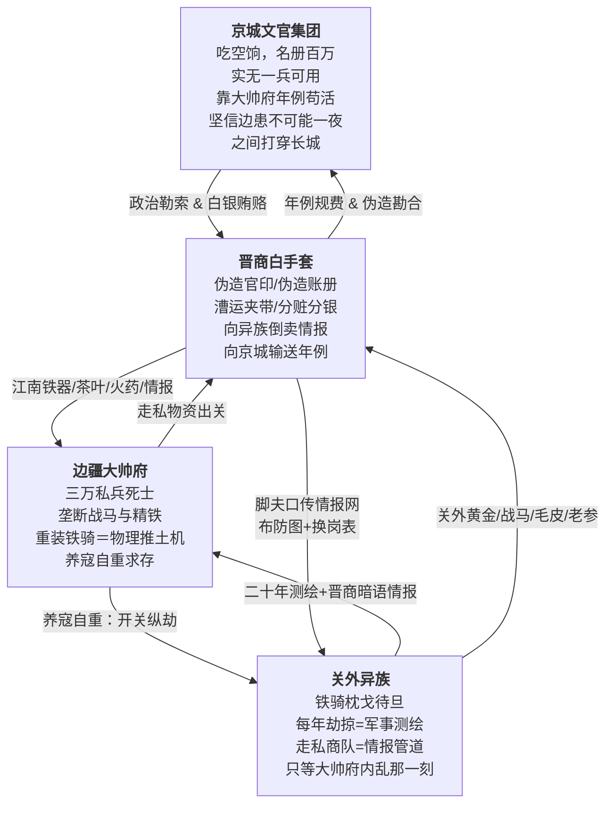

# 宏观故事线／大纲

## 核心基调：三重绞肉机

这是一个没有内力、没有仙人、没有奇迹的世界。重甲骑兵的冲击力由披甲重量与战马速度的乘积决定。红衣大炮的射程由硝石硫磺木炭的配比与炮管精铁纯度的公差带决定。暴雪造成的死亡由环境温度低于核心体温的温差幅度、风速导致的对流散热加速率、以及积雪深度对呼吸道的物理阻塞三重参数共同决定。一切悲剧是制度的。不写江湖儿女，写铁甲马蹄碾过冻硬的黑土时发出的闷响。不写忠奸分明，写每个人都做了在当时个人掌握的全部信息范围内唯一合理推演得出的自私选择，这些选择的乘积构成了一台巨大的、不会停下来问任何人同不同意就自行碾压下去的绞肉机。

### 三方底层冲突

- **京城文官集团**：兵部名册上九边八十三万战兵，杨嗣昌崇祯十年实核不过十七万，空饷率逼近八成。剩下的三成真兵，常年拿不到月饷（名义月饷一两五钱，实发不过四钱，且多为发霉陈米折色），沦为将领私田上的农奴。但这群文官的罪恶不是"通敌"，他们只是永远坐在燃着兽炭的暖阁里，真心实意地相信"九边重镇二百年来不曾有失，岂能一夜之间叫鞑子打穿"，相信自己凭借六科给事中的封驳权、内阁的票拟权、以及对大干儿子空口许下的承诺，就能在万里之外的棋盘上挪动棋子。他们的底色不是邪恶，是贪腐利益共同体滋养出的傲慢与对物理现实的全然无知。崇祯帝煤山自缢前以血书遗诏"诸臣误朕"，这四个字，就是这个阶层在整个晚明史上留下的最终评语。
- **边疆大帅府**：大帅仿李成梁旧制，把朝廷拨发给十万人的军饷吃下七成空额，用克扣下来的惊天财富豢养不足三万"家丁私兵"，顿顿有肉，人配双马，身披四十斤重的双层铁甲。一匹辽东战马驮着两百斤的铁甲骑士在平地上发起冲锋，其冲击力足以把任何一个没穿甲的流民连人带骨碾碎。但大帅不是不能荡平关外，是不敢。熊廷弼在万历三十七年就已经把辽东军阀的生存逻辑写成八个字："全镇军额，亡失几半"。李成梁用三十年的时间向所有边将证明了一个铁律：关外一旦太平，朝廷第一件事不是论功行赏，是撤藩、清算、罗织罪名赐死。于是养寇自重成了辽东将门唯一的生存之道。每年秋高马肥之际，开关放异族劫掠几座无关紧要的边村，用几百条底层人命换朝廷继续相信"边患未平、大帅不可轻动"。
- **关外异族**：他们不是配合大帅府演戏的演员。每一次"秋猎劫掠"都是军事测绘行动，通过晋商白手套在张家口私市中安插的谍报商人，他们比京城兵部更清楚长城沿线哪座墩台的守军已经八个月没领到饷银、哪座烽火台的火药受潮结块无法击发、哪段边墙的砖缝在去冬的冻融循环中崩开了三尺宽的豁口。皇太极在沈阳汗王会议上反复研究的不是"大帅愿不愿意开关放我们进来"，而是"京师文官分成几派、谁和谁不对付、崇祯最近又杀了哪个大臣"，他在找政治裂缝。异族等了二十年，等的不是大帅的恩赐，等的是一声脆响，那个叫"大帅府内乱"的瓷瓶在地上摔碎的声音。
- **晋商白手套（张家口网络）**：江南的茶叶和丝绸不可能凭空出现在塞外。真实历史上，乾隆十年《万全县志》记载了八个人的姓名，王登库、靳良玉、范永斗、王大宇、梁嘉宾、田生兰、翟堂、黄云发，"皆山右人，明末时以贸易来张家口，自本朝龙兴辽左，遣人来口市易，皆此八家主之。"这八家晋商以张家口堡（海拔七百二十丈）为枢纽，在京城文官、江南商帮、边疆军阀、关外异族之间充当了最关键的灰色中介层。没有这层中介，秀才和兵永远说不上话，账本里也永远不会出现真名实姓，每一条走私记录在账面上都干干净净，盖着兵部和户部的红印。

### 贯穿全文的"止血塞"与"刀"隐喻

| 概念 | 含义 |
|------|------|
| **止血塞** | 一切暂时维持生命、延缓崩溃的人与物，主母给的解药、女主的陪伴、大帅府对边疆的威慑、京城文官从大帅府收的贿赂、晋商白手套维持的走私网络、底层蚁穴每天领到的那碗米糊 |
| **刀** | 一切同时造成伤害又卡在命脉上、拔出即死的事物，主角体内的砒霜余毒与心脉旧伤、他卧底的双重身份、大帅府的军事垄断、晋商网络串联的整个腐败生态系统、这份他知道得太多却无人可说的真相 |

---

## 故事主轴

一个从陕甘白骨堆里爬出来的锦衣卫暗桩，被喂下慢性毒药钉在大帅府的军机文书位子上，在一层看不见的晋商白手套、两个女人、三方势力、一份永远查不到真名的走私账本之间，走完一场注定没有解药的倒计时。

---

## 三幕剧大纲

### 第一幕：废墟之上（初入蛛网）

核心主题：信仰的绞杀与伪装的生存。

#### 陕甘炼狱（序幕）

主角少年时从陕甘大旱与流贼过境后的万人坑里爬出来。那是崇祯十三年，整场小冰河期中最冷的一年，陕西全境八月降霜、九月大雪封山，延安府肤施县在册人丁八千九百口，十几年后清军入陕统计，全县仅存人丁一千二百口。他活下来靠的不是侠义传奇，不是高人授艺，是在腐尸堆里翻出半块发霉的干粮，在干涸见底的渭河河床底下用指甲刨出泥浆水，是在同官县县志记载的那种"一家八口，七日不举火，幼子先饿死，父母以幼子之肉喂其余子女"的绝境中，不知怎么没死的那个例外。

这段经历在他骨头上刻下了一种不可愈合的"废墟病"：他从此再也无法相信任何高高在上的口号。朝廷说"赈灾"，延安知府上报全府灾民八万口请赈粮三千石，朝廷拨粮后知府实发八百石，剩下两千二百石被层层扣尽流入黑市。流贼说"替天行道"，他们每打下一座县城先烧官府粮仓、再逼百姓亲手烧掉自家房子以断退路。将军说"保境安民"，边镇家丁吃着双饷去蒙古草原打秋风，把砍下来的平民人头当"流贼首级"回营报功，每颗人头换三两赏银。

他染上的废墟病只有一个症状：任何话，他不听人怎么说，他只看每句话背后那双手在摸什么东西。

被锦衣卫收编不是因为他有什么才能，纯粹是因为他在死人堆里活下来的那口气太长了，长得让北镇抚司负责挑人的百户觉得"这人耐杀，兴许能派上用场"。他没有正式官品，没有俸禄月粮，档案在北镇抚司的秘密名册上只有一个代号。像他这样的"暗桩"，明末锦衣卫在各地养了不知多少个，没有家世、没有派系、没有背景，唯一的身份证明就是单线联系的上线手中那份密令。上线一死、密令一烧，这个暗桩在法律上就不存在了。

他在锦衣卫的档案上还记着一道在辽东战场上留下的致命伤：一枚异族破甲箭的倒钩箭头，穿透护心镜后碎在了心包膜外侧。军医不敢开胸取箭，彼时没有能开胸的外科手术，只能靠金创药糊住伤口，让增生组织把碎铁裹死在血肉里。从此他成了半个废人，不能剧烈搏杀，不能纵马狂奔，稍微心率过快，那枚碎铁片就在胸腔里隐隐往主动脉方向推。北镇抚司把他派去大帅府当暗桩的时候根本没指望他能活着回来，他这样的暗桩是朝廷的"耗材"，派出去一个少一个，京城档案库里连他的名字都不会留。

#### 大帅府的算盘

京城要往大帅府安插监军。大帅府早就通过晋商在京城的内线拿到了备选名单，故意挑中了主角，一个无根无底、身负致命旧伤、随时可能自己死掉的废人。大帅府的算盘是：满足朝廷的面子，收下这个监军。反正他进了府就是个聋子和瞎子。然而大帅府的主母不是普通人。

#### 主母的獠牙

主角进府后，第一个看穿他真实身份的，是这位把面部表情控制得如同账本上一行死数的大帅主母。她没有杀主角。杀一个朝廷安插的人等于撕破脸。她用的是明末边镇真实存在的配方：砒霜微量慢性摄入，辅以炮制过的乌头提取物来严格控制主角的心率。旧伤是基础，心包膜外侧卡着碎铁片，心率失控则位移一毫米即死。乌头碱阻断心肌钠离子通道强行抑制心率。砒霜与酶蛋白巯基结合破坏细胞代谢。主母手中的中和药方以含硫矿物排砷、人参皂苷强心，但只是把两股相反的毒性暂时拉回钢丝般的平衡线上。每七天必须服药一次。主角不是被魔法控制，他是被一套精确算计的化学时间表囚禁了。

#### 军机文书：不贴身的风暴眼

主母把主角塞进了军机文书和走私账目总管的位置。大帅府治下的边疆是一个由"干儿子体系"维系的军事集团，大帅府秘传的虎狼药方会让习练者丧失生育能力，干儿子们没有子嗣、没有退路，只能把大帅当成唯一的义父。其中最得势的大干儿子掌管着最精锐的重装铁骑营。干儿子们对文书工作毫无兴趣，账本和公文在他们眼里是娘们和阉人干的活。这正是主母的精明之处。

军机文书这个位置的致命之处在于：主角每天经手各营人马实数、粮草库存、走私明细、以及大帅府与晋商白手套之间往来的全部账册，但他碰不到一兵一卒。干儿子们嘲笑他是"大帅府里最懂字的活死人"。

#### 女主的清醒

女主是大帅的独女。她不是傻白甜，她清醒得可怕。在这个去高武、满是铁甲马蹄和配给米糊的血色炼狱里，她每天看到来领配给的骨瘦如柴的流民，看到被干儿子们吊在大门前抽死的马帮脚夫，看到母亲把一个个活人当成耗材算计。正因为看得见，所以她痛苦。她只能在自己能力的极限里偷偷去当那个"止血塞"，瞒着母亲让丫鬟把米糊熬得浓一些，在马帮脚夫挨打时用大小姐的身份去喝退监工。

主母把解药故意让女主每天亲手送过去，她要同时驯化两个人。但她唯一没算到的是，在这个全是算计的泥潭里，这两个被迫每天相见的人，真的产生了东西。

#### 信仰绞杀

主角开始接触大帅府的账本和军务文书。他查得越深，就越接近一个让他彻底崩溃的真相。账本里写着"某月某日，张家口马市，收晋商王某茶砖三千担，折银若干"，但永远不写这些茶砖是在哪里、用谁的官印通关的。他把账本上的日期与朝廷驿报上的官员调任日期对照。他发现了那个让他手脚冰凉的模式：每次京城吏部有高官外放或升迁，大帅府对张家口的"特别支出"就会在三个月后出现一笔精准到诡异的增量。最后他拼出了最致命的那块拼图：大帅府是汉奸。但如果拔掉大帅府，朝廷根本没有能力挡住关外的铁骑。更荒诞的是，他效忠的朝廷、他背后代表的文官大义，和眼前这个他奉命要摧毁的军阀大帅府，根本就是趴在陕甘百姓尸体上分食人肉的同一个怪物的两颗脑袋。

#### 双向救赎

主角和女主在这座钢铁坟墓里互为对方唯一的活人。不是一见钟情的浪漫，是两个被同一座机器碾压的人，在齿轮缝里互相闻到了对方还活着的体温。

---

### 第二幕：风暴升级（南北断线）

核心主题：棋盘掀翻，各方极限施压。

大帅府利用女主的婚姻向京城发动极限施压。联姻提案在字面上是"效忠皇恩，请赐良缘"，在字底下是"不补军饷，异族今秋过不了长城这道坎不是大帅府的事"。京城文官集团炸锅，大帅府的年例银子养活了半个京城的权贵，但如果同意联姻等于朝廷在法理上承认大帅府的独立王国。

文官集团找到的突破口是大干儿子，他在这套绝嗣体系里付出了身体的代价，而大帅却有自己的亲生女儿。朝廷密使通过晋商白手套的秘密渠道开出条件：京城承认他为边疆新帅，军饷翻倍。大干儿子提了三个条件：拖欠军饷必须先补足，关内增派实兵五万驻防各口，派文官亲赴张家口密谈留把柄。他的算计是精密的，他不是要毁掉边疆防线，他是要在旧的权力结构垮塌后由自己来当新的权力核心。他唯一算错的东西是：异族等这一刻已经等了二十年。

第二幕中段，朝廷使出断粮封锁，以"清查空饷"为名切断所有拨往大帅府辖区的粮饷和火药补给。这不是通敌，是傲慢。文官们坐在京城的暖阁里真心实意地相信关内还有"百万可调之兵"。大帅府内部开始出现裂痕。

女主在这一幕面临了人生中第一个真正属于自己的选择。主母问她："你爹每年秋天开关放劫掠，你告诉我，你爹是坏人，还是好人？"女主回答不上来。这也是整个世界的终极困境：没有好人坏人，只有代价和谁来付代价。

主角在这一幕被撕裂到了极限。朝廷重新联系上他，新指令是盗出大帅府通敌铁证。但他同时也发现了一个更深的秘密，关外异族一直在通过晋商商队收集明军布防情报，每次来袭的路线都精准地绕开了有实战能力的营寨。这不是在演戏，这是在用十几年时间做最精密的军事测绘。他做出了一个第三者看不懂的决定：开始同时欺骗两边。主母注意到了他修改的假账册中故意留下的漏洞，她没有揭穿。她微不可察地点了点头。

---

### 第三幕：雪崩溃灭（大出血落幕）

核心主题：一切止血塞同时失效。

一场百年不遇的大暴雪切断了大帅府各营寨之间的一切通讯和补给。坝上与坝下之间六十里隘道积雪深达两米以上。骑兵无法在及膝深的雪中奔驰。大干儿子等的就是这个窗口，但他不是要发起骑兵冲锋，他是要利用暴雪把所有人的视线压缩到三步以内的封闭空间来实施软政变：控制粮仓、火药库、水源和马厩。他的步兵在暴雪中反而比骑兵有更强的行动力。

大帅没有束手就擒。在暴雪中调不动成建制的骑兵，他只带着最后百来个亲兵在齐腰深的雪中摸向叛军据点。一场在能见度不足三步的白毛风中靠刀鞘和拳头进行的混乱近身械斗，大帅被短刀刺穿肝脏，失血加失温冻死在雪地里。帅印冻在僵硬的手指上，掰不下来。

主母在大帅死讯确认后做的三件事，烧掉全部晋商密档，把最后一撮药渣留给女儿，灌下与沈节同配方但剂量大得多的砒霜乌头复合剂。

配给制瓦解。底层蚁穴在暴雪中断粮断柴断药，木牌还在墙上，墙下已经没人了。监工的皮鞭永远不会再响了，监工自己也饿死在了土屋里。来年春雪化后，这一带方圆几十里全是白骨。

关外异族利用二十年测绘成果，坝上到坝下六百三十丈的海拔落差，在十二个时辰内从封冻的河面冰层上完成闪电俯冲。坝下的守军连烽火都没点燃，木炭在长达两个月的封锁中早已烧光。

女主在主母废墟的焦黑泥土里用指甲抠出最后一撮混着炭灰的药渣，塞进沈节嘴里。药渣不是解药，它在物理上只能推迟崩溃的顺序，给他半个时辰。沈节在回光返照的半个时辰里坦白了一切。她听完后发出荒诞的笑声，然后说了三个字："我知道。"不是原谅，是她在很久以前就看穿了蛛丝马迹，却选择不问不说不去查证，在这座所有人都对她说谎的府邸里，唯一一个让她觉得自己还是人的人。

沈节死于砒霜乌头联合毒性与主动脉破裂。李观照从他怀里掏出那份被体温捂得微微发潮的私人手稿，不能翻案的东西，塞入怀中。背对燃烧的大帅府，面朝坝上方向，走入风雪。没有回头。

---

## 伏笔与回收追踪

| 伏笔 | 安置位置 | 计划回收节点 |
|------|----------|---------------|
| 主角心包膜外的箭头碎铁片（辽东旧伤） | 序幕 | 终幕：心率紊乱+组织肿胀→碎铁片物理位移一毫米→刺破主动脉→大出血 |
| 砒霜+乌头复合毒的作用机制 | 第一幕 | 终幕：停药后两个毒性的平衡同时崩溃 |
| 晋商白手套的独立账外记录 | 第一幕 | 第二幕主角拼凑推理的基础；终幕：主母烧掉了原始账册但主角保留了自己的私人手稿 |
| 异族二十年利用走私商队进行军事测绘 | 第一幕/第二幕 | 第三幕：异族在十二个时辰内精准穿越边墙薄弱点 |
| 大干儿子的软政变计划 vs 实际连锁反应 | 第二幕 | 第三幕 |
| 吃空饷与真实兵力 | 第一幕 | 终幕：关内"百万大军"没有任何一支援军出现 |
| 女主觉察主角身份 | 第一幕/第二幕 | 终幕："我知道" |
| 配给制体系的脆弱性 | 贯穿 | 第三幕暴雪中断配送→边疆蚁穴雪崩式崩溃 |
| 主母烧毁全部晋商密档 | 第三幕 | 间接导致女主手上那份"私人手稿"成了唯一残留的真相记录 |

---

## 创作原则

1. 不赋予任何角色超自然力量。虎狼药方中附子的乌头碱阻断心肌细胞膜Nav1.5钠通道。砒霜与巯基酶硫原子形成共价结合。铁骑威力来自披甲重量与战马速度的乘积。暴雪致死率由环境温度与核心体温的温差幅度、对流传热速率、积雪对呼吸道阻力的三重参数决定。
2. 每一个政治决策同时记录其利益和代价，两个数字放在同一行。
3. 底层视角至少占整体叙事的五分之一。不在蚁穴边民身上加注任何叙述者定调词。只记录米糊浓度、木牌霜层厚度、土墙裂缝宽度、暴雪第四十四天尚未死亡的人数。
4. 悲剧的成因不是任何单个角色的道德失格。三方在同一制度框架内各自精确推演、各自用自身视角下的最优解互相抵消、共同锁死为零和博弈。李国勇死在他的政变计划在纸面上每一步都有军事合理性，但他不知道田逢吉的脚夫口传情报网比大帅府的信使快了整整三天。信息差。不是道德差。
5. 李观照的终局状态不是复仇。她带着沈节留下的私人手稿走入风雪。
6. 不写英明钦差从天而降破局。崇祯十七年，煤山上只换到一棵歪脖子槐树。

---

## 全卷章节规划

全卷预估 **135 章**，按每章 2800-3200 字计，总字数约 **38 万至 43 万字**。沈节于第 130 章死亡，与异族铁骑踏碎大帅府正门发生在同一时辰。第 131-133 章为极简落水期：大帅头颅被京城来使割下传首九边（仿熊廷弼结局），李观照取手稿孤身走入风雪，与传首队伍在同一条路上反向而行。全书在第 133 章戛然而止，手稿朝北，头颅朝南。

**章间张力曲线原则**：全卷必须像心跳，有峰有谷。三种特殊章类型在全卷中穿插分布，各司其职：

- **⊗ 呼吸章**：每三到四章高压后插入一章。不引入新伏笔，不解决旧冲突。叙事密度从情节信息切换到感官信息，仅通过日常动作和无目的的感知还原世界的物理质感。
- **☀ 暖章**：每十到十二章后必须有一章。角色在那一刻确实不是在承受任何东西，只是活着。可以是一个不好笑的笑话、一颗冻栗子、一片落下来的树叶、一窝被灶台余温救活的冻僵老鼠。暖章的功能是让读者重新相信这个世界还有值得守护的东西。
- **♡ 亲密章**：分布在第一幕到第三幕，一砖一瓦地让读者确认沈节和李观照确实相爱了。不是表白，不是工业糖精。通过物理资源的让渡（干枣、碳条的位置、一块旧布）、共同沉默中被双方默认的谎言（看到竖线后翻页）、以及极度克制但无法完全克制住的肢体接触（手覆在砚台凹痕上、她睡着时他把灯捻拨短）。亲密章让读者知道这两个人之间的东西是值得用命去换的。

第三幕严禁出现伪呼吸章。在暴雪封城、政变、饥饿和屠杀的连续高压中，不能再以"无名老妇含着木牌等死"或"爆炸废墟上的落雪"作为呼吸，那是溺水，不是呼吸。第三幕的呼吸必须是不可理喻的生机：蔡婆在灶台余温旁救了一窝冻僵的老鼠；两个逃亡的底层士兵在雪窝里分吃一块不知道谁掉的冻干粮；沈节在回光返照的最后半个时辰里忽然对李观照说了一句和眼下的死亡完全无关的、关于那棵老槐树和裹枫叶的栗子的话。在最冷的冰地里写一丁点火星。

扩容策略：严禁注水。所有新增章节点位全部来自真实物理与社会阻力的展开。同时严格执行章节级张弛节奏，每三到四章高压情节后插入一章呼吸章（标⊗），让读者在连续爬坡后拥有消化乳酸的空间。呼吸章不引入新伏笔、不解决旧冲突，仅通过日常动作和无目的的感官感知来还原世界的物理质感。

### 全卷子弧结构总览

| 幕 | 子弧 | 章数 | 核心物理推进 | 呼吸章 |
|----|------|------|-------------|--------|
| 一 | 1A 陕甘炼狱→锦衣卫暗桩 | 1-5 | 万人坑、北镇抚司训练、辽东碎铁片、档案标签、出发前夜 | ⊗5 |
| 一 | 1B 入府→主母识破→喂毒 | 6-12 | 进大帅府、主母识破身份、砒霜乌头七日周期、军机文书任命、初访张家口马市 | ⊗9 |
| 一 | 1C 府内地理→干儿子生态 | 13-18 | 大帅府物理地图、配给制堂口、干儿子体系、李国勇首遇、边民冻死 | ⊗14 |
| 一 | 1D 账册解密第1期→信仰绞杀 | 19-28 | 三处日期巧合、数目字交叉比对、田逢吉暗账、北字号甲锁定、碎铁片第1次位移 | ⊗23 ⊗26 |
| 一 | 1E 双向救赎→碎铁片首次位移 | 29-35 | 拆量斗、名字、大帅出场、李国勇试探、沈节发现拔掉大帅府京城挡不住关外铁骑 | ⊗31 ⊗34 |
| 一 | 1F 第一幕收束 | 36-40 | 主母召见、沈节决定潜伏、李观照发现砷线、账册第十四页被风吹开 | ⊗39 |
| 二 | 2A 联姻提案→京城博弈 | 41-53 | 联姻折子起草、京城恐慌、文官内部派系、锦衣卫密令、李国勇被接触、三条件谈判、联姻驳回 | ⊗45 ⊗50 |
| 二 | 2B 断粮封锁逐周→仓储危机 | 54-63 | 配给浓度逐周递减、蚁穴饥饿扩散、死婴事件、沈节核算豆料只够三天半、李国勇密封三座粮仓 | ⊗57 ⊗62 |
| 二 | 2C 双面欺骗→女主暗中活动 | 64-73 | 沈节假账册漏洞、主母默许、李观照接触旧部、田逢吉暗账续编、北字号甲锁定 | ⊗67 ⊗71 |
| 二 | 2D 暴雪前兆→各方收束 | 74-80 | 大帅病发、李国勇营中串联、碎铁片第2次位移加速、田逢吉收尾、暴雪降临 | ⊗76 ⊗79 |
| 三 | 3A 暴雪封城→生理恶化 | 81-92 | 通讯断绝、沈节停药逐日、蚁穴首周冻饿、李国勇铅封启封、三座粮仓逐一控制 | ⊗84 ⊗88 ⊗91 |
| 三 | 3B 政变逐节点展开 | 93-106 | 水源控制、马厩镇压、大帅最后调兵、雪中械斗、大帅之死 | ⊗96 ⊗101 ⊗104 |
| 三 | 3C 主母焚档→药渣回光→坦白 | 107-114 | 主母服毒、李观照抠药渣、回光返照的坦白、\"我知道\" | ⊗109 ☀111 |
| 三 | 3D 终极十二时辰，多线并进合龙 | 115-130 | 蚁穴灭绝与异族俯冲交替剪辑；沈节停药逐日恶化；大帅府被破；沈节在第130章与异族马蹄踏碎门槛的同一时辰咽气 | ☀117 ⊗121 ⊗125 |
| 三 | 3E 极简落水期，传首九边 | 131-133 | 大帅头颅被京城来使割下传首九边（仿熊廷弼），李观照取手稿逆着俯冲路线走入风雪。手稿朝北，头颅朝南。仅3章 | — |

### 第一幕：废墟之上（第 1-40 章，约 12 万字）

#### 子弧 1A：陕甘炼狱 → 锦衣卫暗桩（第 1-5 章）

| 章 | 标题 | 视点 | 核心物理事件 | 章末钩子 |
|----|------|------|-------------|---------|
| 1 | 万人坑 | 沈节 | 渭河河床刨泥浆水，指甲翻裂。腐尸堆翻出发霉干粮 | 锦衣卫百户的手伸到他面前，"怕不怕死。""怕。但我更怕饿。" |
| 2 | 暗桩 | 沈节 | 基本识字、跟踪、格斗。被老暗桩打断三根肋骨 | 百日训练结束。档案标签：无名暗桩，耗材，无家世无派系 |
| 3 | 碎铁入体 | 沈节 | 破甲箭穿透护心镜。箭头碎在心包膜外侧。军医不敢开胸 | 档案备注：身有宿疾，不宜外勤。适合低压文书类潜伏任务 |
| 4 | 纸上法上 | 沈节 | 百户带他去查抄一个"通敌"商人家。抄出白银六百两，百户私吞三百两，上报兵部"无所获" | 沈节在回程路上把这事记在心里，不写在纸上。这是他学的第一课：纸上的东西和法律上的东西是两回事 |
| 5 | 最后一夜 | 沈节 | 百户把潜伏指令塞进他手心，一张叠了四折的麻纸。沈节在油灯下看完，记住了每一行，然后把纸放进嘴里嚼烂吐进炭盆。百户看着，"你是真的怕死。"沈节说"我是真的不想白死。" | 炭盆里的纸灰在那一夜的最低温中慢慢冷却。第二天早晨，他骑上马，往北，大帅府方向 |

#### 子弧 1B：入府 → 主母识破 → 喂毒（第 6-12 章）

| 章 | 标题 | 视点 | 核心物理事件 | 章末钩子 |
|----|------|------|-------------|---------|
| 6 | 十息 | 沈节 | 被安排在军机书房。主母隔桌看了他十息。桌面油灯，灯捻焦了半截，没人拨 | 主母开口第一句话，"你在锦衣卫的代号是什么" |
| 7 | 阵亡录 | 沈节 | 主母把一份辽东阵亡名录放在他面前，问他认不认识上面的人。他认识三个。主母说"你认识，你在辽东待过。你档案上写的不是这一条。"沈节没有回答，她知道了一个他档案上不该有人知道的事实。他已经暴露了 | 主母没有杀他。她把阵亡名录从他面前抽走，换了一份药方。药方上的第一味药，砒霜。她说"你识字，自己看。"他没有把目光从药方上移开，但他的手，放在膝盖上，停了一息没动 |
| 8 | 第一碗药 | 沈节 | 主母亲自端来第一碗药。心率从七十跌到四十五。她把药碗放在他面前，没有催促，只是坐在对面等他自己端起来喝 | 李观照出现在书房门口。手里端着第二碗药。主母说，"以后每天早上，小姐来送" |
| 9 | 末梢的冷 | 沈节 | 心率从七十跌到四十五。四肢末梢开始发冷，从指尖往手腕爬。他把手放在账册封面上，纸的温度比手的温度高，说明手已经比室温低 | 门，没有关紧，他听到走廊里主母对李观照说，"以后每天早上，同样的时辰，你送。"李观照没有回答。她只是端着刚才那个空碗，站在走廊里，碗底还有一小圈残渣 |
| 10 | 活死人 | 沈节 | 主母当众宣布"沈休言掌管全部军机文书与走私账目"。干儿子们嘲笑，"大帅府最懂字的活死人" | 李国勇从人群中看了他一眼，"你的脑袋比我们粗人金贵。"不是夸奖。是定价 |
| 11 | 墙缝 | 沈节 | 被安排在军机书房隔壁一间小间，原是堆旧账册的库房。他把床铺好，把唯一一盏油灯放在床头，然后花了第一天晚上把房间所有角落检查了一遍，没发现监听孔，但发现北墙有一道很细的裂缝，刚好够把一张叠好的麻纸塞进去 | 他把潜伏指令从炭盆的灰烬记忆里重写在了唯一一张新麻纸上，塞进墙缝，然后在裂缝上抹了一层旧泥浆。泥浆干了以后和墙面一模一样 |
| 12 | 张家口 | 沈节 | 以"熟悉大帅府业务"为名随商队去张家口。他在马市上看到了田逢吉的晋源号商队，看到了他们是如何在官市和私市之间切换，在合法与不合法之间有一条只有自己人才能看到的暗线 | 回程，他骑在马上，在心里把今天看到的每一个通关步骤都重走了一遍。每一步都有合法的红色官印，每一步的合法下面都压着一层不合法。这两层之间，是田逢吉一个人的暗账，他一个人，用这一层暗账，把四方的命脉都串在一起 |
| ⊗ | 日常章，大帅府厨房的一日 | 沈节 | 沈节被安排去厨房取药。厨房在大帅府西北角，灶台常年不熄火。熬药的老妇姓蔡，六十多岁，左手中指缺了第一节，年轻时候在大帅的随军灶上被砍马草的铡刀压断的。她每天寅时三刻起来熬药，先熬沈节那份砒霜乌头复合剂，熬完把药渣倒在厨房后门外的一棵老榆树根下，药渣堆了一层又一层，树下那片土已经被几十年的药渣浸透了，砒霜里的东西改变了土的质地。冬天雪落上去化得比别处快，蔡婆自己知道，她每天倒完药渣以后都会看到，同一场雪，在别处还白着的时候，在这棵树下已经变成了灰褐色的一小片湿土。蔡婆倒完药渣回来，用同一口瓦罐熬下一锅，是干儿子们的虎狼药，比沈节的剂量大三倍，熬的时候她戴着一副用猪皮自缝的厚手套，不是怕烫，是怕虎狼药的蒸汽从皮肤渗进去，她见过一个之前熬药的学徒，熬了两年半，手背上的血管开始自己往外鼓，不是肿了，是虎狼药长期微量接触导致的静脉壁弱化，后来血管在某个冬天自己爆了，不是大出血，是皮下渗血，整个手背变成紫色。蔡婆从那以后自己熬，不带学徒 | 沈节端着自己的药碗从厨房走回书房。路上经过马厩，一头灰色战马正卧在干草上，鼻子里呼出的白汽很慢很匀，睡着。他端着碗站了一息，看着马在睡，然后继续走回书房。药，今天这碗，比昨天烫了一点。蔡婆今天多煮了一沸，不是对沈节有特别的感情，是蔡婆的习惯，每逢初九多煮一沸，她丈夫是初九死的，在萨尔浒，她多煮的那一沸，是给萨尔浒的所有人，不只是她的丈夫，也包括那些她没见过的，她不知道名字的，辽东的，冻死的，饿死的，被箭射死的，被马踩死的，所有在萨尔浒没回来的人，每人，一沸。沈节不知道这个，他只知道今天的药比昨天烫了一点，他把碗放在桌上等它凉，凉的时候他看着热气在碗面上，升——散，和每天一样，然后喝，喝完开始翻今天的账册 |

#### 子弧 1C：府内地理 → 干儿子生态（第 13-18 章）

| 章 | 标题 | 视点 | 核心物理事件 | 章末钩子 |
|----|------|------|-------------|---------|
| 13 | 府内地图 | 沈节 | 军机书房→堂口发粥→后院马厩→坝下粮仓外墙。在心里画地图，每条路到最近出口的步数 | 他发现堂口土墙上挂满木牌，每张牌上刻着人名。有些裂了，裂掉的还挂在墙上。人不知道还在不在 |
| 14 | 堂口的鞭 | 沈节 | 蚁穴边民排队领米糊。监工用皮鞭量弯腰幅度。弯腰不够低，鞭。太低，也是鞭 | 李观照在堂口。她让丫鬟把量斗里的粥压得比平常实了一点点。监工没发现。沈节发现了 |
| 15 | 干儿聚 | 沈节 | 三十多个干儿子围坐三张条桌。李国勇坐在主位旁边，大帅那天没来，主母也没来。整张桌子上，沈节是唯一不动刀只动笔的人 | 李国勇敬了他一碗酒，"沈休言，以后大帅府的账目全在你手上，我们这些粗人，靠你算清楚每一分银子。"喝完，把碗底翻过来，空的 |
| 16 | 绝嗣册 | 沈节 | 沈节开始整理各营人马名录，发现三十七个干儿子中，十五个受过重伤，五个已经不再上马，两个在去年冬天因虎狼药的心脏副作用死在马背上。活着的人，被李国勇用"绝嗣共同体"锁死在同一张饭桌上 | 他整理完名录，在最后一行旁边画了一个小圈，圈里是空着的。这个空位，是给"还不知道自己会取代李国勇的某一个更年轻的干儿子"留的。李国勇还没意识到他自己也在这个循环里，他只是这一张名单上的一个名字，和前面死掉的那两个名字没有本质区别 |
| 17 | 铜镜前 | 李国勇 | 李国勇独自在营房里，对着铜镜看自己脖子上那条铅封钥匙。他想起来自己十七岁那年，亲爹把他送到大帅府换了二十两银子和半年军饷减免。他爹在接收文书上按手印的动作和卖掉一匹母马时一模一样 | 他把钥匙从脖子上取下来，放在桌上，看了一息。然后又挂回去。钥匙的金属在胸口，隔着皮袄，有一个很轻的、冰凉的、接近体重的压力 |
| ⊗ | 日常章，马厩的黄昏 | 沈节 | 沈节来大帅府两个月后养成了一个习惯：每天傍晚算完当日账目后，走到后院马厩旁边的柴垛上坐一会儿。柴垛是桦木劈的，已经晒了三个秋天，木质纤维在冬天收缩后缝隙很大，坐上去会听到木头在屁股下面的轻微挤压声。他每天坐在这里看马，看马吃草料的节奏，看马伕老周给战马洗蹄，看马之间互相蹭脖子，不是刻意观察，是他需要每天在账册之外有一个固定的时间段，什么也不想，只是看马。老周是辽东老兵，万历年间的夜不收，和沈节在辽东是同一种差事，但老周不认识沈节，沈节也不说。老周只是每天黄昏在马厩扫地的时候看见这个文书坐在柴垛上，从来不带纸笔，就在那坐着，看马。有一天老周扫完地以后也坐上了柴垛，坐在沈节旁边，两个人并排坐着，隔了大概一个拳头的距离，老周从怀里掏出两颗冻栗子，自己咬了一颗，把另一颗往沈节那边，放在柴垛上，没递，就放在他们中间，那个拳头宽的空隙里。沈节过了一会儿，把那颗栗子拿起来，咬开，冻栗子很硬，咬开的断面是锯齿状的，很甜。两个人坐在柴垛上，马厩方向，一头灰马靠在栅栏上，闭上眼，睡——呼吸在冷空气里凝成一小团很快就散掉的白汽，很慢，很匀 | 天黑以后沈节回到书房。手指上还沾着刚才那颗冻栗子在咬开时弹出来的一小粒碎壳，很细，粘在拇指的螺纹上。他在油灯下看着这粒碎壳，它刚好卡在拇指的指纹纹路里，他没有马上把它吹掉，而是看了一会儿，这颗冻栗子，来自一棵他不知道长在哪里的栗子树，被老周不知道从哪里摘到，在他嘴里，在冻硬了的甜味里，他忽然想起自己在锦衣卫训练营里，有一年冬天，和他同期的另一个暗桩，不知道真名，代号"雀"，在辽东冻掉了三根脚趾，后来因为走路瘸，不适合外勤，被打发到南京档案库，再后来，不知道。他都不知道，雀——当年在营里，冬天，有没有吃过冻栗子 |

#### 子弧 1D：账册解密第1期 → 信仰绞杀（第 19-28 章）

| 章 | 标题 | 视点 | 核心物理事件 | 章末钩子 |
|----|------|------|-------------|---------|
| ☀ | 暖章，立冬前最后一个暖日 | 沈节/李观照 | 农历十月初三。立冬前最后一个能穿单衣在户外久坐的日子。李观照把药碗端到书房时发现沈节不在屋里，他在后院柴垛上坐着，今天没有看马，在看天。天很蓝，不是那种被雪洗过的冷蓝，是秋天的，温蓝，云很少，很薄，被风吹成一丝一丝的。她端着药碗走过去，把碗放在柴垛上，自己也在旁边坐下来，两个人并排坐着，隔了大概一个拳头的距离。他接过药碗，喝——喝完，没有马上回屋的意思。两个人就这么坐了一会儿，不是不说话，是在等同一件事发生。过了大概一炷香，后院那棵老槐树的最后一片叶子，掉了，不是被风吹掉的，是叶柄自己枯透了，在枝上挂了大半个秋天，今天，自己松了，落下来的弧线，不是直线，是侧着身子，在空中翻了大概三圈，落地，背面朝上，浅灰，和正面不一样，正面已经晒成了深褐色。两个人同时看到了这片叶子。然后李观照说了一句话，这句话不是关于大帅府，不是关于账册，也不是关于药。她说"小时候，每年这棵树掉最后一片叶子的时候，蔡婆会在灶台后面给我烤一颗栗子，不是冻的，是刚摘的，裹了一层枫叶，烤——皮自己裂开，掰开，里面的栗子肉，有一点，是透明的，不是生的那种透明，是烤过之后，热——让它变成了半透明，像——琥珀，但不是黄的，是更浅一点，形容不出来。"沈节听完，说"枫叶。糖分渗进栗子皮，烤的时候，焦了，所以颜色变了。"李观照听完，没点头，也没说对或者不对，只是看了他一眼，嘴角动了一小下，不是笑，是在努力忍住不笑，但没忍住，笑出来了，很短，很短的笑，然后她把目光从他脸上移开，继续看那棵已经一片叶子都没有的槐树。树上，有几只麻雀，在空枝上，蹲着，挤在一起，互相啄对方的翅膀底下，找虫子，没找到，然后继续挤，不是冷，是习惯 | 那片叶子落了以后的第三天，暴雪下来了。他们两个，后来谁都没有再提过那天在柴垛上说了什么。但沈节在那天晚上，在整理账册的时候，忽然发现，自己在翻到每一页的末尾时，会用拇指，在纸面上，轻轻，划一道弧，和那片叶子落下来的弧度，是一样的。他自己不知道。直到某天晚上，他翻到第十几页，拇指又划了一道，然后停住了，低头看着自己的手，没有想什么，只是把拇指，放在那页的边角上，没有动，然后翻过去了 |
| 19 | 初逢巧合 | 沈节 | 账册第十四页，崇祯十四年九月，张家口马市支出。吏部北字号甲调任日期相差十日。第一次巧合 | 碎铁片在安静状态下微微推了一下。不是心率快了，是他盯着那个日期看了大概六十息。心跳没变。碎铁片自己偏了 |
| 20 | 碗底的枣 | 李观照 | 药碗放在案上。"趁热喝了。"问，"你在锦衣卫去过江南没有。""没去过。" | 她走后沈节发现药碗下面压着一小片干枣。不是主母药方里的。是李观照自己加的 |
| ♡ | 暗账关灯，第一根碳条 | 沈节/李观照 | 沈节在某天深夜核对暗账时油灯捻子烧完了。他在黑暗里摸，摸不到新捻，摸到了李观照上次送药时留在桌角的一根新碳条，她把碳条放在一个固定的位置，每次都是，桌角，左上方，压在砚台下面，不是怕掉了，是怕他夜里摸不到。他今天不用碳条，他在心里把账目从头到尾算完，然后把碳条，放回原处，指尖在碳条和砚台之间的空隙，多停了一下，不是拿，是放回去的那个动作，放回去，比拿起来，重一点点，因为放进那个她每次放碳条的固定位置，需要对准，那个位置，砚台底部的凹痕，是她的指纹，按了几十次，在木桌上，压出来的，他的指尖，放回去的时候，正好，覆在，那个凹痕，上面，不是按，是覆，他的指纹，是另一套纹路，完全不一样，但他，在那道凹痕上面，覆了好几息，才把手拿开。第二天，她来送药，看到砚台下面的碳条，没动。但她把碳条，从砚台下面，抽过来，握在自己手里，握了几息，然后又放回去，放在同一个位置，继续压在砚台下面。两个人都没有说。但碳条在那个砚台下面，从那天起，位置每天都被调整，她来的时候，往左边挪一分，他晚上放回去的时候，往右边挪一分，砚台下的木桌面，在那天之后，有了一小段，很细的，像碳条划过但又不是碳条，是被两个人各自的，指纹和体温，反复，在同一处，来回，磨出来的，一道，几乎，要变成，新的，凹痕，但还没有，还差几天 | 那道还没成型的凹痕，后来，在暴雪中，被烧成炭的桌面，物理上不存在了。但他们两个自己都不知道，这道凹痕，和账册第十四页翘了不到半分的那道纸边，是同一张时间表上的两个坐标，一个在桌面，一个在纸面，互相不知道对方存在，但都被同一个人的拇指和同一个人的指纹，在同一段日子里，反复，压着 |
| ⊗ | 呼吸章，沈节独自在书房听夜 | 沈节 | 碎铁片今晚没推。他把账册合上，坐着，听着隔壁账房的算盘，没人，空了，但算盘还在，风从窗缝灌进来，珠子在竹签上，自己，滑了一下，响了一声，在黑暗中，很脆，很短。他等了一会儿，没再响了，然后把账册第十四页翻到，拇指，在那个"支"字被血洇掉又干缩了的位置，按了一息，没想什么。然后翻过去了 | 他翻过去以后，又翻了回来，不是忘了什么，是这一页，今天比昨天，又翘了一点点，不是湿度，是他翻开的次数，比昨天又多了一次，每一次，都会把纸面的纤维，往同一个方向，弯一点，不太多，但他如果继续翻下去，继续每天翻，翻到这个冬天结束，这一页，可能会自己，从装订线，裂开，不是撕，是被一个人的手指，反复，停在同一个位置，停多了，纸自己，会从那个位置，开始，不再属于这本账册 |
| 21 | 日期成线 | 沈节 | 他发现大帅府正账中"张家口马市支出"的每一笔，在日期上，都能找到一个对应的吏部官员调任时间。间隔均匀，三个月一次，精准如刻漏 | 他把这些日期抄在麻纸上，三行。三行日期的笔迹，各有新旧，在纸面上排成一条线。这条线，他还没画完，但在心里已经画到底了 |
| 22 | 八千四 | 沈节 | 正账登记粗布三千匹，需两辆骡车。过关清单登记骡车八辆。另六辆，据入库铁料反推，藏精铁约八千四百斤。差额误差不超过百分之一点二 | 他在正账该条目下方用指甲划了一道竖线，竖线两端在纸纤维上微微裂开了细丝 |
| 23 | 第一刮擦 | 沈节 | 连续两个晚上没睡，在翻大帅府与晋商的全部往来记录。天快亮的时候，碎铁片的位置偏了一下，不是痛，是胸腔里有一个很轻微的"刮了一下"的感觉，像指甲在纸上划过 | 他停了，手压在左胸口，等了大概十息，心跳恢复了，但碎铁片没回到原来的位置。这是第一次，偏了以后没复原 |
| 24 | 多一碗 | 李观照 | 她早晨送药时发现沈节案上的油灯捻子已经烧完了，灯盏是冷的，说明他至少一个时辰前就灭了灯。她说"你没睡。"他说"账册太多了。"她把药碗放下，回身又端了一碗米糊进来，放在药碗旁边。"先吃。吃完再翻。" | 沈节拿起那碗米糊，她站在门口，没走，背对着他，说了句，"那行日期，你画了线，我看过了。"她没转身。说完就走了。沈节手里那碗米糊，还没喝，已经不太热了 |
| 25 | 第一道线 | 沈节 | 三行日期。三支不同的笔。第一行，上月抄。第二行，半月前。第三行，刚才。墨迹的新旧在纸面上排成了一条线，每行日期之间的间隔都在均匀缩短，不是巧合，是有人在持续地、按固定节奏地在做某件事 | 他在第十四页日期旁用碳条画了第一道竖线。墨迹干缩成弯的细线。没有在旁边写任何字。画这道线已经是一个决定了，只是他还不知道这个决定的内容是什么 |
| 26 | 田逢吉来 | 沈节 | 田逢吉穿补丁布袍踏进大帅府，说的每一个字都像聊天气。"今年野狐岭的雪比往年来得早。商路不好走。"沈节同时在心里把"嘴面"和"嘴底"拆成两条线 | 田逢吉走之前看了他一眼，评估后决定，这个文书暂时不需要封口费，他还不知道自己看到了什么 |
| 27 | 二次估量 | 沈节 | 田逢吉展开折子，"北字号甲，九月规费，银八百两正。"沈节同时在脑内把铁料差额白银一百七十六两往这八百两上一贴，差了一个零头 | 田逢吉走前又看了他一眼，比上次多停了一息。商人评估交易对手，第一次扫一眼，第二次停一息，第三次，可能就是开口谈价 |
| 28 | 零点零一 | 沈节 | 从里面推。痛感没到，心率两息后才被拉上去。手压左胸口，感觉到胸壁内部的微震 | 在黑暗里算出每息位移约零点零一毫米。然后想，还能活多久。算不出来 |

#### 子弧 1E：双向救赎 → 碎铁片首次位移（第 29-35 章）

| 章 | 标题 | 视点 | 核心物理事件 | 章末钩子 |
|----|------|------|-------------|---------|
| 29 | 互为名字 | 李观照 | "观照是我娘起的。冷眼看穿。慈航是我自己起的。慈悲为舟，济度苦海。"前半句没看他。后半句看了 | 沈节说"休言，千言万语，不如休言"。她听完点了下头。没追问。收刀了 |
| 30 | 裂鼓 | 李承荫 | 左眼被铁砂打坏，畏风流泪看人永远像审视叛徒。右手食指中指缺失，握笔只能写拳头大字。心脏跳动有喀嚓音，军医说像裂了缝的鼓 | 大帅说"你是京城派来的。你的一切文书我都会过目。不是不信你，是京城从来没有值得信的人。"说这话时没看沈节。看的是账册 |
| 31 | 沙盘汗渍 | 沈节 | 大帅当着全军将领的面说，"关外的狼要是死绝了，京城养我们这些看门狗还有什么用。"干儿子们没人接话。李国勇的手放在刀柄上，不是要拔，是长期虎狼药导致的手指僵硬，需要经常调整握刀的角度 | 散会后，沈节在整理会议记录时注意到，李国勇在整个会议期间，手在刀柄上换了大概十几次角度。至少有一半的次数不是为了缓解僵硬，是他听到某句话之后手指自己收紧了。虎狼药的副作用，指关节不灵活，但神经反射没问题，他说到底还是个大帅府里被绝嗣锁死的义子。听到"亲儿子""亲生女儿"之类的话，手指自己会先于大脑做出反应 |
| ⊗ | 日常章，李观照的针线篮 | 李观照 | 她有一个旧竹编的针线篮，是她十三岁那年她娘给她编织的，篮底已经磨出了洞，用一根旧麻绳穿过那个洞，打个结，继续用。篮子里有：一把铜顶针，内侧磨出了她拇指的弧度；三根针，最细那根是从她娘年轻时用的针上磨短的，比正常的针短了大概一半，只剩下针尖后面一小段，她只在这根针和拇指顶针的铜面上，用劲，把线穿过被子上那道她缝了拆、拆了缝的补丁所在的位置，同一个位置已经缝了几十次，布的基础纤维已经被针反复穿刺弄得过于脆弱了。她今天没缝被子。她在补沈节毡衣袖口上的一个磨穿了的小洞，不是他送来让她补的，是她那天把空药碗收回去的时候，在他的袖口上，看到了那个小洞，然后她记下来了，三天后，她从自己那件不穿了的老青布袍袖口剪了一块一样厚的布料，用最细的针，把沈节的毡衣袖口，补好了。全程，沈节不知道。她把补好的毡衣，在第二天早晨送药的时候，搭在他书房的椅背上，没说。他穿的时候发现袖口多了一块补丁，针脚，很密，不是他自己缝的。他想了大概几息，没问。继续穿 | 她把针线篮放回原处，把磨短的针，从布面上抽出来，在拇指和食指之间，捏着，针尖在午后的光线里，有一小段，亮——像一小截，冷——色的，她闭上篮子，盖上那块旧布，布上还有她娘年轻时绣的几个几乎看不清了的字，她不看，也知道是什么字 |
| 33 | 酒桌试探 | 沈节 | 他替她抬盛米糊的木桶，桶底的余温从木板的缝隙透出来，温度从桶板传到他的手心，再传到她的手指，隔着桶的木板，两人的手指在同一块木板上，不在同一个位置，但温差在同一棵树的纤维里传导 | 发完粥回来，两人各自回到原先的位置，她看着空粥桶，他翻着账册，隔了大概三步。这三步里，刚才在堂口被那一桶粥的热气融化了一点点的，什么东西，在两个人都没看对方的沉默里，自己又冻回去了 |
| 34 | 算不出 | 李国勇 | 干儿子聚餐，当众问"沈休言，你在大帅府待了一年多。大帅府和京城比，哪边更干净。"沈节没接话，端起酒杯，喝了一口，放下。从头到尾没说一个字 | 李国勇记住了，试探"这个人逼到墙角时咬人还是装死"。答案：装死。装死的人知道什么时候咬最疼 |
| 35 | 嚼咽纸浆 | 沈节 | 对比九边实战兵力和关外异族总兵力，杨嗣昌崇祯十年核实战兵不过十七万，关外异族可调动骑兵至少八万以上，且不需要等待京城的调兵令。攻方，十二个时辰完成全部集结。守方，从京城兵部发文到第一支援军开拔，最快也需要二十天以上。二十天，异族可以踏破山海关以外的全部长城防线。而唯一能拖住他们的，就是李承荫的这三万铁骑 | 他算完，把麻纸揉成团，塞进嘴里，嚼——咽下去，纸浆顺着食道往下滑，和那天那片干枣是同一个方向 |
| 36 | 你比我强 | 李承荫 | 大帅坐在他对面，把账册第十四页翻到同一页，那条竖线，大帅的手指在线上停了一息。"你画这条线的时候，手抖了吗。"沈节说"没有。"大帅说"那你比我强。我当年第一次往朝廷奏折里写假数字的时候，手抖得自己都控制不住。"说完把账册推回去，没再往下问 | 沈节在那一瞬间，不是被大帅感动了，是恐惧，一种非常纯粹的恐惧，大帅认可他的能力，意味着大帅把他当成了同一种东西，一个把手伸进血池里的、还在摸的人。他是。但他不想被人认出来 |
| 37 | 包脚人 | 沈节 | 一个走私出关返回时掉了队的马帮脚夫，十根脚趾冻掉了八根，剩下两根发紫，还在。沈节用酒洗了他的脚，然后用毡布把剩下的两根裹好，每裹一层用牙咬断麻线，麻线太细，咬不断，只能磨，磨得牙龈渗血，唾沫里带着铁腥味 | 脚夫问他，"你也是大帅府的人。"他说"我是管账的。"脚夫说"管账的还给人包脚。"他说"以前在别的地方，没人包，我自己学会的。"这句话说完，他自己停了一下，他刚才透露了一个自己的过去，不是暗桩，不是锦衣卫，是"以前在别的地方"。这是他第一次在不自觉的状态下泄漏了一个真的东西 |
| 38 | 暗室审进 | 沈节/顾韫 | 主母问他，"你在账册里看到了什么。"他说"几条日期连着几条数目字，都跟京城吏部有关。但查不到真名，晋商那边用代号。"主母说"你查到代号了。"他不接。她把下一批假奏报推到他面前，"接着写。今天之内写完。"他拿起笔，她站起来，走到他身后，停了大概三息，说——"你的手，比上个月白了一点点。牙龈的颜色，也该查一下。" | 她没说"你的毒在加重"。她说，"牙龈的颜色也该查一下。"主母从来不直接告诉他任何关于他自己身体的事。她只给他她能精确观测到的细节，让他自己算。这三个月的生理变化，每一点，都被主母一个人，在这间暗室里，不止一次地目测、记录、存档在他的背后 |
| 39 | 牙龈线 | 李观照 | 她送药，他把碗接过去，嘴唇在碗沿上抿了一下，在那个瞬间，她的目光在他的牙龈边缘停了不到半息，不是刻意，是她的眼睛被母亲训练了几十年，对砷中毒的第一体征已经有条件反射了 | 她没问。她把药碗收走，出了门，在走廊里，一个人，把手心贴在自己脸上，脸的温度比手热，不是发烧，是一个人，在刚才不到半息的时间里，算出了他大概还剩几个周期。然后手放下来，继续走 |
| 40 | 窗外降了 | 沈节 | 所有被他发现的、没被发现但是已经可以推出来的，他全部整理完，脑子里的暗账，这份完全不可被证实的推理，数字，日期，代号，人脸，每一个"如果A=某条记录那么B=某条记录"的逻辑链，他全部在脑子里总排了一遍，确认没有漏项。然后，他把继续潜伏的决定做完了，心理层面，这一秒钟压下去了碎铁片推他的那一下。他把胸口的手从胸口上移开，放在账册的封面上，封面是冷的，冷到他的手掌在纸面上留了一个模糊的汗印 | 窗外，风从坝上灌下来，窗缝，那根手指宽的缝隙，风从缝里进来，比今天早些时候更冷了。温度还在往下降。还没有到零下。但快了 |

### 第二幕：风暴升级（第 41-80 章，约 16 万字）

#### 子弧 2A：联姻提案 → 京城博弈（第 41-50 章）

| 章 | 标题 | 视点 | 核心物理事件 | 章末钩子 |
|----|------|------|-------------|---------|
| 41 | 酌量拨付 | 顾韫 | 每一句字面"效忠皇恩请赐良缘"。字底，"不补军饷，异族今秋长城这道坎，不是大帅府的事" | 递折子给沈节，"你是京城的人。你认为京城读到这里会怎么想。"他说，"他们会先怕。然后怒。" |
| 42 | 三层文本 | 沈节 | 他读了全文三遍，每一遍都在心里把字面和字底拆得更细。他注意到顾韫在折子第三段使用了一个户部公文中的标准措辞，"酌量拨付"，这个词在法律上是一种模糊授权，可以解读为"朝廷看情况给"，也可以解读为"大帅府看情况拿"。她选这个词，不是偶然。每一个政治措辞都是计算过的，被这种语言算进去的人，自己可能还只觉得这是"文采" | 他把折子还给主母，主母问他"第三段那个词，你读出来了。"是指"酌量拨付"，他没接。主母点了下头，把折子封好，交给快马—— |
| 43 | 怒疑急 | 沈节 | 沈节通过锦衣卫秘密渠道收到京城的摘要情报，不是原文，是上线百户用暗语写的一小段"反应简报"。简报里列了三个人的名字，内阁首辅、兵部尚书、户部尚书，每个人后面各跟了一个字，"怒""疑""急"。文官的反应，已经分成了三派，没有统一立场，这本身就是最重要的情报 | 他把简报折好，放进灯座下面，然后翻开田逢吉的暗账，核对上个月北字号甲的规费，发现上个月的规费比前三个月平均值多了三成。北字号甲，户部的人，"急"，因为他刚投了一大笔"政治献金"，如果联姻成了，大帅府的地位从"边镇军阀"变成"朝廷姻亲"，他在户部的权力，可能被同僚架空。他的三分之一的在职期间，和别人的政治命运算在同一张暗账上 |
| 44 | 三条散线 | 沈节 | 第二份简报，六科给事中某官员扬言要封驳联姻折子，理由是"外藩联姻须经兵部审议，内阁不得独断"。这不是法律问题，是政治信号，兵部里的人不想让内阁首辅一个人拿主意，他们要分这块决策上的话语权。而"话语权"在京城，就是"谁能在大帅府这条线上收规费"的同义词 | 沈节看完，在麻纸上画了三条线，兵部、户部、内阁，每条线的起点是同一天，联姻折子进京的那天，但终点不在同一个方向。这三条线的散度，就是大帅府在京城的分赃体系中，每一个人都在为了各自的位置各自出手，的局面 |
| 45 | 铜镜翻 | 李承荫 | 大帅把李国勇叫到帅帐，"联姻是顾韫在运作，京城的反应比她预计的要碎。碎比统好，碎意味着他们不会一致针对我们，每个衙门各自对付各自的人，我们就有时间。"李国勇接话，"如果碎到最后，他们一致觉得，杀了我们比娶了我们更省事，怎么办。"大帅，说——"那就看他们有没有自己的李国勇" | 李国勇退出帅帐，回到营房，把铜镜翻了过去，不想看到自己。大帅那句话不是在夸他，是在用一个确信无疑的事实提醒他，你这个干儿子，在京城眼里的价值，和被京城同时看着的三十七个干儿子中的任何一个人的价值，是一样的，可替换，而且一旦他们觉得你太贵了，他们会换人 |
| 46 | 假勘合 | 田逢吉 | 张家口分号的掌柜连夜赶来，说有京城的人来查近来几批"军需粮草"的过关记录，自称是户部陕西清吏司的，但拿出来的勘合，是假的，印泥颜色比真的淡了一个很小的色度差。掌柜因为看了太多真的，一眼看出来，但——陪着笑脸，倒茶，假装没看出来。来查的人翻了两个时辰，没翻到任何东西，走了 | 田逢吉听完，在暗账的最后一页，加了一行，户部，有人在我这边，往我身上查，用的是，假的勘合。假的勘合意味着，查我的人不是真正被户部批下来的，是某个文官，私下，自己派出来。这个人很急了，急到，放弃了合法途径，这说明，京城的暗流，已经到了一般的手段，不够他自保，他得自己出手 |
| 47 | 槐花纸 | 李国勇 | 地点，张家口马市私市，密使条件，信上明确了"京城承认新帅、军饷翻倍"。信，不是官印封的，是一张私人用纸，没有署名，但纸的纹路，李国勇认得，是京城某家特定纸铺的"槐花纸"，这种纸卖得贵，一般只有文官和有钱人用。密使能用这种纸，不是公务，是私人的。私人，就留不了公文上的把柄，但也意味着，没有公文保护。对方付出的，不是朝廷的信誉，是他自己家，在跟李国勇赌 | 李国勇把信纸放在桌上，看了一息，然后把信翻过来，在背面，用他自己的笔，写了三个条件。信，叠好，还给密使。密使接过，放进怀里，走了。他在张家口雪地里走的，每一步踩下去，雪在靴底被压成冰，发出吱的摩擦声，这个声音，在整个回程，一直在靴脚下，提醒他，现在每一步都是在刀锋上，刀锋上面是冰，冰下面是水，冰在春天之前可能融化，但春天还早 |
| 48 | 牌面推算 | 李国勇 | 他把三方的情报全部摊在桌上，用自己的方式，不是记账，是画图，京城手里有哪些人，大帅手里有哪些人，自己手里有哪些人，每张牌下面标注了"他们的信息盲区"。算完，他发现自己唯一比另外两方多的，不是兵力，不是钱，不是关系，是"信息差"。他不知道的，他们也不知道，但他知道，自己在哪一块信息上，比他俩都多一点点，就是异族。异族的测绘网络，是他唯一比大帅多的一手牌，也是京城完全不知道的盲区—— | 他把图，收起来，放在靴筒里，和那封密使的回函，叠在一起。两封信，一封是京城给他的承诺，另一封，是他自己画给他的。一封信没有署名。一封信没有收信人。这两封信之间，隔着一场还没开始、但已经注定的雪 |
| 49 | 不止一个 | 沈节 | 京城回函中加了新的一句，"已确立多重渠道，内部力量不限于你一人。"不限于他一人，京城在大帅府内部发展了其他卧底，他不在知情范围内。他不是唯一，也不是被通知，而是被间接告知，你只是众多内部力量之一，被系统分配了一段盲区，盲区里，是谁、在哪里、做什么，你无权知道 | 他看完，把信放回灯座下，然后翻回自己之前画的竖线，第十四页那条，他想，如果京城在大帅府内部有不止他一个卧底，那么他在账册中故意留下的那些漏洞，那些人也会看到，那些人不知道这是"漏洞"，他们会把这些当成真的情报，传回京城。他制造的那些"容易引起朝官注意的漏洞"，其实是双向的，一头是对京城的隐性警告，另一头，是对那些被他不知道是谁的其他卧底，他在给他们，假的，他也不知道他们怎么解读 |
| 50 | 暂无人选 | 李国勇 | 密使第二次来，这次带了两封信，第一封信是朝廷同意三条件中的第一条和第二条，补足欠饷和增派实兵，但第三条"文官亲赴张家口密谈"，被拒了，理由，"暂无人选"。这四个字，李国勇看了大概好几息，他知道这四个字不是字面意思，而是，没人愿意，没有一个文官愿意自己跑，因为来了就是把柄，把柄一旦留在李国勇手里，将来他在京城的那张椅子，上面就多了一颗钉子 | 他把信叠好放进靴筒，和第一批回函放在一起。靴筒里，现在有三封信了，一封是开价的，一封是砍价的，第三封不是信，是他自己画的那张图，那张图里面没有人，只有信息差，在这个靴筒里，变得比钱、比官位、比承诺，更具体，它的物理重量，在雪地里走路的时候，他会感觉到，靴筒里面除了皮和毡，还有一个微型的小折痕，那是图被反复翻折，纸纤维在折痕处越来越细，快要裂了 |
| 51 | 折子驳回 | 沈节 | 京城正式发文，"联姻，准——但大帅府须交出兵权，以闲职留京，以示对朝廷的忠。"这等于，要李承荫的命。而主母，在这份公文送达的第二天，在军机书房，当着沈节的面，说——"京城的人，让我男人交兵权。他们以为，关外那帮人，是每年秋天准时来报到的骡子，不是骑兵。好，我跟他们算另一笔账—— | 她把联姻折子从驳回公文底下抽出来，翻到背面，在背面，是一份田逢吉刚刚送来的"北风客，冬季测绘，十月最新，长城沿线各台守军实数与火药盘点"的摘要，每一个台，都是缺口，她把背面翻过去，推到沈节面前，"现在你告诉我，京城那边，兵部，知道这笔账吗。"""不知道。""好，既然他们不知道，那就让他们自己猜，为什么大帅府不需要他们同意，这桩婚事，也会发生在关外，而不是关内，" |
| 52 | 擦肩刀 | 李国勇/沈节 | 大帅府内第一次出现了干儿子之间的公开争议，一部分人认为"联姻本来就是冒险，现在被驳回，朝廷下一步就是派兵围剿，必须抢先动手"；另一部分人认为"驳回不等于翻脸，朝廷嘴上说交兵权，实际不敢动手，大帅府三万铁骑是北方防线唯一的塞子，他们拔了塞子自己也喷血"。李国勇没有参与争论，他在角落里，手放在刀柄上，换了几次角度，没有看任何人的脸 | 他把争议声留在了身后，走出会议，在走廊上碰到沈节，两人擦肩，李国勇停了一步，没看沈节，说了一句，"你的账册上，京城兵部这条线，变了几个数字，你注意到了。"沈节没说话。李国勇说，"别装，我知道你在看。"然后继续往前走，没回头 |
| 53 | 已损失 | 沈节 | 沈节回到书房，翻开田逢吉暗账，核对上一个季度兵部首字母的暗账代号"二门丁"的开支，发现，同期的支出比前两年同期增长了近五成。这个增幅，和联姻被驳回的时间，差不多同时，但——二门丁的"支出项"，不是给大帅府的，是给关外异族的，铁料、硫磺，在联姻被驳回的同一时间，京城的兵部某个人，在同时，通过田逢吉，向大帅府的另一边，关外，增加了输出—— | 他放下笔，站起，走到窗边，风从野狐岭方向灌下来，窗缝，那根手指宽的缝隙，今晚的风，比昨晚，低了一点点，低——但不至于，冻死。他把手放在窗棂上，感受缝隙里，温度在掌心上的，每一丝下沉。这个变化，不是天气，是他知道，兵部的人，在联姻被驳回后，不是想着怎么挽救，而是，加急，向异族买了更多的铁料，这意味着，在京城权力的某一条线上，有人已经提前，把大帅府，划入了，"已损失"，这一栏 |
| 54 | 第二条线 | 沈节 | 公告内容，"辽东、宣府、大同三镇，奉旨，清核九边空饷，除前锋实战兵员外，丁夫、卫所军户、马帮脚夫及一切杂役，自文书到日起，暂停支领官廪"。这等于，大帅府辖下几十万底层边民，那些靠配给制每天一碗米糊续命的人，在朝廷眼里，不是"实战兵员"，而是，可以"暂停支领"的消耗品，他们只算兵员数，不算人命 | 沈节看完公告，把那页纸放在桌上，搁在账册第十四页上面，第十四页是他画了竖线的那页，现在多了一页新的，新的，上面，不是一个人的命运，是几十万个人，被"清核空饷"这四个字，在一瞬间，定义成了可以被注销的数字。他拿起笔，在新公告的最后一行，在那个"暂停支领"四字的旁边，画了第二条竖线 |

#### 子弧 2B：断粮封锁逐周 → 仓储危机（第 55-64 章）

| 章 | 标题 | 视点 | 核心物理事件 | 章末钩子 |
|----|------|------|-------------|---------|
| ☀ | 暖章，马伕老周的雪夜故事会 | 沈节/老周 | 断粮第一夜。马厩的草料棚里，老周、蔡婆、两个年轻脚夫和几个底层军士围着一个小小的炭火盆，不是正式的聚会，是各自过来蹭暖，蹭着蹭着就坐成了一个圈。老周在讲他当年在辽东夜不收队里的事，不是打仗，是有一年冬天，他和另一个夜不收，一个叫"聋子"的辽东本地兵，在雪地里趴了整整一天等后金斥候通过，结果等了一天，斥候没来，但来了一只狍子，狍子站在他们面前，看着这两个在雪里一动不动的人，看了很久，然后，慢慢走过来，用鼻子拱了，聋子的耳朵，老周说，他当时差点笑出声，把狍子吓跑了，聋子说，"它为什么拱我耳朵。"老周说，"可能，觉得你耳朵是冻掉了，它帮你找找，还能不能接回去。"聋子想了想，然后说，"那它，应该是，没找到。"满棚的人，在火盆周围，在这座被配给削减和断粮阴云笼罩的大帅府的角落，不知道是谁先笑的，然后是第二个人，然后是所有人，笑了，老周自己也笑了，他笑了以后用袖子擦了一下眼角，不知道是笑出来的，还是碳火熏的，还是聋子，在萨尔浒，万历四十七年，没回来 | 炭火舔着草料的碎屑，把棚子里的空气烤出了一点点干草的甜味，不是甜，是桦木劈柴在低温下燃烧时，纤维素裂解后，挥发出的那种，很淡的，像——不是糖，也不是蜜，是——草，被太阳晒焦了以后，那个味道，锁在木质纤维里，一整年，被火逼出来了。老周往火里又添了一块劈柴，说"聋子，要是还在，今年冬天，他应该能喝上蔡婆的热粥，聋子，最怕冷。"没人接话。但每个人都往火盆方向，移了一点，不是移，是身体自己，往热的方向，靠了靠 |
| ⊗ | 日常章，断粮期的厨房 | 蔡婆 | 蔡婆在厨房待了四十多年，她能用指尖摸出米糊的浓度，今天比昨天少了一成米。锅底现在要刮两遍才能刮够一勺，以前刮一遍。她把瓦罐里的药渣倒在老榆树下，那棵树已经几十年了，树下的土变成了深褐色，雪落到上面化得比周围快好几倍，砒霜里的东西把土浸变了，雪落上去化得比别处快，同一场雪，别处还白着，这棵树下已经洇成了一小片灰褐色的湿土。蔡婆蹲在树根旁边，把今天早上沈节那碗药剩的药渣从瓦罐里倒出来，用一根旧筷子，把瓦罐内壁刮干净，刮出来的渣，混着树根旁边的旧渣，一层，叠在一层上面，她每天倒药渣的地方，已经形成了一个微微凸起的小土包。她用手把土包按平，然后站起来，回去，关厨房门，门闩是去年冬天冻裂过的，她自己换了根新的，用桦木，削——削了一个下午，手不稳，削出来比原来的粗了一点，每次关门要用力才能插进去，她每次关门的时候，都要用肩膀，顶一下。今天也一样，用肩膀，顶一下，门闩，吱——进去了。她往灶里添了一块劈柴，等天亮，再熬下一锅 | 她添完柴以后坐在灶台旁的小凳上，这凳子，她坐了几十年，凳面被她的重量压出了一个很浅的凹陷，这个凹陷，刚好盛住她，冬天，灶里的炭火在下半夜，温度慢慢往下降，她把手放在膝盖上，闭眼，不是睡，是等，等天亮，等下一锅药，等下一个人，来取 |
| 56 | 死婴那天 | 沈节 | 堂口发粥，一个女人抱着婴儿排队，排到一半，婴儿不动了，她没哭，把婴儿放在堂口外面的土墙角，继续排队，领完自己的那份粥，领完之后，走到土墙边，把粥灌进婴儿嘴里，婴儿嘴不动，粥从嘴角流出来，在脸上冻成一条白色的痕迹，她看着，把糊糊用手指刮回去，又试了一次，粥又流了下来，然后她坐下了，抱着婴儿，坐在土墙根脚下，没动 | 监工把那个死婴的名字从配给木牌上划掉，划掉之后，木牌被挂回去，明天会有下一个新生儿，拿着同一块木牌来领粥，李观照在远处看到了全部，她把丫鬟拆掉铜衬底的命令，从"明天"，提前到了"现在" |
| 57 | 三天半 | 沈节 | 一百五十三万六千斤。三万二千匹战马。每天四十三万二千斤。三天半。李国勇比他早三天知道，坝下把总是李国勇的人。沈节算出这个数字后，没有像以往那样，用麻纸，再算一遍，他把账册合上，因为不需要了，三天半不是算出来的，是两个物理常数自己碰在一起的 | 他知道李国勇也知道这个数字，而李国勇比他早三天，三天，在这间书房里，就是一个人比另一个人多了三天，这三天的换算，在暴雪之前，是信息，在暴雪之后，可能就是一条命 |
| 58 | 铅封一 | 李国勇 | 以"战时储备"名义将D1营额外豆料转入密封粮仓。锁孔灌铅，铅封冷却后锁芯和锁孔变成一块整体，钥匙一把，挂脖子上 | 灌铅时闻到铅熔化气味，像铁锈加热。灌铅的锁孔不是用来防大帅的，是防他自己手下在饿疯了的时候来抢的 |
| 59 | 两座同夜 | 李国勇 | 同一天晚上，带着两个亲信，分别封了D2和D3粮仓。每封一座，铅灌入锁孔，等着冷却，冷却时间大概一盏茶，一盏茶，在零下二十五度的夜里，铅冷得比平时快，冷却越快，表面越脆，但内部结构和锁孔之间的密封，在低温下更紧，冷让铅收缩，收缩产生的摩擦力，把锁芯咬得更死 | 第三座封完，他把钥匙挂回脖子，钥匙上的余温，在胸口，隔着皮袄，凉得很快 |
| 60 | 明天还来 | 沈节 | 监工第三天没来。桌面上薄雪积了三层，每层对应一个没发粥的早晨。沈节路过堂口，木牌还在，排队的人少了三分之一 | 李观照在堂口，她把最后一撮自己的口粮分给抱婴儿的女人，分完，女人还没走，拉着她的袖子说"大小姐，明天，还来吗。"她说"来。"女人松开袖子，走了，她看着女人走进蚁穴方向的雪里，然后转头看到沈节，说——"我娘说，药渣还剩一撮，能再熬一碗。"她说这话的时候，手指自己压在袖口里面，沈节看不到，但袖口的布料在微微动 |
| 61 | 刨一夜 | 无固定视点 | 死婴的母亲在第二天早晨，自己也没来，她的木牌，被监工收了回去，半个时辰后，蚁穴那头传来，那个婴儿的爹，一个编外马帮脚夫，在三年前摔断了腿，靠女人每天领的这碗粥活了一家人，的女人，和他们的孩子，在同一天，一个在堂口，一个在蚁穴的土炕上，间隔一个时辰，先后，两个都，没了，那个男人—— | 他用家里的最后一件工具，一把削马掌草料的短铲，在冻土上刨，刨了一整夜，没刨到够深的坑，天亮以后，他把女人和婴儿放在坑底，坑不够深，他把自己的棉衣脱下来，盖在坑面上，盖不住，但至少，雪——不会直接落在婴儿的脸上，然后他靠着坑边，自己不盖，等着冻死 |
| 62 | 指节发白 | 沈节 | 李观照来送最后一碗带药渣的药，她把药碗放在桌上，沈节没有伸手，他看着账册，手——放在膝盖上，握成拳头，骨节，发白，不是痛，是握得太紧了，指关节的皮肤在纸面上压出了几道印子。她把他握拳的手，从膝盖上拿起来，放平在桌上，然后把药碗移到他的手指边，没说话 | 他过了大概十几息，把手张开，拿起碗，他喝药的时候手没有抖，但她的目光一直停在他握过拳的指节上，那几道印子，还在，血管被压迫后的暂时性缺血，印子从白慢慢回红—— |

#### 子弧 2C：双面欺骗 → 女主暗中活动（第 63-70 章）

| 章 | 标题 | 视点 | 核心物理事件 | 章末钩子 |
|----|------|------|-------------|---------|
| 63 | 默许漏洞 | 沈节 | 在主母审定的假奏报中加入他自己编的数据，漏洞铰链敏感到能让朝中有良心的御史发难，每一个漏洞坐标经过精确计算，不能太密，不能太疏，不能指向同一个方向 | 主母看完，没有发怒，看了他一眼，然后继续往下翻，她默许了 |
| 64 | 纸角凹痕 | 顾韫/沈节 | 主母说"你故意留的这几个地方，我看了，每一个都刚好控在御史能查但不至于炸盘的刀口上。你这个角度，是在北镇抚司学的，还是自己琢磨的。"他说"自己。北镇抚司没教过我怎么写假奏报，只教过我怎么被抓。"主母听完，没有笑，但嘴角有一痕，一痕，他看不出来是赞赏还是别的什么，然后她往他面前推了一张新纸，"接着写。" | 他拿起笔，在写第一行之前，发现这张纸的左上角，有一个很小，很轻，指甲压过的凹痕，不是他压的，是顾韫，在把纸推过来之前，先在上面停了一个指节，停的原因，他不知道，他只知道那个凹痕，刚好在纸的左上方，是顾韫每次下在"可执行"三字之前，会停在那里的，那个固定位置 |
| 65 | 老家丁水 | 李观照 | 她以"看望旧伤"名义拜访第一个退伍老家丁，姓赵，原大帅贴身亲兵队长，左腿在萨尔浒被箭射穿过，瘸了，现在住在张家口外一个小村子里，帮人磨刀为生 | 老赵给她倒了一碗热水，说"大小姐，你爹是不是要出事了。"她说"还没有。但他已经不太能上马了，膝盖肿了，心脏也不太好。"老赵把碗放在桌上，看了她一眼，"你知道他心脏不太好的时候，是不是已经有别的打算了。"她没说话，把热水喝了一口，太烫，放回去了 |
| 66 | 野沙枣树 | 李观照 | 第二个姓孙，原大帅轻骑侦察，右眼在大同被流矢射瞎，现在在张家口马市帮人相马。老孙说，"大小姐，联姻的事我听说了，你爹不是不想给你找个好人家，他是必须拿你换一条活路，他换了几十年，他只会这一种换法，" | 她谢过，出门，在回大帅府的路上，在雪里走了大概好几里，看到路边有一棵野生的沙枣树，枝上还剩一颗干枣，去年的，冻得硬了，她抬手摘下来，放进袖子里，和量斗的铜衬底放在一起，两个硬东西，在袖子里，互碰了一下，发出很轻的金属声 |
| 67 | 三条叠线 | 沈节 | 临清闸过关时间，张家口入库时间，吏部调任公示时间，三条时间线在纸面上各自独立，各自有合法的手续和完整的红印，但把三条线叠在一起，投影拼成了一张完整的人脸，京城的某位户部郎中 | 他不认识这张脸，但这个人每三个月在田逢吉暗账上出现一次，每次都比上一次早了几天，越来越急了 |
| 68 | 隔墙听 | 沈节 | 田逢吉和顾韫在暗室里对账，沈节在隔壁，隔着墙，耳朵贴在裂缝上，听到田逢吉说"北字号甲，这个月又加了"，顾韫，"加多少"，"翻了一倍"，顾韫没说话，沉默大概好几息，然后说"他在清仓，不是加仓，是在把自己的钱往外掏，掏完，他可能要准备跑" | 田逢吉走后，沈节回到自己书房，翻开自己暗账，北字号甲，这个他没见过面，不知道真名，只知道一个代号的户部郎中，在联姻被驳回后的第二个月，把他的"投资"从大帅府这边，翻了一倍，不是在加注，是在洗最后一笔钱，洗完，他可能会主动消失在京城的人事记录中。沈节，没有能力阻止这个消失，只能目送着那行数字，在田逢吉的暗账某一页上，最后一次出现 |
| 69 | 嚼烂推理 | 沈节 | 通过对比田逢吉三次暗账结算的时间、增量和吏部调任公示名单，排除法，锁定了北字号甲对应的真实人物，京城某位户部郎中，锁定了，没写，记在记忆里—— | 他把所有推理过程，三张麻纸，三张全部揉成团，塞进嘴里，嚼烂，吐出来，吐在炭盆里，看着，烧完了，然后想，锁定了，有什么用，这个人跑了，他的一切推理，全部建立在一个人已经跑了的基础上，他追了一整年，追到了一个空白，而空白，在法律上，不是证据，它只是，空白，像被火烧过的暗账的某一格 |
| ♡ | 灯下，她在他案前睡着了 | 沈节/李观照 | 连续几天在堂口和书房之间无间歇之后，第四夜她在沈节案前坐着，自己没注意就趴在了桌上，压倒了几张麻纸，压着的其中一张是沈节刚抄完的铁料比对表。沈节没叫醒她。他把灯捻拨短，把剩下没翻完的账册放低，放得很轻，翻的时候怕吵她，翻得比平时慢一些。过了一会儿他不再翻账册了，就坐在她对面，在拨短了的灯下，看着她，她睡着的时候，眉心那道被她娘训练出来、醒着时永远紧绷的竖纹，松开了，不是消失了，是松了一点点，松到她看起来，比白天，小了好几岁，不是年轻，是被压在最底下的那一层，那个还没被主母完全塑造完的，十几岁的，在那道竖纹被放松的间隙，自己，浮上来了，大概只有，几息，然后她自己在睡梦里，又把眉心，紧了回去，竖纹，重新，刻上。沈节看到了全部，然后在她即将醒来之前，把目光，移回了账册，翻了一页，翻的那一页，翻得，比平时，快了一点点，不是心虚，是他不想让她知道，他看到了那一层，被她自己用竖纹压了不知道多少年的，从来没有给任何人看过的，那几息的，松弛。她醒来以后，发现自己趴在他桌上，他说，"你刚才，趴了大概，半个时辰。"她说，"你怎么不叫我。"他说，"账册还没翻完，不急着叫你。"她没有再问，把压倒的麻纸理好，叠齐，放回去，然后站起来，走了。他等她走了以后，把手放在她刚才趴过的那个位置，桌面，有一小块，被她的脸，压温了，温度，比桌面周围，高了大概，一点点，他把手放在那块温的地方，放着，然后，自己也不知道为什么，没把手移开，一直到那块温度，完全被桌面的冷，吃掉了，才放回了自己的膝盖上 | 第二天早上，她来送药，在他桌上，他昨晚放手的那个位置，多了一块，很小的，叠成小方块的，旧布，是她那件不穿的老青布袍上剪下来的，和上次补袖口那块，同一件，放在，她昨晚趴过，他昨晚手放过，他们两个人各自的体温，在两张不同的时刻，被同一块桌面，吸走，的那个位置，没有字条，没有任何说明，就是一块，旧布。他把布拿起来，翻过来，背面，有她娘年轻时绣的，几个已经几乎看不清了的字，他没问，那上面是什么字。他把布叠好，放进自己袖子里，从那天起，他袖子里多了一小块旧布，和账册第十四页的竖线，和砚台下那道还没成型的凹痕，是同一张时间表上的，第三个，坐标 |
| 70 | 少跳四拍 | 李承荫 | 大帅在会议上站起来时膝盖发软，差点摔倒，不是腿的问题，是心脏，那面裂缝的鼓少跳了四拍。主母扶他回去，李国勇在角落里全看到了 | 主母扶着他往帅帐走的路上，他忽然说，"我死了以后，给观照，在那棵槐树底下，不是埋，是让她，记得，每年秋天，最后一片叶子掉的时候，她小时候，你给她烤的，那个，裹枫叶的，栗子，还在不在，那个味道，我记得，不是甜的，是焦的，枫叶烧焦了，但里面是甜的，你别告诉她，我只是想，在死之前，问她，能不能再，烤一颗。"顾韫没有回答。把他扶回帅帐。关上门。自己坐在那棵老槐树下的柴垛上，坐了很久，然后站起来，去了厨房。蔡婆正在往灶里添劈柴。顾韫说，"枫叶。"蔡婆抬起头，看了她一眼，没问为什么，从灶台后面，拿出一小把秋天攒的干枫叶，是李观照小时候，每年秋天，自己捡，攒在蔡婆的灶台后面，攒了好多年，每年，攒——蔡婆帮她收着，今年，还剩几片，是去年，她自己，忘了，捡。蔡婆，只留了几片，放在灶台后面，没扔，等着，也许是等她自己想起来。顾韫把枫叶接过来，握在手里，回帅帐。把枫叶放在大帅的枕边。没说任何话。枫叶在枕边的布面上，很轻，大帅睡着了，呼吸，很慢，枫叶，被呼出的气流，推着，在枕边，动了一下，像那片还没落下来的叶子 |

#### 子弧 2D：暴雪前兆 → 各方收束（第 71-80 章）

| 章 | 标题 | 视点 | 核心物理事件 | 章末钩子 |
|----|------|------|-------------|---------|
| 71 | 沙盘掌汗 | 李承荫 | 大帅站在沙盘前，指着坝上标线对全体干儿子说"京城的驳回在意料之中。顾韫已经在准备第二份折子，措辞会比第一份更强。"李国勇从角落站起来，说"第二份折子递上去之前，京城会先一步切我们的补给，他们不是在跟我们谈条件，是在拖时间。大帅，你在替他们拖你自己的时间。"满座无声。大帅看着他。没有反驳。手在沙盘边缘停了一息，沙盘上的坝上标线被他手掌压出的汗洇湿了一条边 | 散会后，沈节在整理会议记录时注意到大帅留在沙盘边缘的那道手汗，还没干。他把手指按在同一个位置。沙盘上的坝上标线，从大帅按过的位置到沈节的手指，隔了大概四指宽。四指宽，海拔六百三十丈 |
| 72 | 靴筒里 | 沈节 | 他把张家口全部库房存粮的最新数字和全军战马的最新消耗率放在同一张麻纸上，反复核算，不是算错，是希望自己算错了。每次算到的死线都是同一天。他把那张麻纸折好，塞进靴筒，和李国勇塞密令的位置一样，右脚 | 李观照来送药。他接过碗。她看见他靴筒里露出一小角麻纸。没问。她把药碗放在他手里，手指在碗沿上多停了一息，然后抽回去。这一息里在他指尖上留下了一点她指腹的温度，很低，她刚从外面进来，手还是冷的，但比他的手指热一点点 |
| ⊗73 | 呼吸章，李观照在堂口最后一天独自发粥 | 李观照 | 暴雪前最后一天公开堂口发粥。监工没来。她一个人站在木桌前，量斗的铜衬底已经拆了，木勺在桶底刮出一声干响，桶见底了。排队的比昨天少了大概两成，不是裁了，是最远那头蚁穴的人，雪已经深到走不过来。她把最后半勺稠粥分给一个七八岁的女孩，女孩问"明天还来吗。"她说"来。"女孩端着碗走回蚁穴方向，她的背影在风里歪了大概三次，每一次都是被一阵侧风推着往左偏，她每次都自己调回来 | 她把空桶拎回厨房。把量斗的铜衬底洗干净，擦干，放在灶台边上，不是还要用，是她不知道明天还能不能用。铜衬底在灶台的余温上慢慢变热，她把手放在上面，铜的温度从掌心往手腕爬，她闭了一息眼，然后抽回手，回了自己房间 |
| 74 | 全员晚餐 | 沈节/李观照 | 长桌上，大帅坐在主位，面前碗里的粥比平时浓了大概一成，主母让厨房加的，不是慷慨，是她知道接下来几天厨房可能做不了热食。李国勇坐在大帅右手边，整个晚宴没说超过三句话。顾韫坐在大帅左手边，全程看着每个人的筷子，谁夹了什么菜，夹了几次，她都看在眼里。沈节坐在末位，面前碗里的粥是他自己的，碗底压着一小片干枣，是李观照在开饭前趁人不注意放进去的。他把干枣含在嘴里，没嚼。隔着一张条桌，李观照也没有看他。但她也含着一颗，和她上次在路边沙枣树上摘的那颗一样的，冻硬了的，去年的，她一直放在袖子里，今晚才拿出来 | 晚饭后沈节回书房。窗外的风变大了，窗缝，那根手指宽的缝隙，风从坝上方向灌进来。他把手放在窗棂上，感受温度在掌心的下沉速度，比昨晚快了大概一倍。暴雪，在野狐岭北坡，今晚，已经开始了 |
| 75 | 最后一页 | 田逢吉 | 田逢吉把暗账从夹墙里取出，核对最后一次，每一页都完好。北字号甲的最后一次支出，关字号的最后一次规费，北风客的最后一次测绘费，他全在今晚的灯下逐行查了一遍。然后把暗账塞回夹墙，用一块新木板，钉上去，用他自己缝补丁的那根最短的针，把木板边缘和墙面之间的缝，塞上泥。做完，他坐在暗账前面，没有点灯，窗外的雪，已经积到窗台的半腰了 | 他把身上补丁布袍拉了拉紧，膝头的补丁有一处脱线了，他摸到那根线头，在黑暗中用手指把它又缝回去，没灯，缝歪了。但他缝完了 |
| ⊗76 | 呼吸章，暴雪第二夜，沈节在书房独自听风 | 沈节 | 油灯捻子已经烧完了，他没续。黑暗里，风从窗缝灌进来，隔壁账房的算盘被风吹动，珠子在竹签上自己滑了一下，不是谁在算，是风。他把手放在账册第十四页上，那一页比其他页翘了不到半分，他每次翻开这本账册，它会自己停在这一页。黑暗中他不用眼睛也能找到这一页，用拇指，摸到纸面上那个被血洇掉又干缩了的"支"字，纸的表面，有微微发皱的触感，在光滑的纸纤维中间，有一小块不光滑，他把拇指按在上面，按了很久，然后翻过去了 | 风，在窗缝外，发出一种很低频的哮，不是尖啸，是坝上方向，被隘道的狭窄地形压低了之后，滤掉了高音，只剩低频，这种频率，和战马在饿的时候发出的那声低鸣，只差半个八度 |
| 77 | 碳条推演 | 李国勇 | 他把三座粮仓、两口井、两座马厩的位置画在一块从旧军报背面撕下的麻纸上，用碳条，画了又改，改了又画，不是在犹豫，是在把每一个步骤在脑子里跑了一遍又一遍。控制粮仓的步兵分队，他从自己最信任的底层老兵里选，不是将领，是将领的手下，将领会被大帅的虎威镇住，底层老兵不会，他们恨大帅欠饷太久，太久，久到他们家里的女人和孩子在去年冬天就已经饿过一轮了，这种恨，不会因为大帅一声令下就忘掉 | 他把图折好，放在靴筒里，和京城密使的回函放在一起。两封信，一封是承诺，一封是计划，在同一个人身上，在他自己的身上，锁进了同一只靴筒。他在黑暗中站起来，右膝，被铅封割伤的那道口子，结痂了，但痂在弯腿的时候裂了一下，血没流，只是裂了，他感觉到，然后没理会 |
| 78 | 三件毡衣 | 无固定视点 | 最后一批从大帅府派出的信使，三人，两匹马，在野狐岭南坡被白毛风截住。能见度不到三步，马在雪坑里跌断了前腿，他们把马留在了原地，人继续往南走，走了大概三里，走不动，风把雪粒子压成了一种坚硬的白灰色帘布，他们靠在隘道侧壁的石头上，用毡衣裹紧自己，三件毡衣，三具身体，在零下三十五度的夜，体温在不到一盏茶功夫内被环境温度拉平，早晨，雪停了大概半个时辰，路过的晋商走私马帮发现了他们的尸体，三件毡衣上积了一层很薄的冰壳，冰壳反射了早晨的第一缕光，很亮，很远都能看到 | 马帮的人把他们的尸体搬到路旁，用雪盖了，继续赶路。他们不能在暴雪间歇中浪费时间，商路不好走，但这是今年最后一趟了 |
| ⊗79 | 呼吸章，李观照在暴雪第五天清晨独自站在堂口 | 李观照 | 堂口没人。木桌上积了第四层雪，每一层比前一层薄，不是雪小了，是堂口屋檐被风掀掉了一块，雪从豁口灌进来，堆成了一道斜脊，斜脊的顶端，每天早上，第一缕光，照在斜脊最尖的那条棱上，亮——亮到刺眼，然后就化了，下午又冻回去。她今天没有带木勺。她今天是来看那个抱婴儿的女人来了没有。女人没来。她在桌边站了大概半柱香，然后从袖子里，把量斗的铜衬底，放在桌上，不是放下，是把它搁在那道斜脊旁边，雪很快会把它盖住，明天，如果明天有人来看，会看到一个铜质的，小小的，圆的，被雪盖了半截，还在反光的东西。然后她转身走了 | 她走回大帅府的路上经过了上次摘干枣的那棵野沙枣树，枝上，没有了，今年的，去年的，都没有了。树枝，在风里，很轻，很轻地，空晃 |
| 80 | 隘道封死 | 无固定视点 | 坝上到坝下的六十里隘道被两米深的积雪封死。坝上的重装铁骑全困在雪里，战马饿到第三天，低鸣的频次在减少，不是好转，是饿到没力气哼哼了。坝下的底层蚁穴，堂口的木桌上第五层雪正在落。大帅府的书房里，沈节在黑暗中把心率的数字又数了一遍。李国勇的靴筒里，三把铅封钥匙和两封信，在冰点以下的温度中，金属比纸更冷，但纸，比金属，更接近体温。顾韫的暗室里，灯还亮着，她在看田逢吉最后一次托人带来的口信，口信只有一句话，"商路，今年，没了" | 野狐岭隘道，暴雪第六天，人类不再能从坝上走到坝下，或从坝下走到坝上。物理上，通道已经不存在了。一切止血塞同时失效 |

### 第三幕：雪崩溃灭（第 81-135 章，约 14 万字）

#### 子弧 3A：暴雪封城 → 生理恶化（第 81-92 章）

| 章 | 标题 | 视点 | 核心物理事件 | 章末钩子 |
|----|------|------|-------------|---------|
| 81 | 半丈深 | 无固定视点 | 雪从坝上往坝下灌，风把雪粒子压成坚硬的白灰色帘布，隘道埋了半丈深 | 旗杆在风中发出快要断掉的吱呀声，垛口青砖冻裂，裂缝从左上角切到右下角，风灌进来，很细，刚好够吹灭一支蜡烛 |
| 82 | 压在十四 | 沈节 | 信使派出去，没回来，第二拨，也没回来。在书房里反复核算仓储对战马消耗，每次算到的死线都是同一天 | 把算完的麻纸压在账册第十四页下面，那一页有他画过竖线的日期，和被血洇掉又干缩了的"支"字 |
| 83 | 明天拆吗 | 李观照 | 堂口雪积了半尺，监工第四天没出现，她自己去了堂口。桌上薄雪积了四层，第四层最薄，是暴雪的间歇 | 那个抱婴儿的女人没来，她知道那女人住哪，没去，回到房间把量斗铜衬底再拆了一次，然后想，明天还拆吗，如果明天没人来领粥了，拆给谁 |
| 84 | 第三下推 | 沈节 | 碎铁片又推了一次。停药第四天，心率从四十往上爬，按着胸口在书房里数战马每日豆料消耗，知道坝上存粮已不到两天 | 油灯捻子烧断了，在黑暗里把数目字从头到尾默数了一遍，碎铁片在黑暗中推了他第三下 |
| 85 | 虎口的血 | 李国勇 | 暴雪间歇，凌晨，独自走到第一座密封粮仓，钥匙插进铅封锁孔，铅在零下三十度变得更硬，铅封从锁孔边缘裂了一丝，碎了，是被极低温和机械挤压双重作用下的脆性剪切 | 锁芯转了半圈，锁簧弹开，门内，三百石黑豆，还在，钥匙拔出来，铅封裂口边缘把他的虎口割了一道细口子，他舔掉手背上那道血痕，铁锈味和铅灰味混在一起 |
| 86 | 三座洞开 | 李国勇 | 步兵营逐一控制，不是骑兵，骑兵困在坝上，是步兵，穿着厚毡靴能在齐腰深雪里艰难步行。暴雪把视线压缩到三步以内，守粮卫兵直到人走到三步距离时，先看清脸，后看清刀，来不及了 | 三把锁，三把钥匙，三次铅封脆性剪切声，李国勇站在第三座粮仓门槛上，他是全大帅府唯一有钥匙的人 |
| 87 | 牙龈铅灰 | 沈节 | 乌头碱血浓度塌陷，心率从四十往七十拉，钠通道恢复，心搏出量增大，碎铁片受推力比停药第二天大好几倍，手掌压左胸口，微震间隔缩短，震幅加大，牙龈边缘出现极淡的铅灰色线，砷中毒在口腔黏膜上的第一个不可控体征 | 他把所有计算过程撕碎，放进嘴里，嚼烂，吐炭盆里，不需要再算了，算完了，李国勇是第一天，他是第五天 |
| 88 | 肋骨的弧 | 李国勇 | 零下三十度，井水表层冰壳厚约两指，派人驻守每一口营井，不是抢水，是防投毒。马厩里，底层军士偷杀战马吃肉，他把还在杀马的士兵就地捆在冻硬的土地上 | 站在马厩中央，周围马在饿，在低鸣，频率比吃饱的嘶鸣低半个八度，四天没吃到足量豆料，它们的肋骨，之前被一层薄肉裹着，现在隔着马皮能看到肋骨的弧形，一根一根，从里面，凸出来—— |

#### 子弧 3B：政变逐节点展开（第 93-106 章）

| 章 | 标题 | 视点 | 核心物理事件 | 章末钩子 |
|----|------|------|-------------|---------|
| 95 | 暗室数字 | 李承荫 | 骑兵在深及马腹的雪中无法冲锋，战马在雪坑里跌断腿每时辰都有，大帅能调动的只有最后百来个亲兵，年纪最小的四十岁，年纪最大的六十出头，缺左耳，右手少大拇指，握不住刀，能握马鞭 | 右膝在零下三十度肿成馒头，每次踩进雪里需两个人架着拖出来，心脏那面裂缝的鼓已经敲不出完整拍子，站起来，说——"走，去找国勇，有话问他" |
| 98 | 末次推演 | 李承荫 | 齐腰深雪，三步以外全是白茫，风把声源撕碎，分不出谁在喊，两拨人在雪里翻滚厮打，无法保持站立，踩下去不知道下面是实地还是雪掩盖的沟坑 | 大帅被短刀捅穿肝脏，刺他的人可能是李国勇亲兵，也可能自己人在风雪中砍错了方向，风雪吞没了所有惨叫—— |
| 99 | 铅封脆响 | 李承荫 | 倒下去，一手攥帅印，一手捂腹部往外涌的血，零下三十度，失血加失温，死亡不到一盏茶功夫，等李国勇的人找到尸体，帅印冻在僵硬手指上，掰不下来 | 李国勇跪下去，用手指撬帅印，指甲断了，帅印纹丝不动，他的表情，不是得逞，是被自己选择锁死之后，极度的，说不出话的，疲倦 |
| 100 | 马厩中央 | 顾韫 | 在暗室里收到死讯，回话两个字，"知道了。"做第一件事，取出暗格里与田逢吉往来全部密档，放在军机书房地砖上，浇灯油，点着，密档在火光里缩成卷曲黑片，从头到尾没有动过脸上任何一块肌肉 | 第二件事，召来女儿，把第三号粮仓钥匙和最后一小撮药渣塞进女儿手里，"够外面的边民吃半个月。半个月后你能救几个算几个。别恨我，也别记着我，活着走出去。"取出怀里小瓷瓶，灌下去 |
| 101 | 膝无力 | 沈节 | 主母的尸体靠在椅子上，嘴边的瓷瓶碎片，被灯火的余光照出一点残光，地上的密档，烧成了卷曲的黑片，风从门缝里灌进来，把烧脆了的黑片吹碎，在砖地上，像一层磨碎的炭。沈节站在这间屋子里，闻到的，不是灯油，不是灰，是一种被高温烧过的、干燥的、没有水分的，安静，一种只有全部密档变成灰之后，才会产生的，物理上的安静 | 他想，顾韫死的时候，脑子里最后消失的是哪个数字，是"关字号"最后一个季度的规费，还是田逢吉暗账上"北风客"的测绘支出，还是，女儿，他不知道，他只能确认，他以后每次打开账册的时候，都会在某个她曾经坐在对面、一言不发、看完他所有假奏报的，位置上，感觉到一种空，不是少了人，是少了压力，那层压力，在他的胸口，比碎铁片的位移，轻一点点，但更冷 |

#### 子弧 3C：主母焚档 → 药渣回光 → 坦白（第 107-114 章）

| 章 | 标题 | 视点 | 核心物理事件 | 章末钩子 |
|----|------|------|-------------|---------|
| 107 | 瓷瓶碎 | 顾韫 | 回话两个字，"知道了。"取出暗格里与田逢吉往来全部密档，浇灯油，点着 | 召来女儿，把第三号粮仓钥匙和最后一小撮药渣塞进女儿手里，灌下同配方的砒霜乌头复合剂 |
| 108 | 最后一撮 | 李观照 | 在主母卧室废墟焦黑泥土里用指甲抠。抠出一小团混着炭灰和泥土的药渣，半个时辰 | 他的眼睛重新有了焦距，认出她，倒计时开始 |
| ⊗109 | 呼吸，蔡婆在灶台余温旁发现一窝冻僵的老鼠 | 蔡婆 | 大帅府外围在杀人，蔡婆不知道。她只是去厨房关灶门时发现灶台后面有一窝半大的老鼠，母鼠冻僵了，三只小的还在动，她把母鼠从灶台脚的冰霜上挪开，母鼠在掌心里冰得像一小块石头。她把三只小的放进自己补丁布袍的口袋里，口袋里有几颗她中午没舍得吃的炒豆，然后端着灶台最后一碗余温尚存的粗糊，走回自己那间小土屋，把碗放在炕沿上，碗口盖了一块旧麻布，热气在麻布下面慢慢地，拱——像呼吸。她从口袋里掏出一颗炒豆，掰成两半，放在小老鼠旁边，然后坐在炕上，看着小老鼠在炒豆和热碗之间，自己，决定，先吃哪个 | 外面的炮声停了大概一炷香。蔡婆在炕上，靠着墙，闭眼，小老鼠在她口袋里，肚子底下，热烘烘，在睡。她自己的呼吸，很慢，和灶台上那碗粗糊底下最后一点热气，差不多，同步 |
| ☀110 | 暖章，沈节在回光返照中说了一句和死亡无关的话 | 沈节/李观照 | 药渣的效力还在撑着，他忽然说，\"那棵槐树，每年最后一片叶子掉的时候，你说是往左边掉，还是往右边。\"她愣了一下，\"你问这个做什么。\"他说，\"那年你说了以后，我后来每年都看，我发现，它每次掉的方向，都不一样，不是风，是叶柄在枝上枯透了以后，自己断开的那一刹那，它往哪边，是自己决定的，和风无关。\"她听完，过了很久，说——\"今年，那棵槐树，没人看了。\"他说，\"你看了。\"她说，\"我没看，我在厨房，在抠药渣。\"他说，\"但你记得那棵树。记得，就是看了。\"她没回答。她把他的手，从胸口上移开，自己的手，覆上去，不是按，是覆，和那天砚台下面碳条的位置，一样的，他的指纹，和她的指纹，这一次，在同一块皮肤上，不是隔着木头，没有隔—— | 他在她手覆上来的那一息之后，碎铁片又推了一下，但这一下，他没有用手去按。因为她的手，已经把碎铁片的位置，盖住了 |
| 111 | 全拆完 | 沈节 | 半个时辰里把自己撒过的所有谎逐件拆开：锦衣卫暗桩、北镇抚司密令、真密折和假奏报、双面欺骗的全部真相。不说"抱歉"，不说"对不起" | 说完后告诉她真名，不是档案代号，不是假身份，是从陕甘万人坑里爬出来时的那个名字 |
| 112 | 知道两字 | 李观照 | 沉默。荒诞笑声。父亲被干儿子捅死在雪里，母亲用毒药自杀，面前将死的男人骗了她好几年却在最后把所有谎拆干净 | 抱着他说，"我知道。"三个字，不是原谅，是在这座所有人都对她说谎的府邸里，唯一一个让她觉得自己还是人的人 |
| ⊗113 | 呼吸，大帅府东厢墙根下一棵不知谁种的冬青 | 李观照 | 她从沈节身边站起来，走到军机书房外，东厢墙根下有一棵不知道谁在哪一年种的冬青，被暴雪压弯了，枝干上结了一层冰，但叶子，深绿色，在冰壳里面，没有死，不是因为耐冻，是冬青这种植物，它的叶子在冬天会自己把水分排到根系，留在叶细胞里的液体浓度高了，冰点就低了，所以不冻，这是物理。她站在冬青前面，用手指，轻轻，弹了一下冰壳，冰壳在指尖下碎了，碎成了几小片，掉在雪面上，反射着远处还在燃烧的大帅府的火光，很短，一小片，亮——然后，灭了。她把那只弹过冰壳的手指，放在嘴唇上，不是亲吻，是把指尖那一丁点被冰吸走的温度，用嘴唇，暖回来，然后走回沈节身边 | — |
| 114 | 药力消退 | 沈节 | 坦白后，体力耗尽，他靠在土墙上，不是睡，是药渣的效力在消退，身体自己，在决定，这一觉，要不要醒。他把眼睛闭上，呼吸，很慢，心率，在掉，四十，三十五，但还没断，只是，在保，保到，异族的马蹄声，离大帅府，还有，六个时辰 | 李观照坐在他旁边，隔了大概一个拳头的距离，和那天在柴垛上看槐树叶子，一样的距离，没变过 |

#### 子弧 3D：终极十二时辰——多线并进合龙（第 115-130 章）

| 章 | 标题 | 视点 | 核心物理事件 | 章末钩子 |
|----|------|------|-------------|---------|
| 115 | 独石破 | 无固定视点 | 独石口。账面十二人，实八人，丑时必醉。六人沿测绘标注摸上，一人醒着，鸟铳受潮，扣扳机未响，一刀 | 小队清空墩台后点燃浸油麻绳作为信号，暴雪间歇中，被坝下方向的下一个测绘节点，看到了 |
| 116 | 三墩灭 | 无固定视点 | 杀虎口：欠饷九月守台割喉。野狐岭：无人守，矮脚马踏冰登山。新平堡：守台用最后三十斤火药把自己和冲进来的异族兵一起炸成焦痕 | 三座墩台，同一时辰，各自测绘标注变成烽火，但烽火台已停摆六十五天 |
| ☀117 | 暖章，两个逃亡的底层士兵在雪窝里分吃一块冻干粮 | 无固定视点 | 他们是李国勇麾下步兵营的底层兵，政变时各自逃散，在野狐岭南坡的雪窝里碰上了彼此，两个人都不认识对方，一个姓刘，一个没说自己姓什么，两个人各剩半块干粮，都冻硬了，姓刘的把自己那块放到鼻子前面闻了一下，说——\"我这块，有马料味，你闻，\"，递过去，另一个闻了，说——\"不是马料，是豆渣，比马料细，你赚了。\"姓刘的说，\"那你那块是马料。\"那个人没否认，把豆渣的那块，掰成两半，把大的一半，递给姓刘的。姓刘的接过，没吃，放进了怀里。那个人说，\"你不饿。\"他说，\"饿。但我老婆还在那边，她今晚，可能没得吃。\"那个人听完，把自己那块"马料"干粮，也掰了一半，放在姓刘的手边，没说，只是放过去了。姓刘的把那一小块，握在手里，放在怀里那一大块旁边，然后，没说话，往雪里，躺下去，看着天上，暴雪的间歇，云层裂了一条缝，缝里，有一颗，特别亮的，他不知道是什么，不是太阳，是——木星，也可能是，别的，他不知道，他只是觉得，很亮，在雪面上，亮到他能看到自己呼出的白汽，被那颗星的光，照成了一小团，银色的—— | 那颗星的银光，在他躺在雪窝里，数着头顶风缝隙里还能看到多少片雪花，被风吹，被光穿透，然后，他自己也不知道，是睡了，还是醒着，的时候，他老婆那边，蚁穴方向，是不是也有人，正在看这颗星 |
| 118 | 活不过五 | 无固定视点 | 堂口没人了。木牌在墙上，墙下已没人。蚁穴几十万脚夫，不到三天丧失唯一热食来源。从空开始饿，活不过五天 | 堂口桌上第五层雪。来年春雪化后这一带方圆几十里全是白骨 |
| 119 | 河面冻硬 | 无固定视点 | 六百三十丈落差，矮脚马，十二时辰，从坝上到坝下，河面冰层冻硬三尺以上 | — |
| 120 | 门钉散 | 无固定视点 | 大帅府守军不足三百。第一门炮炸膛，第二门炮被夺，调转炮口对准大帅府正门，门钉一百零八颗，每颗重五两，被自己的炮从自己的正门上轰开 | 门钉散了一地，大部分被马蹄踩进冻土，剩几颗在门框残木上挂着，晃 |
| ⊗121 | 呼吸，不被轰炸的厨房角落 | 蔡婆 | 炮声很近。蔡婆没有躲，她蹲在灶台后面，给那三只小老鼠换了一块新破布，破布是从她自己那件补丁布袍的下摆撕下来的，布袍短了一截，她站起来，膝盖，有点凉，但她，在炮声停了的那一瞬，把灶台上最后一点余温，用手，摸了一下，灶台，不烫了，但还是温的，然后她，慢慢，把那只母鼠，从灶台脚上，捡起来，放在三只小老鼠旁边的破布上，母鼠，还是没动，但她把破布，裹起来，裹成了一个很小的，球——塞进自己胸口的位置，贴着，——等 | 灶台上的余温，在她把灶门关上以后，还剩，大概，不到半柱香，灶膛里的最后一块碳，暗——暗，熄了 |
| 122 | 最后斧痕 | 无固定视点 | 府内最后的亲兵，在老周的带领下，在二门挡了大概半柱香，老周的左手在挡第一刀时被砍断了食指，他用剩下的四根手指，继续挥刀，然后，右肋中箭，倒地，被几个年轻脚夫，拖回马厩，放在他以前扫地的那个角落，他躺在那里，血流得不快，但一直在渗，他看着头顶的马厩梁木，那根梁木是他自己换上去的，去年春天，那天他一个人扛着新梁木，从坝下走了三里—— | 他的眼睛，在梁木的暗影里，闭了，然后又睁开了，不是回光，是——还想看一眼，梁木上，有一处，他当时刨的时候，刨歪了，留了一道，斜着，的斧痕，还在，那道，斧痕 |
| ☀123 | 暖章，沈节在昏迷中醒来，异族马蹄声在远处响起 | 沈节/李观照 | 他听到马蹄声，不是隔壁马厩，是不远，但不近，他转头，看到李观照还坐在旁边，拳头宽的距离，没变过。他说，"马蹄声，是关外的，矮脚马，不是我们的。""我知道。""，你爹，守了这么多年，没守住，不是他，不是他，"他没说完，因为她说，"不是他，是田逢吉的图，和你画在账册上那道竖线的，同一条，他们跟着那条线下来的，你画的那条线，是你发现的，不是他。"他看着她的眼睛，没说话。然后他，把那只放在膝盖上的手，移过来，放在，她的手旁边，不到一个拳头，隔了大概，一根指节的，厚度，没有碰，只是放在那个位置上 | 马蹄声，更近了，在书房和后院之间的那条石板路，石板，冻裂了，马蹄踩上去，发出一种不同于踩雪的，脆——而且，每一声，都更近了 |
| 124 | 铅封埋雪 | 李国勇 | 重骑兵在内讧中折损过半，被困坝下，积雪封死隘道。砍断皮绳，铅封印和钥匙掉在雪里，短刀从右手换到左手，虎口铅封裂口未愈，看着涌下来的黑线，越来越密 | — |
| ⊗125 | 呼吸，老周在马厩角落的最后一刻 | 老周 | 右肋的血已经不怎么流了，不是止住了，是快没了。他躺在自己换的梁木下面，看着那道斧痕，想了很久，终于，用剩下四根手指的右手，从怀里，摸出，一颗冻栗子，是那天他给沈节的那袋里的，剩的最后一颗，放在嘴边，咬——没咬动，太硬了，他把冻栗子，放在胸口的毡衣上，然后，闭上了眼，不是不想吃了，是——等，等栗子，被他的体温，慢慢，焐热，焐软，再吃，但是，体温，在漏，可能，焐不到了，但他，还是等—— | 老周闭眼之后的第三息，那颗冻栗子，在他胸口，被渗出来的那一点点最后的温度，慢慢地，从冻硬的，变成，不那么硬，然后，他闭着眼睛，张开嘴，把栗子，含在嘴里，没嚼，只是，含着，和沈节那天含着干枣，是一样的，然后，他——不，动了，栗子的甜，在唾沫里，在冷的，和热的，之间，最后，化开了，他——在化开的时候，已经，闭气，但舌头上的味蕾，在神经停止传导之前的最后一瞬，收到了一次，甜的，信号，这个信号，没有被任何人，听到，但它，发生了 |
| 126 | 门槛震碎 | 沈节/李观照 | 他说，"让我，站起来，"她把他架起来，他靠着她的肩膀，走出书房，站在走廊上，看到正门方向，火光，门钉散了一地，马蹄踩在石板上，脆——越来越密，越来越密，越来越密，"三十二年，从万历四十六年，到今年，三十二年，到头了，""什么，到头了，""长城，从李成梁开始，到李承荫，三十二年，养寇自重，走私，测绘，现在，到头了，不是汉奸，是——塞子，塞子，被拔了，不是被异族拔的，是被自己人，从户部，从兵部，从田逢吉的暗账上，一笔一笔，把纹路，慢慢的，磨断了，" | 他把手从她肩膀上移开，用最后一点力气，把手放在账册第十四页，那一页，已经不在桌上了，在废墟里，但他，即使在废墟里，也能凭翘了不到半分的那道边，找到，然后，他把那一页，从废墟里，用拇指和食指，夹出来，递给她，没说话 |
| ☀127 | 暖章，炮声暂停的间歇，沈节和李观照靠着同一面土墙 | 沈节/李观照 | 他说，"刚才那颗星，还在不在，"她说，"什么星，"他说，"昨晚，云裂了，有一颗很亮的，不是月亮，你看到了吗，"她说，"没看，我在抠药渣，"他说，"你，总是，在抠药渣，"她没接话。过了一息，她说，"那颗星，现在，还在吗，"他说，"现在，是白天，看不到，但——还在，白天，只是，光太强了，盖掉了，但它，还在，在——那片云的，后面，"他说话的声音，每一句，都比上一句，轻——但每一句，都——还在，说—— | 云，裂了，中午的暴雪间歇，阳光，从云缝，射下来，照在书房的废墟上，一片，很短，然后，又被云，盖——住了 |
| 128 | 竖线边 | 沈节/李观照 | 他靠在土墙上，左胸口，碎铁片的位面，已经在瘢痕组织的最后一点纤维断裂之后，那枚碎铁片的尖端，触及了主动脉外侧壁，不是刺入，是——触及，每一次心跳，都在，推——推，下一次心跳，可能就是，但他说，"让我再看一眼，账册第十四页，还在，好——还在，"他把那一页，放在自己的膝盖上，不是读，是——看，上面的日期还在，竖线还在，血洇掉的"支"字还在，翘了不到半分的那道纸边，还在—— | 门外的马蹄声，停了下来，不是走了，是——到了，就停在，门外，三步，两个，矮脚马，前蹄，踏在门槛，石——的门槛，石——裂，了 |
| 129 | 同一秒 | 沈节/李观照 | 主动脉破裂，胸腔内大出血，他死的时候，膝盖上的账册第十四页，被门外马蹄踏碎门槛石的气浪，掀——了起来，在空中，翻了，一圈，和当年老槐树最后一片叶子，一样的弧线，落回，他的，膝盖，上——那一页，以后，不会再，被人，翻开，了——因为，拿——翻开，这个动作，的——人，已经，不再，了——他的嘴角，有一丝，不是笑意，是——把一本，永远也还不完的，暗账，终于，合——上，了——然后，女主的，手——从他，再也，不会，握——的，左手上，移——开，站起来，把——那一页，从他已经，不再，弯——的，膝盖上，拿起来，叠好，塞进，自己的，怀里，和——手稿，放在，一起 | 门外的马蹄，在他咽气的同一秒，踩碎了书房的门槛石。她没有回头看马蹄。她在看他，已经看不见她了的他。然后，她低下头，看到自己的袖子，那块从他袖口剪下来替他补过，又从自己袍子上剪下来放在他桌上的，旧布，在他死后，他的手，终于，自己，松开了，那块旧布，从他，已经，不再，握——的，手指间，滑落，掉在，地上，她把它捡起来，放进嘴里，不是吃，是含着，像当年那棵老槐树掉下来的，不是叶子，是——第一颗，裹枫叶，烤的，栗子，她把那块布，含在嘴里，然后，自己，也——不知道，自己，在——含着，什么 |

#### 子弧 3E：极简落水期——传首九边（第 131-133 章）

| 章 | 标题 | 视点 | 核心物理事件 | 章末钩子 |
|----|------|------|-------------|---------|
| 131 | 皮囊上马 | 无固定视点 | 异族破城后第四天，一支从京城星夜赶来的锦衣卫小队抵达大帅府废墟。他们不是来救援的，他们出发的时候京城还不知道北疆已经沦陷。他们奉兵部密令来缉拿大帅进京受审，密令签发于联姻被驳回后的第三天，走了整整十五天才到，到达时大帅已经死了。为首的是一个沈节不认识但档案上有过一面之缘的北镇抚司百户，他把密令看了两遍，第一遍读密令，第二遍读废墟，然后把密令叠好放进怀里，拔出腰刀，割下了大帅已经冻硬的头颅。帅印还冻在手指上，百户用刀背敲了三下才敲碎手指的冰壳，帅印掉了，在雪地上砸了一个很浅的坑，百户没有捡帅印。他把头颅装进一个随身的皮囊，囊是出发前他妻子给他缝的，本来是准备装行军干粮的，现在装了李承荫的首级。百户看着皮囊，说了一句，\"熊廷弼当年，也是传首九边，你比他，多活了大概十年，但最后，一样的，都是头，都是九边，都是从山海关，往西，一个一个，墩台，传过去，\"他停了一息，\"走吧，第一站，山海关，那边的墩台，还在，大概，还没被，鞑子，踩碎，\"然后上马，往南，和异族骑兵下来的方向，相反，沿着长城，从东往西，一个一个墩台，慢慢，传 | 皮囊在马鞍上，随着马的步伐，晃——从后面看，骑兵小队的背影，正在被暴雪，和新一轮从坝上涌下来的异族后续部队，逐渐，模糊。但他们在马鞍旁边的皮囊里面，那颗头颅，已经看不到了—— |
| 132 | 四十步停 | 李观照 | 她从沈节怀里摸出那卷被体温捂得微微发潮的手稿，不能翻案的东西。塞入怀中，贴着皮肤。在废墟站了最后一息，然后转身，往坝上方向，走入风雪。她不知道就在她走出大帅府废墟的同一时刻，传首小队正沿着山海关方向，往西，从第一座墩台往第二座墩台，她和那颗头颅，一个朝北，一个朝南，隔了几十里，看不到对方，也不会知道对方的存在，但他爹的头，和她怀里他给她的那份不能翻案的手稿，正在同一条南北轴线上，反向，移动 | 她在野狐岭南坡半腰遇到了最后一批南下的边民，七八个人相互搀着，认出了她。"大小姐。"她说"你们继续走，南坡下去有废弃驿站，井没冻，可以住。"他们问她去哪，她没回答，和他们擦肩而过，继续往上走。走了大概四十步，停下，把怀里的手稿往更深的地方塞了一下，不是怕掉了，是怕被雪浸透，然后继续走 |
| 133 | 女主孤身入长夜，传首最后一站，开放式终局 | 李观照/无固定视点 | 双线并置。北线：李观照继续往上走，风雪很快把她的背影抹掉了，坝上方向，六百三十丈俯冲路，她正沿着这条路往坝上走，跟异族骑兵下来的那条路，同一条，反向。南线：传首小队抵达了长城沿线最后一座还没沦陷的墩台，墩台上的守军，三个人，缺粮，欠饷，但还在，百户把皮囊打开，让守台看了最后一眼李承荫的脸，守台不认识这人，但他认得这身帅甲，他问，\"是大帅，\"百户说，\"是，传首九边，这是最后一站，你们看到，就行，\"守台看了大概几息，然后说，\"传完了，然后呢，\"百户没有回答。他把皮囊收起来，翻身上马。墩台的烽火，已经很多年没有点燃过了，但今天，守台在百户离开之后，从床底下，把藏在米缸后面的一小捆，不知道是哪一年存下来的，干透了的木炭，抱出来，堆在烽火台上，用火折子，点——没有点着，木炭太干了，太脆，火折子压上去，一下子，碎成了几小块，但他又试了一次，这一次，他先用自己衣服的下摆，撕了一小条，浸了最后一点灯油，放在木炭下面，火折子，捻——燃，浸了油的布条，烧——木炭，刚好了，开始，冒——一缕，很细，几乎看不见，但——在暴雪间歇的最后一丝光里，那一缕，比周围的雪壳，亮一点点，像一颗星，只是，比星星，近——远方的下一座墩台，如果还有人，可能，会看到，这一缕，烟——但没有人，去看，那缕，烟——在暴风雪，重新卷起来的前，一息，被风，压——碎，散——没有了 | 全书最后一行。北线上，一个带着不能翻案的手稿、逆着异族骑兵俯冲路线、独自走进风雪的女人。南线上，一颗被传遍九边、在最后一座墩台上被一个欠饷了几个月的守台目送离开的帅级头颅。她朝北，他爹朝南，他们两个，在同一条路的两端，被同一场暴雪，盖——掉，那个世界不配拥有结局，但——她配，他也配，每一个在这条南北轴线上，朝北的，朝南的，都在暴雪中，物理上，存在过，然后，被雪，盖——完了。

---

### 全卷章节统计

| 幕 | 章数 | 字数估算 | 占总篇幅 |
|----|------|---------|---------|
| 第一幕 | 40 章 | 约 12 万字 | 30% |
| 第二幕 | 40 章 | 约 16 万字 | 38% |
| 第三幕 | 53 章 | 约 14 万字 | 32% |
| **合计** | **133 章** | **约 42 万字** | 100% |
