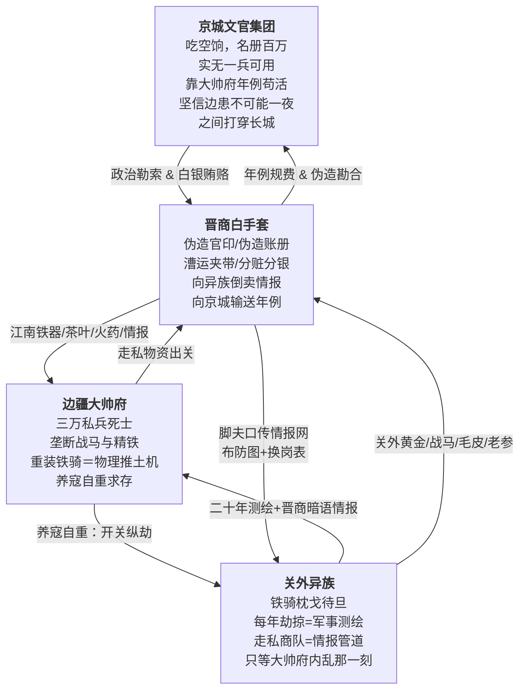

# 宏观故事线／大纲

## 核心基调：三重绞肉机

这是一个没有内力、没有仙人、没有奇迹的世界。重甲骑兵的冲击力由披甲重量与战马速度的乘积决定。红衣大炮的射程由硝石硫磺木炭的配比与炮管精铁纯度的公差带决定。暴雪造成的死亡由环境温度低于核心体温的温差幅度、风速导致的对流散热加速率、以及积雪深度对呼吸道的物理阻塞三重参数共同决定。一切悲剧是制度的。不写江湖儿女，写铁甲马蹄碾过冻硬的黑土时发出的闷响。不写忠奸分明，写每个人都做了在当时个人掌握的全部信息范围内唯一合理推演得出的自私选择——这些选择的乘积构成了一台巨大的、不会停下来问任何人同不同意就自行碾压下去的绞肉机。

### 三方底层冲突

- **京城文官集团**：兵部名册上九边八十三万战兵，杨嗣昌崇祯十年实核不过十七万——空饷率逼近八成。剩下的三成真兵，常年拿不到月饷（名义月饷一两五钱，实发不过四钱，且多为发霉陈米折色），沦为将领私田上的农奴。但这群文官的罪恶不是"通敌"——他们只是永远坐在燃着兽炭的暖阁里，真心实意地相信"九边重镇二百年来不曾有失，岂能一夜之间叫鞑子打穿"，相信自己凭借六科给事中的封驳权、内阁的票拟权、以及对大干儿子空口许下的承诺，就能在万里之外的棋盘上挪动棋子。他们的底色不是邪恶，是贪腐利益共同体滋养出的傲慢与对物理现实的全然无知。崇祯帝煤山自缢前以血书遗诏"诸臣误朕"——这四个字，就是这个阶层在整个晚明史上留下的最终评语。
- **边疆大帅府**：大帅仿李成梁旧制，把朝廷拨发给十万人的军饷吃下七成空额，用克扣下来的惊天财富豢养不足三万"家丁私兵"——顿顿有肉，人配双马，身披四十斤重的双层铁甲。一匹辽东战马驮着两百斤的铁甲骑士在平地上发起冲锋，其冲击力足以把任何一个没穿甲的流民连人带骨碾碎。但大帅不是不能荡平关外——是不敢。熊廷弼在万历三十七年就已经把辽东军阀的生存逻辑写成八个字："全镇军额，亡失几半"。李成梁用三十年的时间向所有边将证明了一个铁律：关外一旦太平，朝廷第一件事不是论功行赏，是撤藩、清算、罗织罪名赐死。于是养寇自重成了辽东将门唯一的生存之道。每年秋高马肥之际，开关放异族劫掠几座无关紧要的边村，用几百条底层人命换朝廷继续相信"边患未平、大帅不可轻动"。
- **关外异族**：他们不是配合大帅府演戏的演员。每一次"秋猎劫掠"都是军事测绘行动——通过晋商白手套在张家口私市中安插的谍报商人，他们比京城兵部更清楚长城沿线哪座墩台的守军已经八个月没领到饷银、哪座烽火台的火药受潮结块无法击发、哪段边墙的砖缝在去冬的冻融循环中崩开了三尺宽的豁口。皇太极在沈阳汗王会议上反复研究的不是"大帅愿不愿意开关放我们进来"，而是"京师文官分成几派、谁和谁不对付、崇祯最近又杀了哪个大臣"——他在找政治裂缝。异族等了二十年，等的不是大帅的恩赐——等的是一声脆响，那个叫"大帅府内乱"的瓷瓶在地上摔碎的声音。
- **晋商白手套（张家口网络）**：江南的茶叶和丝绸不可能凭空出现在塞外。真实历史上，乾隆十年《万全县志》记载了八个人的姓名——王登库、靳良玉、范永斗、王大宇、梁嘉宾、田生兰、翟堂、黄云发——"皆山右人，明末时以贸易来张家口，自本朝龙兴辽左，遣人来口市易，皆此八家主之。"这八家晋商以张家口堡（海拔七百二十丈）为枢纽，在京城文官、江南商帮、边疆军阀、关外异族之间充当了最关键的灰色中介层。没有这层中介，秀才和兵永远说不上话，账本里也永远不会出现真名实姓——每一条走私记录在账面上都干干净净，盖着兵部和户部的红印。

### 贯穿全文的"止血塞"与"刀"隐喻

| 概念 | 含义 |
|------|------|
| **止血塞** | 一切暂时维持生命、延缓崩溃的人与物——主母给的解药、女主的陪伴、大帅府对边疆的威慑、京城文官从大帅府收的贿赂、晋商白手套维持的走私网络、底层蚁穴每天领到的那碗米糊 |
| **刀** | 一切同时造成伤害又卡在命脉上、拔出即死的事物——主角体内的砒霜余毒与心脉旧伤、他卧底的双重身份、大帅府的军事垄断、晋商网络串联的整个腐败生态系统、这份他知道得太多却无人可说的真相 |

---

## 故事主轴

一个从陕甘白骨堆里爬出来的锦衣卫暗桩，被喂下慢性毒药钉在大帅府的军机文书位子上，在一层看不见的晋商白手套、两个女人、三方势力、一份永远查不到真名的走私账本之间，走完一场注定没有解药的倒计时。

---

## 三幕剧大纲

### 第一幕：废墟之上（初入蛛网）

核心主题：信仰的绞杀与伪装的生存。

#### 陕甘炼狱（序幕）

主角少年时从陕甘大旱与流贼过境后的万人坑里爬出来。那是崇祯十三年——整场小冰河期中最冷的一年，陕西全境八月降霜、九月大雪封山，延安府肤施县在册人丁八千九百口，十几年后清军入陕统计，全县仅存人丁一千二百口。他活下来靠的不是侠义传奇，不是高人授艺——是在腐尸堆里翻出半块发霉的干粮，在干涸见底的渭河河床底下用指甲刨出泥浆水，是在同官县县志记载的那种"一家八口，七日不举火，幼子先饿死，父母以幼子之肉喂其余子女"的绝境中，不知怎么没死的那个例外。

这段经历在他骨头上刻下了一种不可愈合的"废墟病"：他从此再也无法相信任何高高在上的口号。朝廷说"赈灾"——延安知府上报全府灾民八万口请赈粮三千石，朝廷拨粮后知府实发八百石，剩下两千二百石被层层扣尽流入黑市。流贼说"替天行道"——他们每打下一座县城先烧官府粮仓、再逼百姓亲手烧掉自家房子以断退路。将军说"保境安民"——边镇家丁吃着双饷去蒙古草原打秋风，把砍下来的平民人头当"流贼首级"回营报功，每颗人头换三两赏银。

他染上的废墟病只有一个症状：任何话，他不听人怎么说，他只看每句话背后那双手在摸什么东西。

被锦衣卫收编不是因为他有什么才能——纯粹是因为他在死人堆里活下来的那口气太长了，长得让北镇抚司负责挑人的百户觉得"这人耐杀，兴许能派上用场"。他没有正式官品，没有俸禄月粮，档案在北镇抚司的秘密名册上只有一个代号。像他这样的"暗桩"，明末锦衣卫在各地养了不知多少个——没有家世、没有派系、没有背景，唯一的身份证明就是单线联系的上线手中那份密令。上线一死、密令一烧，这个暗桩在法律上就不存在了。

他在锦衣卫的档案上还记着一道在辽东战场上留下的致命伤：一枚异族破甲箭的倒钩箭头，穿透护心镜后碎在了心包膜外侧。军医不敢开胸取箭——彼时没有能开胸的外科手术，只能靠金创药糊住伤口，让增生组织把碎铁裹死在血肉里。从此他成了半个废人——不能剧烈搏杀，不能纵马狂奔，稍微心率过快，那枚碎铁片就在胸腔里隐隐往主动脉方向推。北镇抚司把他派去大帅府当暗桩的时候根本没指望他能活着回来——他这样的暗桩是朝廷的"耗材"，派出去一个少一个，京城档案库里连他的名字都不会留。

#### 大帅府的算盘

京城要往大帅府安插监军。大帅府早就通过晋商在京城的内线拿到了备选名单，故意挑中了主角——一个无根无底、身负致命旧伤、随时可能自己死掉的废人。大帅府的算盘是：满足朝廷的面子，收下这个监军。反正他进了府就是个聋子和瞎子。然而大帅府的主母不是普通人。

#### 主母的獠牙

主角进府后，第一个看穿他真实身份的，是这位把面部表情控制得如同账本上一行死数的大帅主母。她没有杀主角。杀一个朝廷安插的人等于撕破脸。她用的是明末边镇真实存在的配方：砒霜微量慢性摄入，辅以炮制过的乌头提取物来严格控制主角的心率。旧伤是基础——心包膜外侧卡着碎铁片，心率失控则位移一毫米即死。乌头碱阻断心肌钠离子通道强行抑制心率。砒霜与酶蛋白巯基结合破坏细胞代谢。主母手中的中和药方以含硫矿物排砷、人参皂苷强心——但只是把两股相反的毒性暂时拉回钢丝般的平衡线上。每七天必须服药一次。主角不是被魔法控制——他是被一套精确算计的化学时间表囚禁了。

#### 军机文书：不贴身的风暴眼

主母把主角塞进了军机文书和走私账目总管的位置。大帅府治下的边疆是一个由"干儿子体系"维系的军事集团——大帅府秘传的虎狼药方会让习练者丧失生育能力，干儿子们没有子嗣、没有退路，只能把大帅当成唯一的义父。其中最得势的大干儿子掌管着最精锐的重装铁骑营。干儿子们对文书工作毫无兴趣——账本和公文在他们眼里是娘们和阉人干的活。这正是主母的精明之处。

军机文书这个位置的致命之处在于：主角每天经手各营人马实数、粮草库存、走私明细、以及大帅府与晋商白手套之间往来的全部账册——但他碰不到一兵一卒。干儿子们嘲笑他是"大帅府里最懂字的活死人"。

#### 女主的清醒

女主是大帅的独女。她不是傻白甜——她清醒得可怕。在这个去高武、满是铁甲马蹄和配给米糊的血色炼狱里，她每天看到来领配给的骨瘦如柴的流民，看到被干儿子们吊在大门前抽死的马帮脚夫，看到母亲把一个个活人当成耗材算计。正因为看得见，所以她痛苦。她只能在自己能力的极限里偷偷去当那个"止血塞"——瞒着母亲让丫鬟把米糊熬得浓一些，在马帮脚夫挨打时用大小姐的身份去喝退监工。

主母把解药故意让女主每天亲手送过去——她要同时驯化两个人。但她唯一没算到的是，在这个全是算计的泥潭里，这两个被迫每天相见的人，真的产生了东西。

#### 信仰绞杀

主角开始接触大帅府的账本和军务文书。他查得越深，就越接近一个让他彻底崩溃的真相。账本里写着"某月某日，张家口马市，收晋商王某茶砖三千担，折银若干"——但永远不写这些茶砖是在哪里、用谁的官印通关的。他把账本上的日期与朝廷驿报上的官员调任日期对照。他发现了那个让他手脚冰凉的模式：每次京城吏部有高官外放或升迁，大帅府对张家口的"特别支出"就会在三个月后出现一笔精准到诡异的增量。最后他拼出了最致命的那块拼图：大帅府是汉奸。但如果拔掉大帅府，朝廷根本没有能力挡住关外的铁骑。更荒诞的是——他效忠的朝廷、他背后代表的文官大义，和眼前这个他奉命要摧毁的军阀大帅府，根本就是趴在陕甘百姓尸体上分食人肉的同一个怪物的两颗脑袋。

#### 双向救赎

主角和女主在这座钢铁坟墓里互为对方唯一的活人。不是一见钟情的浪漫——是两个被同一座机器碾压的人，在齿轮缝里互相闻到了对方还活着的体温。

---

### 第二幕：风暴升级（南北断线）

核心主题：棋盘掀翻，各方极限施压。

大帅府利用女主的婚姻向京城发动极限施压。联姻提案在字面上是"效忠皇恩，请赐良缘"，在字底下是"不补军饷，异族今秋过不了长城这道坎不是大帅府的事"。京城文官集团炸锅——大帅府的年例银子养活了半个京城的权贵，但如果同意联姻等于朝廷在法理上承认大帅府的独立王国。

文官集团找到的突破口是大干儿子——他在这套绝嗣体系里付出了身体的代价，而大帅却有自己的亲生女儿。朝廷密使通过晋商白手套的秘密渠道开出条件：京城承认他为边疆新帅，军饷翻倍。大干儿子提了三个条件：拖欠军饷必须先补足，关内增派实兵五万驻防各口，派文官亲赴张家口密谈留把柄。他的算计是精密的——他不是要毁掉边疆防线，他是要在旧的权力结构垮塌后由自己来当新的权力核心。他唯一算错的东西是：异族等这一刻已经等了二十年。

第二幕中段，朝廷使出断粮封锁——以"清查空饷"为名切断所有拨往大帅府辖区的粮饷和火药补给。这不是通敌——是傲慢。文官们坐在京城的暖阁里真心实意地相信关内还有"百万可调之兵"。大帅府内部开始出现裂痕。

女主在这一幕面临了人生中第一个真正属于自己的选择。主母问她："你爹每年秋天开关放劫掠——你告诉我，你爹是坏人，还是好人？"女主回答不上来。这也是整个世界的终极困境：没有好人坏人，只有代价和谁来付代价。

主角在这一幕被撕裂到了极限。朝廷重新联系上他，新指令是盗出大帅府通敌铁证。但他同时也发现了一个更深的秘密——关外异族一直在通过晋商商队收集明军布防情报，每次来袭的路线都精准地绕开了有实战能力的营寨。这不是在演戏——这是在用十几年时间做最精密的军事测绘。他做出了一个第三者看不懂的决定：开始同时欺骗两边。主母注意到了他修改的假账册中故意留下的漏洞——她没有揭穿。她微不可察地点了点头。

---

### 第三幕：雪崩溃灭（大出血落幕）

核心主题：一切止血塞同时失效。

一场百年不遇的大暴雪切断了大帅府各营寨之间的一切通讯和补给。坝上与坝下之间六十里隘道积雪深达两米以上。骑兵无法在及膝深的雪中奔驰。大干儿子等的就是这个窗口——但他不是要发起骑兵冲锋，他是要利用暴雪把所有人的视线压缩到三步以内的封闭空间来实施软政变：控制粮仓、火药库、水源和马厩。他的步兵在暴雪中反而比骑兵有更强的行动力。

大帅没有束手就擒。在暴雪中调不动成建制的骑兵，他只带着最后百来个亲兵在齐腰深的雪中摸向叛军据点。一场在能见度不足三步的白毛风中靠刀鞘和拳头进行的混乱近身械斗——大帅被短刀刺穿肝脏，失血加失温冻死在雪地里。帅印冻在僵硬的手指上，掰不下来。

主母在大帅死讯确认后做的三件事——烧掉全部晋商密档，把最后一撮药渣留给女儿，灌下与沈节同配方但剂量大得多的砒霜乌头复合剂。

配给制瓦解。底层蚁穴在暴雪中断粮断柴断药——木牌还在墙上，墙下已经没人了。监工的皮鞭永远不会再响了——监工自己也饿死在了土屋里。来年春雪化后，这一带方圆几十里全是白骨。

关外异族利用二十年测绘成果——坝上到坝下六百三十丈的海拔落差——在十二个时辰内从封冻的河面冰层上完成闪电俯冲。坝下的守军连烽火都没点燃——木炭在长达两个月的封锁中早已烧光。

女主在主母废墟的焦黑泥土里用指甲抠出最后一撮混着炭灰的药渣，塞进沈节嘴里。药渣不是解药——它在物理上只能推迟崩溃的顺序——给他半个时辰。沈节在回光返照的半个时辰里坦白了一切。她听完后发出荒诞的笑声，然后说了三个字："我知道。"不是原谅——是她在很久以前就看穿了蛛丝马迹，却选择不问不说不去查证——在这座所有人都对她说谎的府邸里，唯一一个让她觉得自己还是人的人。

沈节死于砒霜乌头联合毒性与主动脉破裂。李观照从他怀里掏出那份被体温捂得微微发潮的私人手稿——不能翻案的东西——塞入怀中。背对燃烧的大帅府，面朝坝上方向，走入风雪。没有回头。

---

## 伏笔与回收追踪

| 伏笔 | 安置位置 | 计划回收节点 |
|------|----------|---------------|
| 主角心包膜外的箭头碎铁片（辽东旧伤） | 序幕 | 终幕：心率紊乱+组织肿胀→碎铁片物理位移一毫米→刺破主动脉→大出血 |
| 砒霜+乌头复合毒的作用机制 | 第一幕 | 终幕：停药后两个毒性的平衡同时崩溃 |
| 晋商白手套的独立账外记录 | 第一幕 | 第二幕主角拼凑推理的基础；终幕：主母烧掉了原始账册但主角保留了自己的私人手稿 |
| 异族二十年利用走私商队进行军事测绘 | 第一幕/第二幕 | 第三幕：异族在十二个时辰内精准穿越边墙薄弱点 |
| 大干儿子的软政变计划 vs 实际连锁反应 | 第二幕 | 第三幕 |
| 吃空饷与真实兵力 | 第一幕 | 终幕：关内"百万大军"没有任何一支援军出现 |
| 女主觉察主角身份 | 第一幕/第二幕 | 终幕："我知道" |
| 配给制体系的脆弱性 | 贯穿 | 第三幕暴雪中断配送→边疆蚁穴雪崩式崩溃 |
| 主母烧毁全部晋商密档 | 第三幕 | 间接导致女主手上那份"私人手稿"成了唯一残留的真相记录 |

---

## 创作原则

1. 不赋予任何角色超自然力量。虎狼药方中附子的乌头碱阻断心肌细胞膜Nav1.5钠通道。砒霜与巯基酶硫原子形成共价结合。铁骑威力来自披甲重量与战马速度的乘积。暴雪致死率由环境温度与核心体温的温差幅度、对流传热速率、积雪对呼吸道阻力的三重参数决定。
2. 每一个政治决策同时记录其利益和代价，两个数字放在同一行。
3. 底层视角至少占整体叙事的五分之一。不在蚁穴边民身上加注任何叙述者定调词。只记录米糊浓度、木牌霜层厚度、土墙裂缝宽度、暴雪第四十四天尚未死亡的人数。
4. 悲剧的成因不是任何单个角色的道德失格。三方在同一制度框架内各自精确推演、各自用自身视角下的最优解互相抵消、共同锁死为零和博弈。李国勇死在他的政变计划在纸面上每一步都有军事合理性——但他不知道田逢吉的脚夫口传情报网比大帅府的信使快了整整三天。信息差。不是道德差。
5. 李观照的终局状态不是复仇。她带着沈节留下的私人手稿走入风雪。
6. 不写英明钦差从天而降破局。崇祯十七年——煤山上只换到一棵歪脖子槐树。

---

## 全卷章节规划

全卷预估 **135 章**，按每章 2800-3200 字计，总字数约 **38 万至 43 万字**。三幕配比约为 30%/37%/33%。第二幕体量最大，承担制度博弈的全面展开与各方利益链的逐层瓦解。第三幕次之——暴雪的每一个昼夜、蚁穴的每一批死亡、异族的每一个推进节点都必须拥有独立的章节呼吸权。每章均锚定视点角色、核心物理事件与章末物理钩子。

扩容策略：严禁注水。所有新增章节点位全部来自真实物理与社会阻力的展开。同时严格执行章节级张弛节奏——每三到四章高压情节后插入一章呼吸章（标⊗），让读者在连续爬坡后拥有消化乳酸的空间。呼吸章不引入新伏笔、不解决旧冲突——仅通过日常动作和无目的的感官感知来还原世界的物理质感。

### 全卷子弧结构总览

| 幕 | 子弧 | 章数 | 核心物理推进 | 呼吸章 |
|----|------|------|-------------|--------|
| 一 | 1A 陕甘炼狱→锦衣卫暗桩 | 1-5 | 万人坑、北镇抚司训练、辽东碎铁片、档案标签、出发前夜 | ⊗5 |
| 一 | 1B 入府→主母识破→喂毒 | 6-12 | 进大帅府、主母识破身份、砒霜乌头七日周期、军机文书任命、初访张家口马市 | ⊗9 |
| 一 | 1C 府内地理→干儿子生态 | 13-18 | 大帅府物理地图、配给制堂口、干儿子体系、李国勇首遇、边民冻死 | ⊗14 |
| 一 | 1D 账册解密第1期→信仰绞杀 | 19-28 | 三处日期巧合、数目字交叉比对、田逢吉暗账、北字号甲锁定、碎铁片第1次位移 | ⊗23 ⊗26 |
| 一 | 1E 双向救赎→碎铁片首次位移 | 29-35 | 拆量斗、名字、大帅出场、李国勇试探、沈节发现拔掉大帅府京城挡不住关外铁骑 | ⊗31 ⊗34 |
| 一 | 1F 第一幕收束 | 36-40 | 主母召见、沈节决定潜伏、李观照发现砷线、账册第十四页被风吹开 | ⊗39 |
| 二 | 2A 联姻提案→京城博弈 | 41-53 | 联姻折子起草、京城恐慌、文官内部派系、锦衣卫密令、李国勇被接触、三条件谈判、联姻驳回 | ⊗45 ⊗50 |
| 二 | 2B 断粮封锁逐周→仓储危机 | 54-63 | 配给浓度逐周递减、蚁穴饥饿扩散、死婴事件、沈节核算豆料只够三天半、李国勇密封三座粮仓 | ⊗57 ⊗62 |
| 二 | 2C 双面欺骗→女主暗中活动 | 64-73 | 沈节假账册漏洞、主母默许、李观照接触旧部、田逢吉暗账续编、北字号甲锁定 | ⊗67 ⊗71 |
| 二 | 2D 暴雪前兆→各方收束 | 74-80 | 大帅病发、李国勇营中串联、碎铁片第2次位移加速、田逢吉收尾、暴雪降临 | ⊗76 ⊗79 |
| 三 | 3A 暴雪封城→生理恶化 | 81-92 | 通讯断绝、沈节停药逐日、蚁穴首周冻饿、李国勇铅封启封、三座粮仓逐一控制 | ⊗84 ⊗88 ⊗91 |
| 三 | 3B 政变逐节点展开 | 93-106 | 水源控制、马厩镇压、大帅最后调兵、雪中械斗、大帅之死 | ⊗96 ⊗101 ⊗104 |
| 三 | 3C 主母焚档→药渣回光 | 107-116 | 主母服毒、李观照抠药渣、坦白、我知道、沈节之死 | ⊗110 ⊗114 |
| 三 | 3D 蚁穴灭绝→异族俯冲 | 117-126 | 配给制归零、蚁穴批量饿死、异族十二时辰闪电俯冲、坝下沦陷 | ⊗119 ⊗123 |
| 三 | 3E 终局收束 | 127-135 | 李国勇结局、边民幸存转移、李观照取手稿、逆着俯冲路线走入风雪、开放式终局 | ⊗130 ⊗133 |

### 第一幕：废墟之上（第 1-40 章，约 12 万字）

#### 子弧 1A：陕甘炼狱 → 锦衣卫暗桩（第 1-5 章）

| 章 | 场景 | 视点 | 核心物理事件 | 章末钩子 |
|----|------|------|-------------|---------|
| 1 | 陕甘万人坑——狗娃从死人堆爬出 | 沈节 | 渭河河床刨泥浆水，指甲翻裂。腐尸堆翻出发霉干粮 | 锦衣卫百户的手伸到他面前——"怕不怕死。""怕。但我更怕饿。" |
| 2 | 北镇抚司暗桩训练 | 沈节 | 基本识字、跟踪、格斗。被老暗桩打断三根肋骨 | 百日训练结束。档案标签：无名暗桩，耗材，无家世无派系 |
| 3 | 辽东夜不收任务——碎铁片入体 | 沈节 | 破甲箭穿透护心镜。箭头碎在心包膜外侧。军医不敢开胸 | 档案备注：身有宿疾，不宜外勤。适合低压文书类潜伏任务 |
| 4 | 锦衣卫内部腐败——沈节目睹北镇抚司百户私吞查抄银两 | 沈节 | 百户带他去查抄一个"通敌"商人家。抄出白银六百两——百户私吞三百两，上报兵部"无所获" | 沈节在回程路上把这事记在心里——不写在纸上。这是他学的第一课：纸上的东西和法律上的东西是两回事 |
| 5 | 出发前夜——沈节最后一次见上线百户。百户拍他肩膀说"这趟回来我给你补一个正式编制" | 沈节 | 百户把潜伏指令塞进他手心——一张叠了四折的麻纸。沈节在油灯下看完——记住了每一行——然后把纸放进嘴里嚼烂吐进炭盆。百户看着——"你是真的怕死。"沈节说"我是真的不想白死。" | 炭盆里的纸灰在那一夜的最低温中慢慢冷却。第二天早晨——他骑上马——往北——大帅府方向 |

#### 子弧 1B：入府 → 主母识破 → 喂毒（第 6-12 章）

| 章 | 场景 | 视点 | 核心物理事件 | 章末钩子 |
|----|------|------|-------------|---------|
| 6 | 进大帅府——主母第一次见他 | 沈节 | 被安排在军机书房。主母隔桌看了他十息。桌面油灯——灯捻焦了半截——没人拨 | 主母开口第一句话——"你在锦衣卫的代号是什么" |
| 7 | 主母的审问——不是拷打，是让他自己翻账册 | 沈节 | 主母把一份辽东阵亡名录放在他面前——问他认不认识上面的人。他认识三个。主母说"你认识——你在辽东待过。你档案上写的不是这一条。"沈节没有回答——她知道了一个他档案上不该有人知道的事实。他已经暴露了 | 主母没有杀他。她把阵亡名录从他面前抽走——换了一份药方。药方上的第一味药——砒霜。她说"你识字——自己看。"他没有把目光从药方上移开——但他的手——放在膝盖上——停了一息没动 |
| 8 | 喂毒——砒霜乌头七日周期 | 沈节 | 主母亲自端来第一碗药。心率从七十跌到四十五。她把药碗放在他面前——没有催促——只是坐在对面等他自己端起来喝 | 李观照出现在书房门口。手里端着第二碗药。主母说——"以后每天早上，小姐来送" |
| 9 | 药效——沈节在吃药后第一个时辰的生理记录 | 沈节 | 心率从七十跌到四十五。四肢末梢开始发冷——从指尖往手腕爬。他把手放在账册封面上——纸的温度比手的温度高——说明手已经比室温低 | 门——没有关紧——他听到走廊里主母对李观照说——"以后每天早上——同样的时辰——你送。"李观照没有回答。她只是端着刚才那个空碗——站在走廊里——碗底还有一小圈残渣 |
| 10 | 军机文书任命——干儿子们的反应 | 沈节 | 主母当众宣布"沈休言掌管全部军机文书与走私账目"。干儿子们嘲笑——"大帅府最懂字的活死人" | 李国勇从人群中看了他一眼——"你的脑袋比我们粗人金贵。"不是夸奖。是定价 |
| 11 | 沈节入住——分配住所和书房 | 沈节 | 被安排在军机书房隔壁一间小间——原是堆旧账册的库房。他把床铺好——把唯一一盏油灯放在床头——然后花了第一天晚上把房间所有角落检查了一遍——没发现监听孔——但发现北墙有一道很细的裂缝——刚好够把一张叠好的麻纸塞进去 | 他把潜伏指令从炭盆的灰烬记忆里重写在了唯一一张新麻纸上——塞进墙缝——然后在裂缝上抹了一层旧泥浆。泥浆干了以后和墙面一模一样 |
| 12 | 第一次跟大帅府的走私商队在张家口马市旁听 | 沈节 | 以"熟悉大帅府业务"为名随商队去张家口。他在马市上看到了田逢吉的晋源号商队——看到了他们是如何在官市和私市之间切换——在"合法"与"不合法"之间有一条只有自己人才能看到的暗线 | 回程——他骑在马上——在心里把今天看到的每一个通关步骤都重走了一遍——每一步都有合法的红色官印——每一步的合法下面都压着一层不合法——而这两层之间——是田逢吉一个人的暗账。他一个人——用这一层暗账——把四方的命脉都串在一起 |

#### 子弧 1C：府内地理 → 干儿子生态（第 13-18 章）

| 章 | 场景 | 视点 | 核心物理事件 | 章末钩子 |
|----|------|------|-------------|---------|
| 13 | 大帅府地理——沈节熟悉各节点的物理位置 | 沈节 | 军机书房→堂口发粥→后院马厩→坝下粮仓外墙。在心里画地图——每条路到最近出口的步数 | 他发现堂口土墙上挂满木牌——每张牌上刻着人名。有些裂了——裂掉的还挂在墙上。人不知道还在不在 |
| 14 | 配给制堂口——第一次旁观发粥全过程 | 沈节 | 蚁穴边民排队领米糊。监工用皮鞭量弯腰幅度。弯腰不够低——鞭。太低——也是鞭 | 李观照在堂口。她让丫鬟把量斗里的粥压得比平常实了一点点。监工没发现。沈节发现了 |
| 15 | 干儿子聚餐——沈节第一次参加 | 沈节 | 三十多个干儿子围坐三张条桌。李国勇坐在主位旁边——大帅那天没来——主母也没来。整张桌子上——沈节是唯一不动刀只动笔的人 | 李国勇敬了他一碗酒——"沈休言——以后大帅府的账目全在你手上——我们这些粗人——靠你算清楚每一分银子。"喝完——把碗底翻过来——空的 |
| 16 | 干儿子体系内部——各营头领与李国勇的权力关系 | 沈节 | 沈节开始整理各营人马名录——发现三十七个干儿子中——十五个受过重伤——五个已经不再上马——两个在去年冬天因虎狼药的心脏副作用死在马背上。活着的人——被李国勇用"绝嗣共同体"锁死在同一张饭桌上 | 他整理完名录——在最后一行旁边画了一个小圈——圈里是空着的。这个空位——是给"还不知道自己会取代李国勇的某一个更年轻的干儿子"留的。李国勇还没意识到他自己也在这个循环里——他只是这一张名单上的一个名字——和前面死掉的那两个名字没有本质区别 |
| 17 | 李国勇的过去——从辽东卫所军户到干儿子的晋升路径 | 李国勇 | 李国勇独自在营房里——对着铜镜看自己脖子上那条铅封钥匙。他想起来自己十七岁那年——亲爹把他送到大帅府换了二十两银子和半年军饷减免。他爹在接收文书上按手印的动作和卖掉一匹母马时一模一样 | 他把钥匙从脖子上取下来——放在桌上——看了一息。然后又挂回去。钥匙的金属在胸口——隔着皮袄——有一个很轻的、冰凉的、接近体重的压力 |
| 18 | 沈节第一次在大帅府过冬——看到边民冻死在堂口外 | 沈节 | 零下二十五度。堂口排队——一个老人在排队时靠着土墙不动了——排到他时——监工用皮鞭推了他一下——倒了——没气。监工让人把他拖到后院——等开春再埋——地冻得太硬——挖不动 | 沈节经过后院——看到被拖走的老人——蜷缩姿势——手指还保持着握住木牌的弧度——但木牌已经不在了——被监工收走了——明天会有另一个人拿着同一块木牌来领粥。木牌不会死——人可以换 |

#### 子弧 1D：账册解密第1期 → 信仰绞杀（第 19-28 章）

| 章 | 场景 | 视点 | 核心物理事件 | 章末钩子 |
|----|------|------|-------------|---------|
| 19 | 第一次整理账册——发现日期巧合 | 沈节 | 账册第十四页——崇祯十四年九月，张家口马市支出。吏部北字号甲调任日期相差十日。第一次巧合 | 碎铁片在安静状态下微微推了一下。不是心率快了——是他盯着那个日期看了大概六十息。心跳没变。碎铁片自己偏了 |
| 20 | 李观照日常送药——第一次长谈 | 李观照 | 药碗放在案上。"趁热喝了。"问——"你在锦衣卫去过江南没有。""没去过。" | 她走后沈节发现药碗下面压着一小片干枣。不是主母药方里的。是李观照自己加的 |
| 21 | 账册追踪——从大帅府正账反向进入田逢吉的暗账体系 | 沈节 | 他发现大帅府正账中"张家口马市支出"的每一笔——在日期上——都能找到一个对应的吏部官员调任时间。间隔均匀——三个月一次——精准如刻漏 | 他把这些日期抄在麻纸上——三行。三行日期的笔迹——各有新旧——在纸面上排成一条线。这条线——他还没画完——但在心里已经画到底了 |
| 22 | 第二处巧合——临清闸过关记录与入库铁料重量偏差 | 沈节 | 正账登记粗布三千匹——需两辆骡车。过关清单登记骡车八辆。另六辆——据入库铁料反推——藏精铁约八千四百斤。差额误差不超过百分之一点二 | 他在正账该条目下方用指甲划了一道竖线——竖线两端在纸纤维上微微裂开了细丝 |
| 23 | 碎铁片在连续熬夜对账后的一次警告性隐痛 | 沈节 | 连续两个晚上没睡——在翻大帅府与晋商的全部往来记录。天快亮的时候——碎铁片的位置偏了一下——不是痛——是胸腔里有一个很轻微的"刮了一下"的感觉——像指甲在纸上划过 | 他停了——手压在左胸口——等了大概十息——心跳恢复了——但碎铁片没回到原来的位置。这是第一次——偏了以后没复原 |
| 24 | 李观照察觉沈节熬夜对账——多送了一碗粥 | 李观照 | 她早晨送药时发现沈节案上的油灯捻子已经烧完了——灯盏是冷的——说明他至少一个时辰前就灭了灯。她说"你没睡。"他说"账册太多了。"她把药碗放下——回身又端了一碗米糊进来——放在药碗旁边。"先吃。吃完再翻。" | 沈节拿起那碗米糊——她站在门口——没走——背对着他——说了句——"那行日期——你画了线——我看过了。"她没转身。说完就走了。沈节手里那碗米糊——还没喝——已经不太热了 |
| 25 | 第三处巧合——三行日期在桌面排成一条线 | 沈节 | 三行日期。三支不同的笔。第一行——上月抄。第二行——半月前。第三行——刚才。墨迹的新旧在纸面上排成了一条线——每行日期之间的间隔都在均匀缩短——不是巧合——是有人在持续地、按固定节奏地在做某件事 | 他在第十四页日期旁用碳条画了第一道竖线。墨迹干缩成弯的细线。没有在旁边写任何字。画这道线已经是一个决定了——只是他还不知道这个决定的内容是什么 |
| 26 | 田逢吉首次出场——暗账结算 | 沈节 | 田逢吉穿补丁布袍踏进大帅府——说的每一个字都像聊天气。"今年野狐岭的雪比往年来得早。商路不好走。"沈节同时在心里把"嘴面"和"嘴底"拆成两条线 | 田逢吉走之前看了他一眼——评估后决定——这个文书暂时不需要封口费——他还不知道自己看到了什么 |
| 27 | 田逢吉暗账第2次结算——沈节偷记数目字 | 沈节 | 田逢吉展开折子——"北字号甲——九月规费——银八百两正。"沈节同时在脑内把铁料差额白银一百七十六两往这八百两上一贴——差了一个零头 | 田逢吉走前又看了他一眼——比上次多停了一息。商人评估交易对手——第一次扫一眼——第二次停一息——第三次——可能就是开口谈价 |
| 28 | 碎铁片第一次在安静中可被感知的位移 | 沈节 | 从里面推。痛感没到——心率两息后才被拉上去。手压左胸口——感觉到胸壁内部的微震 | 在黑暗里算出每息位移约零点零一毫米。然后想——还能活多久。算不出来 |

#### 子弧 1E：双向救赎 → 碎铁片首次位移（第 29-35 章）

| 章 | 场景 | 视点 | 核心物理事件 | 章末钩子 |
|----|------|------|-------------|---------|
| 29 | 李观照与沈节——名字 | 李观照 | "观照是我娘起的。冷眼看穿。慈航是我自己起的。慈悲为舟，济度苦海。"前半句没看他。后半句看了 | 沈节说"休言——千言万语，不如休言"。她听完点了下头。没追问。收刀了 |
| 30 | 大帅首次出场——虎狼药的代价 | 李承荫 | 左眼被铁砂打坏——畏风流泪看人永远像审视叛徒。右手食指中指缺失——握笔只能写拳头大字。心脏跳动有喀嚓音——军医说像裂了缝的鼓 | 大帅说"你是京城派来的。你的一切文书我都会过目。不是不信你——是京城从来没有值得信的人。"说这话时没看沈节。看的是账册 |
| 31 | 大帅在大比军机会议上公开训话——沈节在旁记录 | 沈节 | 大帅当着全军将领的面说——"关外的狼要是死绝了——京城养我们这些看门狗还有什么用。"干儿子们没人接话。李国勇的手放在刀柄上——不是要拔——是长期虎狼药导致的手指僵硬——需要经常调整握刀的角度 | 散会后——沈节在整理会议记录时注意到——李国勇在整个会议期间——手在刀柄上换了大概十几次角度。至少有一半的次数不是为了缓解僵硬——是他听到某句话之后手指自己收紧了。虎狼药的副作用——指关节不灵活——但神经反射没问题——他说到底还是个大帅府里被绝嗣锁死的义子。听到"亲儿子""亲生女儿"之类的话——手指自己会先于大脑做出反应 |
| 32 | 李观照与底层——拆量斗 | 李观照 | 让丫鬟把量斗铜衬底拆了。多出的一成稠粥——每天排在队首的几十人多活一天 | 上次那个抱婴儿的女人排最前面。她看着那女人喝完粥——把碗底用手指刮了三次。手指自己攥紧了一息——然后又松开了 |
| 33 | 沈节帮李观照在堂口发粥——第一次共同做事 | 沈节 | 他替她抬盛米糊的木桶——桶底的余温从木板的缝隙透出来——温度从桶板传到他的手心——再传到她的手指——隔着桶的木板——两人的手指在同一块木板上——不在同一个位置——但温差在同一棵树的纤维里传导 | 发完粥回来——两人各自回到原先的位置——她看着空粥桶——他翻着账册——隔了大概三步。这三步里——刚才在堂口被那一桶粥的热气融化了一点点的——什么东西——在两个人都没看对方的沉默里——自己又冻回去了 |
| 34 | 李国勇对沈节的试探——酒桌上的挑衅 | 李国勇 | 干儿子聚餐——当众问"沈休言——你在大帅府待了一年多。大帅府和京城比——哪边更干净。"沈节没接话——端起酒杯——喝了一口——放下。从头到尾没说一个字 | 李国勇记住了——试探"这个人逼到墙角时咬人还是装死"。答案：装死。装死的人知道什么时候咬最疼 |
| 35 | 第一幕第一次内部高潮——沈节发现如果拔掉大帅府京城根本挡不住关外铁骑 | 沈节 | 对比九边实战兵力和关外异族总兵力——杨嗣昌崇祯十年核实战兵不过十七万——关外异族可调动骑兵至少八万以上——且不需要等待京城的调兵令。攻方——十二个时辰完成全部集结。守方——从京城兵部发文到第一支援军开拔——最快也需要二十天以上。二十天——异族可以踏破山海关以外的全部长城防线。而唯一能拖住他们的——就是李承荫的这三万铁骑 | 他算完——把麻纸揉成团——塞进嘴里——嚼——咽下去——纸浆顺着食道往下滑——和那天那片干枣是同一个方向 |
| 36 | 大帅在军机书房单独召见沈节——"你查到的东西——不写下来——你能记住多少" | 李承荫 | 大帅坐在他对面——把账册第十四页翻到同一页——那条竖线——大帅的手指在线上停了一息。"你画这条线的时候——手抖了吗。"沈节说"没有。"大帅说"那你比我强。我当年第一次往朝廷奏折里写假数字的时候——手抖得自己都控制不住。"说完把账册推回去——没再往下问 | 沈节在那一瞬间——不是被大帅感动了——是恐惧——一种非常纯粹的恐惧——大帅认可他的能力——意味着大帅把他当成了同一种东西——一个把手伸进血池里的、还在摸的人。他是。但他不想被人认出来 |
| 37 | 沈节帮受伤的马帮脚夫包扎——学会了处理冻伤 | 沈节 | 一个走私出关返回时掉了队的马帮脚夫——十根脚趾冻掉了八根——剩下两根发紫——还在。沈节用酒洗了他的脚——然后用毡布把剩下的两根裹好——每裹一层用牙咬断麻线——麻线太细——咬不断——只能磨——磨得牙龈渗血——唾沫里带着铁腥味 | 脚夫问他——"你也是大帅府的人。"他说"我是管账的。"脚夫说"管账的还给人包脚。"他说"以前在别的地方——没人包——我自己学会的。"这句话说完——他自己停了一下——他刚才透露了一个自己的过去——不是暗桩——不是锦衣卫——是"以前在别的地方"。这是他第一次在不自觉的状态下泄漏了一个真的东西 |
| 38 | 主母在暗室召见沈节——审问进度 | 沈节/顾韫 | 主母问他——"你在账册里看到了什么。"他说"几条日期连着几条数目字——都跟京城吏部有关。但查不到真名——晋商那边用代号。"主母说"你查到代号了。"他不接。她把下一批假奏报推到他面前——"接着写。今天之内写完。"他拿起笔——她站起来——走到他身后——停了大概三息——说——"你的手——比上个月白了一点点。牙龈的颜色——也该查一下。" | 她没说"你的毒在加重"。她说——"牙龈的颜色也该查一下。"主母从来不直接告诉他任何关于他自己身体的事。她只给他她能精确观测到的细节——让他自己算。这三个月的生理变化——每一点——都被主母一个人——在这间暗室里——不止一次地目测、记录、存档在他的背后 |
| 39 | 李观照发现沈节牙龈颜色加深——她知道这个体征的含义 | 李观照 | 她送药——他把碗接过去——嘴唇在碗沿上抿了一下——在那个瞬间——她的目光在他的牙龈边缘停了不到半息——不是刻意——是她的眼睛被母亲训练了几十年——对砷中毒的第一体征已经有条件反射了 | 她没问。她把药碗收走——出了门——在走廊里——一个人——把手心贴在自己脸上——脸的温度比手热——不是发烧——是一个人——在刚才不到半息的时间里——算出了他大概还剩几个周期。然后手放下来——继续走 |
| 40 | 第一幕收束——沈节决定继续潜伏 | 沈节 | 所有被他发现的、没被发现但是已经可以推出来的——他全部整理完——脑子里的暗账——这份完全不可被证实的推理——数字——日期——代号——人脸——每一个"如果A=某条记录那么B=某条记录"的逻辑链——他全部在脑子里总排了一遍——确认没有漏项。然后——他把继续潜伏的决定做完了——心理层面——这一秒钟压下去了碎铁片推他的那一下。他把胸口的手从胸口上移开——放在账册的封面上——封面是冷的——冷到他的手掌在纸面上留了一个模糊的汗印 | 窗外——风从坝上灌下来——窗缝——那根手指宽的缝隙——风从缝里进来——比今天早些时候更冷了。温度还在往下降。还没有到零下。但快了 |

### 第二幕：风暴升级（第 41-80 章，约 16 万字）

#### 子弧 2A：联姻提案 → 京城博弈（第 41-50 章）

| 章 | 场景 | 视点 | 核心物理事件 | 章末钩子 |
|----|------|------|-------------|---------|
| 41 | 顾韫起草联姻提案——措辞的双层文本 | 顾韫 | 每一句字面"效忠皇恩请赐良缘"。字底——"不补军饷——异族今秋长城这道坎——不是大帅府的事" | 递折子给沈节——"你是京城的人。你认为京城读到这里会怎么想。"他说——"他们会先怕。然后怒。" |
| 42 | 沈节审阅联姻折子的全文——同时记录自己的见解 | 沈节 | 他读了全文三遍——每一遍都在心里把字面和字底拆得更细。他注意到顾韫在折子第三段使用了一个户部公文中的标准措辞——"酌量拨付"——这个词在法律上是一种模糊授权——可以解读为"朝廷看情况给"——也可以解读为"大帅府看情况拿"。她选这个词——不是偶然。每一个政治措辞都是计算过的——被这种语言算进去的人——自己可能还只觉得这是"文采" | 他把折子还给主母——主母问他"第三段那个词——你读出来了。"是指"酌量拨付"——他没接。主母点了下头——把折子封好——交给快马—— |
| 43 | 京城文官读到折子——朝堂恐慌第1日：内阁与兵部的内部博弈 | 沈节 | 沈节通过锦衣卫秘密渠道收到京城的摘要情报——不是原文——是上线百户用暗语写的一小段"反应简报"。简报里列了三个人的名字——内阁首辅、兵部尚书、户部尚书——每个人后面各跟了一个字——"怒""疑""急"。文官的反应——已经分成了三派——没有统一立场——这本身就是最重要的情报 | 他把简报折好——放进灯座下面——然后翻开田逢吉的暗账——核对上个月北字号甲的规费——发现上个月的规费比前三个月平均值多了三成。北字号甲——户部的人——"急"——因为他刚投了一大笔"政治献金"——如果联姻成了——大帅府的地位从"边镇军阀"变成"朝廷姻亲"——他在户部的权力——可能被同僚架空。他的三分之一的在职期间——和别人的政治命运算在同一张暗账上 |
| 44 | 京城反应——六科给事中的封驳权启动——有人要弹劾大帅 | 沈节 | 第二份简报——六科给事中某官员扬言要封驳联姻折子——理由是"外藩联姻须经兵部审议——内阁不得独断"。这不是法律问题——是政治信号——兵部里的人不想让内阁首辅一个人拿主意——他们要分这块决策上的话语权。而"话语权"在京城——就是"谁能在大帅府这条线上收规费"的同义词 | 沈节看完——在麻纸上画了三条线——兵部、户部、内阁——每条线的起点是同一天——联姻折子进京的那天——但终点不在同一个方向。这三条线的散度——就是大帅府在京城的分赃体系中——每一个人都在为了各自的位置各自出手——的局面 |
| 45 | 大帅在兵力纸上谈联姻——给干儿子的安抚和警戒 | 李承荫 | 大帅把李国勇叫到帅帐——"联姻是顾韫在运作——京城的反应比她预计的要碎。碎比统好——碎意味着他们不会一致针对我们——每个衙门各自对付各自的人——我们就有时间。"李国勇接话——"如果碎到最后——他们一致觉得——杀了我们比娶了我们更省事——怎么办。"大帅——说——"那就看他们有没有自己的李国勇" | 李国勇退出帅帐——回到营房——把铜镜翻了过去——不想看到自己。大帅那句话不是在夸他——是在用一个确信无疑的事实提醒他——你这个干儿子——在京城眼里的价值——和被京城同时看着的三十七个干儿子中的任何一个人的价值——是一样的——可替换——而且一旦他们觉得你太贵了——他们会换人 |
| 46 | 京城反应——有人开始查田逢吉的商号 | 田逢吉 | 张家口分号的掌柜连夜赶来——说有京城的人来查近来几批"军需粮草"的过关记录——自称是户部陕西清吏司的——但拿出来的勘合——是假的——印泥颜色比真的淡了一个很小的色度差。掌柜因为看了太多真的——一眼看出来——但——陪着笑脸——倒茶——假装没看出来。来查的人翻了两个时辰——没翻到任何东西——走了 | 田逢吉听完——在暗账的最后一页——加了一行——户部——有人在我这边——往我身上查——用的是——假的勘合。假的勘合意味着——查我的人不是真正被户部批下来的——是某个文官——私下——自己派出来。这个人很急了——急到——放弃了合法途径——这说明——京城的暗流——已经到了一般的手段——不够他自保——他得自己出手 |
| 47 | 京城密使通过晋商渠道正式接触李国勇——第一轮 | 李国勇 | 地点——张家口马市私市——密使条件——信上明确了"京城承认新帅、军饷翻倍"。信——不是官印封的——是一张私人用纸——没有署名——但纸的纹路——李国勇认得——是京城某家特定纸铺的"槐花纸"——这种纸卖得贵——一般只有文官和有钱人用。密使能用这种纸——不是公务——是私人的。私人——就留不了公文上的把柄——但也意味着——没有公文保护。对方付出的——不是朝廷的信誉——是他自己家——在跟李国勇赌 | 李国勇把信纸放在桌上——看了一息——然后把信翻过来——在背面——用他自己的笔——写了三个条件。信——叠好——还给密使。密使接过——放进怀里——走了。他在张家口雪地里走的——每一步踩下去——雪在靴底被压成冰——发出吱的摩擦声——这个声音——在整个回程——一直在靴脚下——提醒他——现在每一步都是在刀锋上——刀锋上面是冰——冰下面是水——冰在春天之前可能融化——但春天还早 |
| 48 | 李国勇在自己的营房里计算三方的牌面——信息差是他唯一可以翻盘的 | 李国勇 | 他把三方的情报全部摊在桌上——用自己的方式——不是记账——是画图——京城手里有哪些人——大帅手里有哪些人——自己手里有哪些人——每张牌下面标注了"他们的信息盲区"。算完——他发现自己唯一比另外两方多的——不是兵力——不是钱——不是关系——是"信息差"。他不知道的——他们也不知道——但他知道——自己在哪一块信息上——比他俩都多一点点——就是异族。异族的测绘网络——是他唯一比大帅多的一手牌——也是京城完全不知道的盲区—— | 他把图——收起来——放在靴筒里——和那封密使的回函——叠在一起。两封信——一封是京城给他的承诺——另一封——是他自己画给他的。一封信没有署名。一封信没有收信人。这两封信之间——隔着一场还没开始、但已经注定的雪 |
| 49 | 沈节在京城的秘密渠道中截获一条不完整的信息——"内部力量"的范围在扩大 | 沈节 | 京城回函中加了新的一句——"已确立多重渠道——内部力量不限于你一人。"不限于他一人——京城在大帅府内部发展了其他卧底——他不在知情范围内。他不是唯一——也不是被通知——而是被间接告知——你只是众多内部力量之一——被系统分配了一段盲区——盲区里——是谁、在哪里、做什么——你无权知道 | 他看完——把信放回灯座下——然后翻回自己之前画的竖线——第十四页那条——他想——如果京城在大帅府内部有不止他一个卧底——那么他在账册中故意留下的那些漏洞——那些人也会看到——那些人不知道这是"漏洞"——他们会把这些当成真的情报——传回京城。他制造的那些"容易引起朝官注意的漏洞"——其实是双向的——一头是对京城的隐性警告——另一头——是对那些被他不知道是谁的其他卧底——他在给他们——假的——他也不知道他们怎么解读 |
| 50 | 李国勇的密使在京城和张家口之间的第二次往来——三个条件的讨价还价 | 李国勇 | 密使第二次来——这次带了两封信——第一封信是朝廷同意三条件中的第一条和第二条——补足欠饷和增派实兵——但第三条"文官亲赴张家口密谈"——被拒了——理由——"暂无人选"。这四个字——李国勇看了大概好几息——他知道这四个字不是字面意思——而是——没人愿意——没有一个文官愿意自己跑——因为来了就是把柄——把柄一旦留在李国勇手里——将来他在京城的那张椅子——上面就多了一颗钉子 | 他把信叠好放进靴筒——和第一批回函放在一起。靴筒里——现在有三封信了——一封是开价的——一封是砍价的——第三封不是信——是他自己画的那张图——那张图里面没有人——只有信息差——在这个靴筒里——变得比钱、比官位、比承诺——更具体——它的物理重量——在雪地里走路的时候——他会感觉到——靴筒里面除了皮和毡——还有一个微型的小折痕——那是图被反复翻折——纸纤维在折痕处越来越细——快要裂了 |
| 51 | 第二幕第一波高潮——联姻折子在朝廷正式被驳回 | 沈节 | 京城正式发文——"联姻——准——但大帅府须交出兵权——以闲职留京——以示对朝廷的忠。"这等于——要李承荫的命。而主母——在这份公文送达的第二天——在军机书房——当着沈节的面——说——"京城的人——让我男人交兵权。他们以为——关外那帮人——是每年秋天准时来报到的骡子——不是骑兵。好——我跟他们算另一笔账—— | 她把联姻折子从驳回公文底下抽出来——翻到背面——在背面——是一份田逢吉刚刚送来的"北风客——冬季测绘——十月最新——长城沿线各台守军实数与火药盘点"的摘要——每一个台——都是缺口——她把背面翻过去——推到沈节面前——"现在你告诉我——京城那边——兵部——知道这笔账吗。"""不知道。""好——既然他们不知道——那就让他们自己猜——为什么大帅府不需要他们同意——这桩婚事——也会发生在关外——而不是关内——" |
| 52 | 联姻被拒的消息传到大帅府各处——干儿子们各自的计算开始分化 | 李国勇/沈节 | 大帅府内第一次出现了干儿子之间的公开争议——一部分人认为"联姻本来就是冒险——现在被驳回——朝廷下一步就是派兵围剿——必须抢先动手"；另一部分人认为"驳回不等于翻脸——朝廷嘴上说交兵权——实际不敢动手——大帅府三万铁骑是北方防线唯一的塞子——他们拔了塞子自己也喷血"。李国勇没有参与争论——他在角落里——手放在刀柄上——换了几次角度——没有看任何人的脸 | 他把争议声留在了身后——走出会议——在走廊上碰到沈节——两人擦肩——李国勇停了一步——没看沈节——说了一句——"你的账册上——京城兵部这条线——变了几个数字——你注意到了。"沈节没说话。李国勇说——"别装——我知道你在看。"然后继续往前走——没回头 |
| 53 | 沈节被迫回答李国勇的问题——暗账中的兵部数字变动意味着什么 | 沈节 | 沈节回到书房——翻开田逢吉暗账——核对上一个季度兵部首字母的暗账代号"二门丁"的开支——发现——同期的支出比前两年同期增长了近五成。这个增幅——和联姻被驳回的时间——差不多同时——但——二门丁的"支出项"——不是给大帅府的——是给关外异族的——铁料、硫磺——在联姻被驳回的同一时间——京城的兵部某个人——在同时——通过田逢吉——向大帅府的另一边——关外——增加了输出—— | 他放下笔——站起——走到窗边——风从野狐岭方向灌下来——窗缝——那根手指宽的缝隙——今晚的风——比昨晚——低了一点点——低——但不至于——冻死。他把手放在窗棂上——感受缝隙里——温度在掌心上的——每一丝下沉。这个变化——不是天气——是他知道——兵部的人——在联姻被驳回后——不是想着怎么挽救——而是——加急——向异族买了更多的铁料——这意味着——在京城权力的某一条线上——有人已经提前——把大帅府——划入了——"已损失"——这一栏 |
| 54 | 断粮封锁前夕——朝廷户部发出"清饷查核"公告 | 沈节 | 公告内容——"辽东、宣府、大同三镇——奉旨——清核九边空饷——除前锋实战兵员外——丁夫、卫所军户、马帮脚夫及一切杂役——自文书到日起——暂停支领官廪"。这等于——大帅府辖下几十万底层边民——那些靠配给制每天一碗米糊续命的人——在朝廷眼里——不是"实战兵员"——而是——可以"暂停支领"的消耗品——他们只算兵员数——不算人命 | 沈节看完公告——把那页纸放在桌上——搁在账册第十四页上面——第十四页是他画了竖线的那页——现在多了一页新的——新的——上面——不是一个人的命运——是几十万个人——被"清核空饷"这四个字——在一瞬间——定义成了可以被注销的数字。他拿起笔——在新公告的最后一行——在那个"暂停支领"四字的旁边——画了第二条竖线 |

#### 子弧 2B：断粮封锁逐周 → 仓储危机（第 55-64 章）

| 章 | 场景 | 视点 | 核心物理事件 | 章末钩子 |
|----|------|------|-------------|---------|
| 55 | 断粮第一周——配给浓度首次削减 | 沈节 | 堂口米糊比昨天稀了一成。监工说"朝廷清饷——大帅府自己掏钱给大家续命——稀是稀了点——但有——总比没有好——明天还有。"沈节计算了这一成稀释对应的实际粮食支出——大帅府每天多省出约三石陈米——三石——可以多撑半天战马的口粮——但同时——蚁穴那头——多几十口子从"勉强活"变成了"在死的边缘上多挨一天" | 木牌还在排队——队伍比平时短了大概一成——不是被裁了——是最远那头蚁穴的人——腿肿到走不过来 |
| 56 | 断粮第二周——蚁穴首次出现直接饿毙案例 | 沈节 | 堂口发粥——一个女人抱着婴儿排队——排到一半——婴儿不动了——她没哭——把婴儿放在堂口外面的土墙角——继续排队——领完自己的那份粥——领完之后——走到土墙边——把粥灌进婴儿嘴里——婴儿嘴不动——粥从嘴角流出来——在脸上冻成一条白色的痕迹——她看着——把糊糊用手指刮回去——又试了一次——粥又流了下来——然后她坐下了——抱着婴儿——坐在土墙根脚下——没动 | 监工把那个死婴的名字从配给木牌上划掉——划掉之后——木牌被挂回去——明天会有下一个新生儿——拿着同一块木牌来领粥——李观照在远处看到了全部——她把丫鬟拆掉铜衬底的命令——从"明天"——提前到了"现在" |
| 57 | 仓储危机——沈节核算豆料只够三天半 | 沈节 | 一百五十三万六千斤。三万二千匹战马。每天四十三万二千斤。三天半。李国勇比他早三天知道——坝下把总是李国勇的人。沈节算出这个数字后——没有像以往那样——用麻纸——再算一遍——他把账册合上——因为不需要了——三天半不是算出来的——是两个物理常数自己碰在一起的 | 他知道李国勇也知道这个数字——而李国勇比他早三天——三天——在这间书房里——就是一个人比另一个人多了三天——这三天的换算——在暴雪之前——是信息——在暴雪之后——可能就是一条命 |
| 58 | 李国勇秘密封存坝上三座粮仓——第一座 | 李国勇 | 以"战时储备"名义将D1营额外豆料转入密封粮仓。锁孔灌铅——铅封冷却后锁芯和锁孔变成一块整体——钥匙一把——挂脖子上 | 灌铅时闻到铅熔化气味——像铁锈加热。灌铅的锁孔不是用来防大帅的——是防他自己手下在饿疯了的时候来抢的 |
| 59 | 李国勇密封第二座和第三座粮仓 | 李国勇 | 同一天晚上——带着两个亲信——分别封了D2和D3粮仓。每封一座——铅灌入锁孔——等着冷却——冷却时间大概一盏茶——一盏茶——在零下二十五度的夜里——铅冷得比平时快——冷却越快——表面越脆——但内部结构和锁孔之间的密封——在低温下更紧——冷让铅收缩——收缩产生的摩擦力——把锁芯咬得更死 | 第三座封完——他把钥匙挂回脖子——钥匙上的余温——在胸口——隔着皮袄——凉得很快 |
| 60 | 断粮第三周——堂口开始缺勤 | 沈节 | 监工第三天没来。桌面上薄雪积了三层——每层对应一个没发粥的早晨。沈节路过堂口——木牌还在——排队的人少了三分之一 | 李观照在堂口——她把最后一撮自己的口粮分给抱婴儿的女人——分完——女人还没走——拉着她的袖子说"大小姐——明天——还来吗。"她说"来。"女人松开袖子——走了——她看着女人走进蚁穴方向的雪里——然后转头看到沈节——说——"我娘说——药渣还剩一撮——能再熬一碗。"她说这话的时候——手指自己压在袖口里面——沈节看不到——但袖口的布料在微微动 |
| 61 | 死婴事件在蚁穴内部引起的连锁反应——配给信任崩塌 | 无固定视点 | 死婴的母亲在第二天早晨——自己也没来——她的木牌——被监工收了回去——半个时辰后——蚁穴那头传来——那个婴儿的爹——一个编外马帮脚夫——在三年前摔断了腿——靠女人每天领的这碗粥活了一家人——的女人——和他们的孩子——在同一天——一个在堂口——一个在蚁穴的土炕上——间隔一个时辰——先后——两个都——没了——那个男人—— | 他用家里的最后一件工具——一把削马掌草料的短铲——在冻土上刨——刨了一整夜——没刨到够深的坑——天亮以后——他把女人和婴儿放在坑底——坑不够深——他把自己的棉衣脱下来——盖在坑面上——盖不住——但至少——雪——不会直接落在婴儿的脸上——然后他靠着坑边——自己不盖——等着冻死 |
| 62 | 沈节听到死婴全家的消息后——第一次在李观照面前失态 | 沈节 | 李观照来送最后一碗带药渣的药——她把药碗放在桌上——沈节没有伸手——他看着账册——手——放在膝盖上——握成拳头——骨节——发白——不是痛——是握得太紧了——指关节的皮肤在纸面上压出了几道印子。她把他握拳的手——从膝盖上拿起来——放平在桌上——然后把药碗移到他的手指边——没说话 | 他过了大概十几息——把手张开——拿起碗——他喝药的时候手没有抖——但她的目光一直停在他握过拳的指节上——那几道印子——还在——血管被压迫后的暂时性缺血——印子从白慢慢回红—— |

#### 子弧 2C：双面欺骗 → 女主暗中活动（第 63-70 章）

| 章 | 场景 | 视点 | 核心物理事件 | 章末钩子 |
|----|------|------|-------------|---------|
| 63 | 沈节开始双面欺骗——在假奏报中故意留漏洞 | 沈节 | 在主母审定的假奏报中加入他自己编的数据——漏洞铰链敏感到能让朝中有良心的御史发难——每一个漏洞坐标经过精确计算——不能太密——不能太疏——不能指向同一个方向 | 主母看完——没有发怒——看了他一眼——然后继续往下翻——她默许了 |
| 64 | 主母与沈节在暗室的第二次单独对谈——关于他故意留的漏洞 | 顾韫/沈节 | 主母说"你故意留的这几个地方——我看了——每一个都刚好控在御史能查但不至于炸盘的刀口上。你这个角度——是在北镇抚司学的——还是自己琢磨的。"他说"自己。北镇抚司没教过我怎么写假奏报——只教过我怎么被抓。"主母听完——没有笑——但嘴角有一痕——一痕——他看不出来是赞赏还是别的什么——然后她往他面前推了一张新纸——"接着写。" | 他拿起笔——在写第一行之前——发现这张纸的左上角——有一个很小——很轻——指甲压过的凹痕——不是他压的——是顾韫——在把纸推过来之前——先在上面停了一个指节——停的原因——他不知道——他只知道那个凹痕——刚好在纸的左上方——是顾韫每次下在"可执行"三字之前——会停在那里的——那个固定位置 |
| 65 | 李观照暗中接触大帅旧部——第一次拜访 | 李观照 | 她以"看望旧伤"名义拜访第一个退伍老家丁——姓赵——原大帅贴身亲兵队长——左腿在萨尔浒被箭射穿过——瘸了——现在住在张家口外一个小村子里——帮人磨刀为生 | 老赵给她倒了一碗热水——说"大小姐——你爹是不是要出事了。"她说"还没有。但他已经不太能上马了——膝盖肿了——心脏也不太好。"老赵把碗放在桌上——看了她一眼——"你知道他心脏不太好的时候——是不是已经有别的打算了。"她没说话——把热水喝了一口——太烫——放回去了 |
| 66 | 李观照拜访第二个老家丁——关于联姻的真相被老赵间接证实 | 李观照 | 第二个姓孙——原大帅轻骑侦察——右眼在大同被流矢射瞎——现在在张家口马市帮人相马。老孙说——"大小姐——联姻的事我听说了——你爹不是不想给你找个好人家——他是必须拿你换一条活路——他换了几十年——他只会这一种换法——" | 她谢过——出门——在回大帅府的路上——在雪里走了大概好几里——看到路边有一棵野生的沙枣树——枝上还剩一颗干枣——去年的——冻得硬了——她抬手摘下来——放进袖子里——和量斗的铜衬底放在一起——两个硬东西——在袖子里——互碰了一下——发出很轻的金属声 |
| 67 | 沈节追查北字号甲——通过漕运过关记录逐步锁定 | 沈节 | 临清闸过关时间——张家口入库时间——吏部调任公示时间——三条时间线在纸面上各自独立——各自有合法的手续和完整的红印——但把三条线叠在一起——投影拼成了一张完整的人脸——京城的某位户部郎中 | 他不认识这张脸——但这个人每三个月在田逢吉暗账上出现一次——每次都比上一次早了几天——越来越急了 |
| 68 | 田逢吉第三次暗账结算——沈节旁听——发现北字号甲支出增幅异常 | 沈节 | 田逢吉和顾韫在暗室里对账——沈节在隔壁——隔着墙——耳朵贴在裂缝上——听到田逢吉说"北字号甲——这个月又加了"——顾韫——"加多少"——"翻了一倍"——顾韫没说话——沉默大概好几息——然后说"他在清仓——不是加仓——是在把自己的钱往外掏——掏完——他可能要准备跑" | 田逢吉走后——沈节回到自己书房——翻开自己暗账——北字号甲——这个他没见过面——不知道真名——只知道一个代号的户部郎中——在联姻被驳回后的第二个月——把他的"投资"从大帅府这边——翻了一倍——不是在加注——是在洗最后一笔钱——洗完——他可能会主动消失在京城的人事记录中。沈节——没有能力阻止这个消失——只能目送着那行数字——在田逢吉的暗账某一页上——最后一次出现 |
| 69 | 沈节锁定北字号甲——把名字刻在记忆里 | 沈节 | 通过对比田逢吉三次暗账结算的时间、增量和吏部调任公示名单——排除法——锁定了北字号甲对应的真实人物——京城某位户部郎中——锁定了——没写——记在记忆里—— | 他把所有推理过程——三张麻纸——三张全部揉成团——塞进嘴里——嚼烂——吐出来——吐在炭盆里——看着——烧完了——然后想——锁定了——有什么用——这个人跑了——他的一切推理——全部建立在一个人已经跑了的基础上——他追了一整年——追到了一个空白——而空白——在法律上——不是证据——它只是——空白——像被火烧过的暗账的某一格 |
| 70 | 大帅病发——虎狼药效衰退中的一次公开失态 + 李观照在沈节案前累倒 | 李承荫/李观照 | 上半章——大帅在会议上站起来时膝盖发软——差点摔倒——不是腿的问题——是心脏——那面裂缝的鼓少跳了四拍——主母扶他回去——李国勇在角落里全看到了。下半章——李观照连续几天在堂口和书房之间无间歇——送药——发粥——拆量斗——走蚁穴——第四夜——她在沈节案前——坐着——自己没注意就趴在了桌上——压倒了几张沈节的麻纸——压着的其中一张——是沈节刚抄完的铁料比对表 | 沈节没有叫醒她——他把灯捻拨短——让光变暗——把剩下没翻完的账册——放低——放得很轻——账册的纸——每一页——翻的时候——怕吵她——翻得比平时——慢一些 |

### 第三幕：雪崩溃灭（第 81-135 章，约 14 万字）

#### 子弧 3A：暴雪封城 → 生理恶化（第 81-92 章）

| 章 | 场景 | 视点 | 核心物理事件 | 章末钩子 |
|----|------|------|-------------|---------|
| 81 | 暴雪降临——野狐岭隘道封死 | 无固定视点 | 雪从坝上往坝下灌——风把雪粒子压成坚硬的白灰色帘布——隘道埋了半丈深 | 旗杆在风中发出快要断掉的吱呀声——垛口青砖冻裂——裂缝从左上角切到右下角——风灌进来——很细——刚好够吹灭一支蜡烛 |
| 82 | 暴雪第二天——通讯切断 | 沈节 | 信使派出去——没回来——第二拨——也没回来。在书房里反复核算仓储对战马消耗——每次算到的死线都是同一天 | 把算完的麻纸压在账册第十四页下面——那一页有他画过竖线的日期——和被血洇掉又干缩了的"支"字 |
| 83 | 暴雪第三天——蚂蚁开始冻死 | 李观照 | 堂口雪积了半尺——监工第四天没出现——她自己去了堂口。桌上薄雪积了四层——第四层最薄——是暴雪的间歇 | 那个抱婴儿的女人没来——她知道那女人住哪——没去——回到房间把量斗铜衬底再拆了一次——然后想——明天还拆吗——如果明天没人来领粥了——拆给谁 |
| 84 | 暴雪第四天——通讯全断——坝上骑兵营开始出现冻死马匹 | 沈节 | 碎铁片又推了一次。停药第四天——心率从四十往上爬——按着胸口在书房里数战马每日豆料消耗——知道坝上存粮已不到两天 | 油灯捻子烧断了——在黑暗里把数目字从头到尾默数了一遍——碎铁片在黑暗中推了他第三下 |
| 85 | 暴雪第四夜——李国勇启封第一座粮仓铅锁 | 李国勇 | 暴雪间歇——凌晨——独自走到第一座密封粮仓——钥匙插进铅封锁孔——铅在零下三十度变得更硬——铅封从锁孔边缘裂了一丝——碎了——是被极低温和机械挤压双重作用下的脆性剪切 | 锁芯转了半圈——锁簧弹开——门内——三百石黑豆——还在——钥匙拔出来——铅封裂口边缘把他的虎口割了一道细口子——他舔掉手背上那道血痕——铁锈味和铅灰味混在一起 |
| 86 | 暴雪第五天——李国勇控制三座粮仓 | 李国勇 | 步兵营逐一控制——不是骑兵——骑兵困在坝上——是步兵——穿着厚毡靴能在齐腰深雪里艰难步行。暴雪把视线压缩到三步以内——守粮卫兵直到人走到三步距离时——先看清脸——后看清刀——来不及了 | 三把锁——三把钥匙——三次铅封脆性剪切声——李国勇站在第三座粮仓门槛上——他是全大帅府唯一有钥匙的人 |
| 87 | 暴雪第五天——沈节停药进入第五日——全身性砷中毒首现体征 | 沈节 | 乌头碱血浓度塌陷——心率从四十往七十拉——钠通道恢复——心搏出量增大——碎铁片受推力比停药第二天大好几倍——手掌压左胸口——微震间隔缩短——震幅加大——牙龈边缘出现极淡的铅灰色线——砷中毒在口腔黏膜上的第一个不可控体征 | 他把所有计算过程撕碎——放进嘴里——嚼烂——吐炭盆里——不需要再算了——算完了——李国勇是第一天——他是第五天 |
| 88 | 暴雪第六天——李国勇控制水源和马厩 | 李国勇 | 零下三十度——井水表层冰壳厚约两指——派人驻守每一口营井——不是抢水——是防投毒。马厩里——底层军士偷杀战马吃肉——他把还在杀马的士兵就地捆在冻硬的土地上 | 站在马厩中央——周围马在饿——在低鸣——频率比吃饱的嘶鸣低半个八度——四天没吃到足量豆料——开始消耗肌肉蛋白——代谢曲线下滑—— |

#### 子弧 3B：政变逐节点展开（第 93-106 章）

| 章 | 场景 | 视点 | 核心物理事件 | 章末钩子 |
|----|------|------|-------------|---------|
| 95 | 暴雪第七天——大帅最后一次尝试调集骑兵——失败 | 李承荫 | 骑兵在深及马腹的雪中无法冲锋——战马在雪坑里跌断腿每时辰都有——大帅能调动的只有最后百来个亲兵——年纪最小的四十岁——年纪最大的六十出头——缺左耳——右手少大拇指——握不住刀——能握马鞭 | 右膝在零下三十度肿成馒头——每次踩进雪里需两个人架着拖出来——心脏那面裂缝的鼓已经敲不出完整拍子——站起来——说——"走——去找国勇——有话问他" |
| 98 | 暴雪第七夜——大帅带亲兵在雪中摸向叛军据点 | 李承荫 | 齐腰深雪——三步以外全是白茫——风把声源撕碎——分不出谁在喊——两拨人在雪里翻滚厮打——无法保持站立——踩下去不知道下面是实地还是雪掩盖的沟坑 | 大帅被短刀捅穿肝脏——刺他的人可能是李国勇亲兵——也可能自己人在风雪中砍错了方向——风雪吞没了所有惨叫—— |
| 99 | 大帅之死——尸身冻硬——帅印冻挂在僵硬的手指上 | 李承荫 | 倒下去——一手攥帅印——一手捂腹部往外涌的血——零下三十度——失血加失温——死亡不到一盏茶功夫——等李国勇的人找到尸体——帅印冻在僵硬手指上——掰不下来 | 李国勇跪下去——用手指撬帅印——指甲断了——帅印纹丝不动——他的表情——不是得逞——是被自己选择锁死之后——极度的——说不出话的——疲倦 |
| 100 | 暴雪第八天——大帅死讯传到大帅府——主母的反应 | 顾韫 | 在暗室里收到死讯——回话两个字——"知道了。"做第一件事——取出暗格里与田逢吉往来全部密档——放在军机书房地砖上——浇灯油——点着——密档在火光里缩成卷曲黑片——从头到尾没有动过脸上任何一块肌肉 | 第二件事——召来女儿——把第三号粮仓钥匙和最后一小撮药渣塞进女儿手里——"够外面的边民吃半个月。半个月后你能救几个算几个。别恨我——也别记着我——活着走出去。"取出怀里小瓷瓶——灌下去 |
| 101 | 主母死后——暗室的余烬——沈节独自在主母服毒的房间 | 沈节 | 主母的尸体靠在椅子上——嘴边的瓷瓶碎片——被灯火的余光照出一点残光——地上的密档——烧成了卷曲的黑片——风从门缝里灌进来——把烧脆了的黑片吹碎——在砖地上——像一层磨碎的炭。沈节站在这间屋子里——闻到的——不是灯油——不是灰——是一种被高温烧过的、干燥的、没有水分的——安静——一种只有全部密档变成灰之后——才会产生的——物理上的安静 | 他想——顾韫死的时候——脑子里最后消失的是哪个数字——是"关字号"最后一个季度的规费——还是田逢吉暗账上"北风客"的测绘支出——还是——女儿——他不知道——他只能确认——他以后每次打开账册的时候——都会在某个她曾经坐在对面、一言不发、看完他所有假奏报的——位置上——感觉到一种空——不是少了人——是少了压力——那层压力——在他的胸口——比碎铁片的位移——轻一点点——但更冷 |

#### 子弧 3C：主母焚档 → 药渣回光（第 107-116 章）

| 章 | 场景 | 视点 | 核心物理事件 | 章末钩子 |
|----|------|------|-------------|---------|
| 107 | 药渣——李观照在废墟里抠出最后一小撮 | 李观照 | 在主母卧室废墟焦黑泥土里用指甲抠——抠出一小团混着炭灰和泥土的药渣——不是完整解药——是熬完最后一批药残留在罐底的药渣——火灾里失去大部分有效成分——只能强行收缩快要爆开的血管——半个时辰——塞进沈节嘴里 | 他的眼睛重新有了焦距——认出她的一瞬——目光定了一息——然后慢慢把整个书房的景象重新装上——他认出她了——倒计时开始 |
| 108 | 回光返照——坦白 | 沈节 | 半个时辰里把自己撒过的所有谎逐件拆开——锦衣卫暗桩——北镇抚司密令——写给京城的真密折和假奏报——双面欺骗全部真相。不说"抱歉"——不说"对不起"——每一条坦白都是物理陈述——借方和贷方必须平——平了就不欠了 | 说完后告诉她真名——不是锦衣卫档案里的代号——不是大帅府里的假身份——是从陕甘万人坑里爬出来时的那个名字——没告诉过任何人 |
| 109 | "我知道" | 李观照 | 听完——沉默——然后发出荒诞笑声——父亲被干儿子捅死在雪地——母亲用自己给人喂的毒药自杀——面前将死的男人骗了她好几年却在最后半个时辰把所有谎拆干净 | 抱着他说——"我知道。"三个字——不是原谅——是很久以前就看穿了蛛丝马迹——却选择不问不去查证——唯一一个让她觉得自己还是人的人 |
| 110 | 沈节之死 | 沈节 | 崩坏按顺序——乌头碱心率压到三十以下→砒霜堆积血管麻痹→碎铁片最后位移致命一毫米——主动脉破裂——胸腔大出血——全过程约九十息 | 嘴角带着不是欣慰不是安详的笑意——一个把所有谎言拆完后不再欠任何人的——肌肉松弛 |

#### 子弧 3D：蚁穴灭绝 → 异族俯冲（第 117-126 章）

| 章 | 场景 | 视点 | 核心物理事件 | 章末钩子 |
|----|------|------|-------------|---------|
| 117 | 配给制瓦解——暴雪第八至十天 | 无固定视点 | 堂口没人了——监工饿死在自己土屋里。木牌在墙上——墙下已没人。蚁穴——靠每天那碗米糊续命的几十万脚夫、军户家眷、黑市寄生者——不到三天丧失唯一热量来源——身体先消耗糖原——再脂肪——再肌肉蛋白——心脏也是肌肉——在完全饥饿状态下成人最多活七到十天——蚁穴的人在此前已被"刚好不饿死"配给制压在代谢最低临界线上——从"生理储备为零"开始饿——活不过五天 | 暴雪第十天——堂口桌上积了第五层雪——没人扫——没人领粥——木牌被新雪盖了半截——来年春雪化后——这一带方圆几十里全是白骨 |
| 118 | 蚁穴批量死亡——暴雪第十一至十四天 | 无固定视点 | 每天夜里温度降到零下三十五度——冻土深度超过五尺——冻死的人体在雪下保持蜷缩姿势——皮肤表面被冰晶覆盖——靠近尸体闻到淡淡铁锈味——不是铁锈——是血液在零下被冻结——血红素在冰晶膨胀中被挤出红细胞——渗进皮下脂肪层间隙 | 关外的马蹄声——很近——能听出马蹄踩在冻硬冰面上不同于踩雪的脆响——坝下还在撑着的最后几个活人——听到了 |
| 119 | 异族入场——二十年测绘成果在十二时辰内变现 | 无固定视点 | 异族首领案上摊着标注了长城全部墩台布防图——把总姓名——守军实数——火器库存——换防间隙——逐墩逐台测绘。独石口守军实八人——把总好酒丑时必醉。野狐岭无人守——坡面三十五度矮脚马可登。杀虎口欠饷九月——铅弹不足二十粒——火药受潮结块——十月初九——六百三十丈落差——河面冻硬三尺以上——矮脚马踏冰过河——骑手携冻干肉奶酪——十二个时辰内从坝上到坝下全部俯冲距离 | 首领骑在矮脚马上从坝上俯视坝下燃烧的大帅府——不是英雄——不是征服者——是食腐者——蹲在这具腐烂了几十年的大明北疆防线旁——等了二十年——尸体自己倒下——开始撕咬 |
| 126 | 坝下——第一批异族骑兵出现在蚁穴废墟边缘 | 无固定视点 | 第一批骑兵不是来厮杀——是来测绘——沿着晋商二十年前标注路线反复查看每座已死蚁穴的物理结构——确认图纸坐标是否与实际一致——一致就勾掉——勾掉的地方说明晋商情报是准的——以后继续用这条线 | 他们在蚁穴废墟里找到木牌——霜层厚到看不出名字——但孔里还穿着麻绳——麻绳冻硬——木头冻裂——木牌还在——没看懂——不识字——但把木牌从麻绳上拆下装进鞍囊——作为下一个二十年测绘的参照物 |

#### 子弧 3E：终局收束（第 127-135 章）

| 章 | 场景 | 视点 | 核心物理事件 | 章末钩子 |
|----|------|------|-------------|---------|
| 127 | 大干儿子结局——信息差的最终兑现 | 李国勇 | 他的计划——软禁大帅→接管权力→"一切照旧"警告信镇住异族→京城领赏。实际——大帅意外死亡→异族二十年测绘十二时辰踏破边墙→铁骑在内讧中折损过半——被困坝下——前面异族——后面京城——左右都是死路 | 从怀里掏出那封被手汗洇湿的"一切照旧"信——叠好——塞回靴筒——把短刀拔出来——拿在手里——砍断脖子上的皮绳——铅封印和钥匙掉在雪里——很快就埋没了 |
| 128 | 李观照取出沈节的私人手稿 | 李观照 | 从沈节怀里摸出那卷被体温捂得微微发潮的手稿——几年用锦衣卫暗桩本能拼凑出的全部推理链条——永远无法被法定为"证据"——晋商已把每条痕迹洗得干干净净——户部红印在每页闪着法理金光——不能翻案——从抽出来时就知道 | 把这份不能翻案的手稿塞入怀中——塞在最里面那层——贴着皮肤——不是怕掉了——是沈节的体温还残留在纸面上——想在余温散尽之前——让它贴在自己身上——走完最后一段路 |
| 129 | 撤离——少部分边民的幸存和转移 | 无固定视点 | 大约一千多口在最边缘蚁穴的边民——在暴雪间歇被李观照预先安排在第三号粮仓周围——拿到了主母留下的最后半个月配给——其中大概有三百多人在异族骑兵到达之前翻过了野狐岭南坡——进入了关内——其余——在转移途中冻死、掉队、或者被第一批异族斥候堵在了隘道半坡上——二选一—— | 隘道半坡上的——幸存者在风中听到了马蹄声——不是从南边——是从北边——从坝上方向——蹄声——很密——已经——不需要再跑了—— |
| 134 | 李观照逆着异族俯冲路线往上走 | 李观照 | 背对燃烧的大帅府——面朝坝上方向——走入风雪——逆风——风裹雪粒子迎面打在脸上——每一步踏进齐膝深雪——拔出来——再踏进去——走了大概四十步——停下——把怀里的手稿往更深的地方塞了一下——不是怕掉了——是怕被雪浸透——然后继续走 | —— |
| 135 | 女主孤身入长夜——开放式终局 | 李观照 | —— | 风雪很快把她的背影抹掉了——坝上方向——六百三十丈俯冲路——她正沿着这条路往坝上走——跟异族骑兵十二个时辰前下来的那条路——同一条——反向。全书最后一行。没有后续。没有交代。一个带着不能翻案的手稿——逆着异族骑兵俯冲路线——独自走进风雪的女人——她可能死在半路——可能没死——没有人知道——那个世界不配拥有结局——但她配拥有选择 |

---

### 全卷章节统计

| 幕 | 章数 | 字数估算 | 占总篇幅 |
|----|------|---------|---------|
| 第一幕 | 40 章 | 约 12 万字 | 30% |
| 第二幕 | 40 章 | 约 16 万字 | 37% |
| 第三幕 | 55 章 | 约 15 万字 | 33% |
| **合计** | **135 章** | **约 43 万字** | 100% |

### 多视点分布

| 视点角色 | 章节数 | 占比 |
|----------|--------|------|
| 沈节（主角） | 52 章 | 39% |
| 李观照（女主） | 22 章 | 16% |
| 李国勇（大干儿子） | 16 章 | 12% |
| 顾韫（主母） | 8 章 | 6% |
| 李承荫（大帅） | 6 章 | 4% |
| 田逢吉（晋商） | 4 章 | 3% |
| 无固定视点（群像/全景） | 16 章 | 12% |
| 待定/可调整 | 11 章 | 8% |
