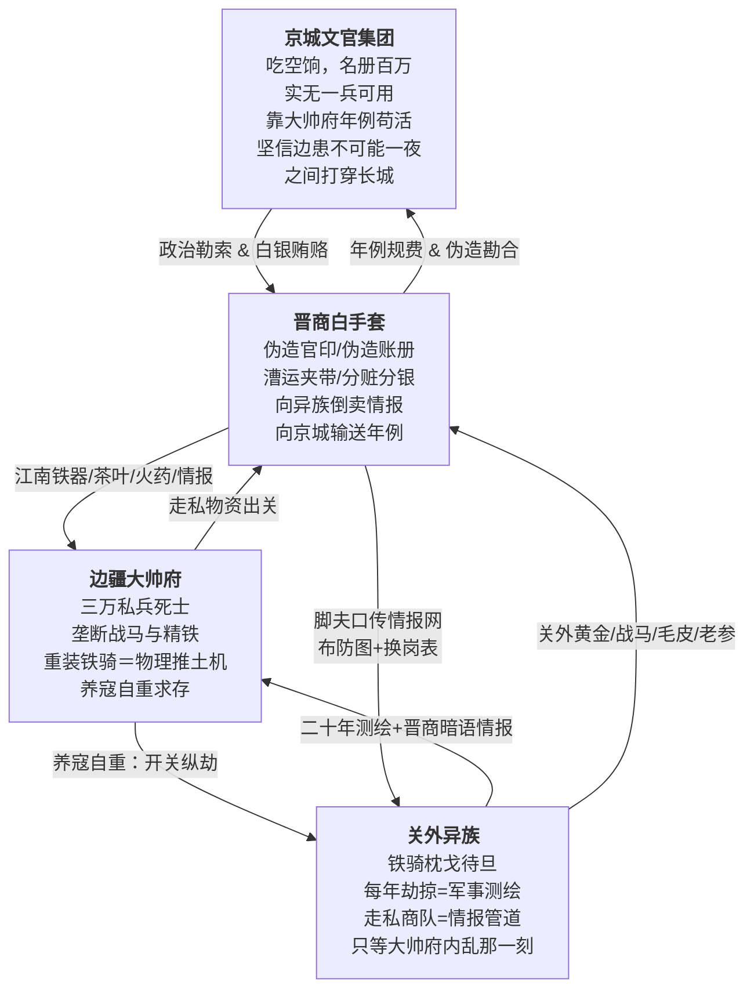

# 宏观故事线／大纲

## 核心基调：三重绞肉机

这是一个没有内力、没有仙人、没有奇迹的世界。重甲骑兵的冲击力由披甲重量与战马速度的乘积决定。红衣大炮的射程由硝石硫磺木炭的配比与炮管精铁纯度的公差带决定。暴雪造成的死亡由环境温度低于核心体温的温差幅度、风速导致的对流散热加速率、以及积雪深度对呼吸道的物理阻塞三重参数共同决定。一切悲剧是制度的。不写江湖儿女，写铁甲马蹄碾过冻硬的黑土时发出的闷响。不写忠奸分明，写每个人都做了在当时个人掌握的全部信息范围内唯一合理推演得出的自私选择，这些选择的乘积构成了一台巨大的、不会停下来问任何人同不同意就自行碾压下去的绞肉机。

### 三方底层冲突

```mermaid
flowchart TD
    京城["<b>京城文官集团</b><br/>吃空饷，名册百万<br/>实无一兵可用<br/>靠大帅府年例苟活<br/>坚信边患不可能一夜<br/>之间打穿长城"]
    大帅府["<b>边疆大帅府</b><br/>三万私兵死士<br/>垄断战马与精铁<br/>重装铁骑＝物理推土机<br/>养寇自重求存"]
    异族["<b>关外异族</b><br/>铁骑枕戈待旦<br/>每年劫掠=军事测绘<br/>走私商队=情报管道<br/>只等大帅府内乱那一刻"]
    晋商["<b>晋商白手套</b><br/>伪造官印/伪造账册<br/>漕运夹带/分赃分银<br/>向异族倒卖情报<br/>向京城输送年例"]

    京城 -- "政治勒索 &amp; 白银贿赂" --> 晋商
    晋商 -- "年例规费 &amp; 伪造勘合" --> 京城
    大帅府 -- "走私物资出关" --> 晋商
    晋商 -- "江南铁器/茶叶/火药/情报" --> 大帅府
    大帅府 -- "养寇自重：开关纵劫" --> 异族
    异族 -- "二十年测绘+晋商暗语情报" --> 大帅府
    晋商 -- "脚夫口传情报网<br/>布防图+换岗表" --> 异族
    异族 -- "关外黄金/战马/毛皮/老参" --> 晋商
```

- **京城文官集团**：兵部名册上九边八十三万战兵，杨嗣昌崇祯十年实核不过十七万，空饷率逼近八成。剩下的三成真兵，常年拿不到月饷（名义月饷一两五钱，实发不过四钱，且多为发霉陈米折色），沦为将领私田上的农奴。但这群文官的罪恶不是"通敌"，他们只是永远坐在燃着兽炭的暖阁里，真心实意地相信"九边重镇二百年来不曾有失，岂能一夜之间叫鞑子打穿"，相信自己凭借六科给事中的封驳权、内阁的票拟权、以及对大干儿子空口许下的承诺，就能在万里之外的棋盘上挪动棋子。他们的底色不是邪恶，是贪腐利益共同体滋养出的傲慢与对物理现实的全然无知。崇祯帝煤山自缢前以血书遗诏"诸臣误朕"，这四个字，就是这个阶层在整个晚明史上留下的最终评语。
- **边疆大帅府**：大帅仿李成梁旧制，把朝廷拨发给十万人的军饷吃下七成空额，用克扣下来的惊天财富豢养不足三万"家丁私兵"，顿顿有肉，人配双马，身披四十斤重的双层铁甲。一匹辽东战马驮着两百斤的铁甲骑士在平地上发起冲锋，其冲击力足以把任何一个没穿甲的流民连人带骨碾碎。但大帅不是不能荡平关外，是不敢。熊廷弼在万历三十七年就已经把辽东军阀的生存逻辑写成八个字："全镇军额，亡失几半"。李成梁用三十年的时间向所有边将证明了一个铁律：关外一旦太平，朝廷第一件事不是论功行赏，是撤藩、清算、罗织罪名赐死。于是养寇自重成了辽东将门唯一的生存之道。每年秋高马肥之际，开关放异族劫掠几座无关紧要的边村，用几百条底层人命换朝廷继续相信"边患未平、大帅不可轻动"。
- **关外异族**：他们不是配合大帅府演戏的演员。每一次"秋猎劫掠"都是军事测绘行动，通过晋商白手套在张家口私市中安插的谍报商人，他们比京城兵部更清楚长城沿线哪座墩台的守军已经八个月没领到饷银、哪座烽火台的火药受潮结块无法击发、哪段边墙的砖缝在去冬的冻融循环中崩开了三尺宽的豁口。皇太极在沈阳汗王会议上反复研究的不是"大帅愿不愿意开关放我们进来"，而是"京师文官分成几派、谁和谁不对付、崇祯最近又杀了哪个大臣"，他在找政治裂缝。异族等了二十年，等的不是大帅的恩赐，等的是一声脆响，那个叫"大帅府内乱"的瓷瓶在地上摔碎的声音。
- **晋商白手套（张家口网络）**：江南的茶叶和丝绸不可能凭空出现在塞外。真实历史上，乾隆十年《万全县志》记载了八个人的姓名，王登库、靳良玉、范永斗、王大宇、梁嘉宾、田生兰、翟堂、黄云发，"皆山右人，明末时以贸易来张家口，自本朝龙兴辽左，遣人来口市易，皆此八家主之。"这八家晋商以张家口堡（海拔七百二十丈）为枢纽，在京城文官、江南商帮、边疆军阀、关外异族之间充当了最关键的灰色中介层。没有这层中介，秀才和兵永远说不上话，账本里也永远不会出现真名实姓，每一条走私记录在账面上都干干净净，盖着兵部和户部的红印。

### 贯穿全文的"止血塞"与"刀"隐喻

| 概念 | 含义 |
|------|------|
| **止血塞** | 一切暂时维持生命、延缓崩溃的人与物，主母给的解药、女主的陪伴、大帅府对边疆的威慑、京城文官从大帅府收的贿赂、晋商白手套维持的走私网络、底层蚁穴每天领到的那碗米糊 |
| **刀** | 一切同时造成伤害又卡在命脉上、拔出即死的事物，主角体内的砒霜余毒与心脉旧伤、他卧底的双重身份、大帅府的军事垄断、晋商网络串联的整个腐败生态系统、这份他知道得太多却无人可说的真相 |

---

## 故事主轴

一个从陕甘白骨堆里爬出来的锦衣卫暗桩，被喂下慢性毒药钉在大帅府的军机文书位子上，在一层看不见的晋商白手套、两个女人、三方势力、一份永远查不到真名的走私账本之间，走完一场注定没有解药的倒计时。

---

## 三幕剧大纲

### 第一幕：废墟之上（初入蛛网）

核心主题：信仰的绞杀与伪装的生存。

#### 陕甘炼狱（序幕）

主角少年时从陕甘大旱与流贼过境后的万人坑里爬出来。那是崇祯十三年，整场小冰河期中最冷的一年，陕西全境八月降霜、九月大雪封山，延安府肤施县在册人丁八千九百口，十几年后清军入陕统计，全县仅存人丁一千二百口。他活下来靠的不是侠义传奇，不是高人授艺，是在腐尸堆里翻出半块发霉的干粮，在干涸见底的渭河河床底下用指甲刨出泥浆水，是在同官县县志记载的那种"一家八口，七日不举火，幼子先饿死，父母以幼子之肉喂其余子女"的绝境中，不知怎么没死的那个例外。

这段经历在他骨头上刻下了一种不可愈合的"废墟病"：他从此再也无法相信任何高高在上的口号。朝廷说"赈灾"，延安知府上报全府灾民八万口请赈粮三千石，朝廷拨粮后知府实发八百石，剩下两千二百石被层层扣尽流入黑市。流贼说"替天行道"，他们每打下一座县城先烧官府粮仓、再逼百姓亲手烧掉自家房子以断退路。将军说"保境安民"，边镇家丁吃着双饷去蒙古草原打秋风，把砍下来的平民人头当"流贼首级"回营报功，每颗人头换三两赏银。

他染上的废墟病只有一个症状：任何话，他不听人怎么说，他只看每句话背后那双手在摸什么东西。

被锦衣卫收编不是因为他有什么才能，纯粹是因为他在死人堆里活下来的那口气太长了，长得让北镇抚司负责挑人的百户觉得"这人耐杀，兴许能派上用场"。他没有正式官品，没有俸禄月粮，档案在北镇抚司的秘密名册上只有一个代号。像他这样的"暗桩"，明末锦衣卫在各地养了不知多少个，没有家世、没有派系、没有背景，唯一的身份证明就是单线联系的上线手中那份密令。上线一死、密令一烧，这个暗桩在法律上就不存在了。

他在锦衣卫的档案上还记着一道在辽东战场上留下的致命伤：一枚异族破甲箭的倒钩箭头，穿透护心镜后碎在了心包膜外侧。军医不敢开胸取箭，彼时没有能开胸的外科手术，只能靠金创药糊住伤口，让增生组织把碎铁裹死在血肉里。从此他成了半个废人，不能剧烈搏杀，不能纵马狂奔，稍微心率过快，那枚碎铁片就在胸腔里隐隐往主动脉方向推。北镇抚司把他派去大帅府当暗桩的时候根本没指望他能活着回来，他这样的暗桩是朝廷的"耗材"，派出去一个少一个，京城档案库里连他的名字都不会留。

#### 大帅府的算盘

京城要往大帅府安插监军。大帅府早就通过晋商在京城的内线拿到了备选名单，故意挑中了主角，一个无根无底、身负致命旧伤、随时可能自己死掉的废人。大帅府的算盘是：满足朝廷的面子，收下这个监军。反正他进了府就是个聋子和瞎子。然而大帅府的主母不是普通人。

#### 主母的獠牙

主角进府后，第一个看穿他真实身份的，是这位把面部表情控制得如同账本上一行死数的大帅主母。她没有杀主角。杀一个朝廷安插的人等于撕破脸。她用的是明末边镇真实存在的配方：砒霜微量慢性摄入，辅以炮制过的乌头提取物来严格控制主角的心率。旧伤是基础，心包膜外侧卡着碎铁片，心率失控则位移一毫米即死。乌头碱阻断心肌钠离子通道强行抑制心率。砒霜与酶蛋白巯基结合破坏细胞代谢。主母手中的中和药方以含硫矿物排砷、人参皂苷强心，但只是把两股相反的毒性暂时拉回钢丝般的平衡线上。每七天必须服药一次。主角不是被魔法控制，他是被一套精确算计的化学时间表囚禁了。

#### 军机文书：不贴身的风暴眼

主母把主角塞进了军机文书和走私账目总管的位置。大帅府治下的边疆是一个由"干儿子体系"维系的军事集团，大帅府秘传的虎狼药方以十五年寿命换取超常战力——代价是四十岁前瘫痪或心脏猝停。干儿子们没有退路，只能用剩下不多的寿命争夺大帅府最高军事地位。其中最得势的大干儿子掌管着最精锐的重装铁骑营。干儿子们对文书工作毫无兴趣，账本和公文在他们眼里是娘们和阉人干的活。这正是主母的精明之处。

军机文书这个位置的致命之处在于：主角每天经手各营人马实数、粮草库存、走私明细、以及大帅府与晋商白手套之间往来的全部账册，但他碰不到一兵一卒。干儿子们嘲笑他是"大帅府里最懂字的活死人"。

#### 女主的清醒

女主是大帅的独女。她不是傻白甜，她清醒得可怕。在这个去高武、满是铁甲马蹄和配给米糊的血色炼狱里，她每天看到来领配给的骨瘦如柴的流民，看到被干儿子们吊在大门前抽死的马帮脚夫，看到母亲把一个个活人当成耗材算计。正因为看得见，所以她痛苦。她只能在自己能力的极限里偷偷去当那个"止血塞"，瞒着母亲让丫鬟把米糊熬得浓一些，在马帮脚夫挨打时用大小姐的身份去喝退监工。

主母把解药故意让女主每天亲手送过去，她要同时驯化两个人。但她唯一没算到的是，在这个全是算计的泥潭里，这两个被迫每天相见的人，真的产生了东西。

#### 信仰绞杀

主角开始接触大帅府的账本和军务文书。他查得越深，就越接近一个让他彻底崩溃的真相。账本里写着"某月某日，张家口马市，收晋商王某茶砖三千担，折银若干"，但永远不写这些茶砖是在哪里、用谁的官印通关的。他把账本上的日期与朝廷驿报上的官员调任日期对照。他发现了那个让他手脚冰凉的模式：每次京城吏部有高官外放或升迁，大帅府对张家口的"特别支出"就会在三个月后出现一笔精准到诡异的增量。最后他拼出了最致命的那块拼图：大帅府是汉奸。但如果拔掉大帅府，朝廷根本没有能力挡住关外的铁骑。更荒诞的是，他效忠的朝廷、他背后代表的文官大义，和眼前这个他奉命要摧毁的军阀大帅府，根本就是趴在陕甘百姓尸体上分食人肉的同一个怪物的两颗脑袋。

#### 双向救赎

主角和女主在这座钢铁坟墓里互为对方唯一的活人。不是一见钟情的浪漫，是两个被同一座机器碾压的人，在齿轮缝里互相闻到了对方还活着的体温。

---

### 第二幕：风暴升级（南北断线）

核心主题：棋盘掀翻，各方极限施压。

大帅府利用女主的婚姻向京城发动极限施压。联姻提案在字面上是"效忠皇恩，请赐良缘"，在字底下是"不补军饷，异族今秋过不了长城这道坎不是大帅府的事"。京城文官集团炸锅，大帅府的年例银子养活了半个京城的权贵，但如果同意联姻等于朝廷在法理上承认大帅府的独立王国。

文官集团找到的突破口是大干儿子，他在这套折寿体系里付出了十五年寿命的代价，而大帅却有自己的亲生女儿。朝廷密使通过晋商白手套的秘密渠道开出条件：京城承认他为边疆新帅，军饷翻倍。大干儿子提了三个条件：拖欠军饷必须先补足，关内增派实兵五万驻防各口，派文官亲赴张家口密谈留把柄。他的算计是精密的，他不是要毁掉边疆防线，他是要在旧的权力结构垮塌后由自己来当新的权力核心。他唯一算错的东西是：异族等这一刻已经等了二十年。

第二幕中段，朝廷使出断粮封锁，以"清查空饷"为名切断所有拨往大帅府辖区的粮饷和火药补给。这不是通敌，是傲慢。文官们坐在京城的暖阁里真心实意地相信关内还有"百万可调之兵"。大帅府内部开始出现裂痕。

女主在这一幕面临了人生中第一个真正属于自己的选择。主母问她："你爹每年秋天开关放劫掠，你告诉我，你爹是坏人，还是好人？"女主回答不上来。这也是整个世界的终极困境：没有好人坏人，只有代价和谁来付代价。

主角在这一幕被撕裂到了极限。朝廷重新联系上他，新指令是盗出大帅府通敌铁证。但他同时也发现了一个更深的秘密，关外异族一直在通过晋商商队收集明军布防情报，每次来袭的路线都精准地绕开了有实战能力的营寨。这不是在演戏，这是在用十几年时间做最精密的军事测绘。他做出了一个第三者看不懂的决定：开始同时欺骗两边。主母注意到了他修改的假账册中故意留下的漏洞，她没有揭穿。她微不可察地点了点头。

---

### 第三幕：雪崩溃灭（大出血落幕）

核心主题：一切止血塞同时失效。

一场百年不遇的大暴雪切断了大帅府各营寨之间的一切通讯和补给。坝上与坝下之间六十里隘道积雪深达两米以上。骑兵无法在及膝深的雪中奔驰。大干儿子等的就是这个窗口，但他不是要发起骑兵冲锋，他是要利用暴雪把所有人的视线压缩到三步以内的封闭空间来实施软政变：控制粮仓、火药库、水源和马厩。他的步兵在暴雪中反而比骑兵有更强的行动力。

大帅没有束手就擒。在暴雪中调不动成建制的骑兵，他只带着最后百来个亲兵在齐腰深的雪中摸向叛军据点。一场在能见度不足三步的白毛风中靠刀鞘和拳头进行的混乱近身械斗，大帅被短刀刺穿肝脏，失血加失温冻死在雪地里。帅印冻在僵硬的手指上，掰不下来。

主母在大帅死讯确认后做的三件事，烧掉全部晋商密档，给女儿留下第三号粮仓钥匙，灌下与沈节同配方但剂量大得多的砒霜乌头复合剂。药渣——李观照后来在自己房间的抽屉里找到的，那是前两天她给沈节煎最后一副药时滤出来的残渣，当时不知道为什么要留着，放在一个小布袋里塞在抽屉角落。现在她知道为什么了。

发粥停了的第二天，来福还在堂口等。端着那只崩口碗，站在空了的发粥桌前。他把碗放在桌上——那个动作是"明天我还来"。碗在积了薄雪的桌面上，风吹过来，碗底的水渍冻成了冰壳。

发粥停了的第三天，春桃最后一次出现在堂口。她站在空了的量斗前面，桌面积了一层雪——她没擦桌子，擦的是量斗铜衬底被拆了五年敲出的那道凹痕。来福的碗还在桌上。她把碗收进灶房，放在灶台旁边——碗崩的那个小口还是老样子。然后把小铜锤放在桌上，走了。李观照后来在废墟里找到那把铜锤——握把上还有春桃拇指磨出的浅痕。灶台旁边那只崩口碗也在，碗底冰壳已经化了，剩一小圈水渍。来福不知道去了哪里。

配给制瓦解。底层蚁穴在暴雪中断粮断柴断药，木牌还在墙上，墙下已经没人了。监工的皮鞭永远不会再响了，监工自己也饿死在了土屋里。春桃不知道去了哪里。来年春雪化后，这一带方圆几十里全是白骨。

关外异族利用二十年测绘成果，坝上到坝下六百三十丈的海拔落差，在十二个时辰内从封冻的河面冰层上完成闪电俯冲。坝下的守军连烽火都没点燃，木炭在长达两个月的封锁中早已烧光。

女主在主母废墟的焦黑泥土里用指甲抠出最后一撮混着炭灰的药渣，塞进沈节嘴里。药渣不是解药，它在物理上只能推迟崩溃的顺序，给他半个时辰。沈节在回光返照的半个时辰里坦白了一切。她听完后发出荒诞的笑声，然后说了三个字："我知道。"不是原谅，是她在很久以前就看穿了蛛丝马迹，却选择不问不说不去查证，在这座所有人都对她说谎的府邸里，唯一一个让她觉得自己还是人的人。

沈节死于砒霜乌头联合毒性与主动脉破裂。李观照从他怀里掏出那份被体温捂得微微发潮的私人手稿，不能翻案的东西，塞入怀中。背对燃烧的大帅府，面朝坝上方向，走入风雪。没有回头。

---

## 伏笔与回收追踪

| 伏笔 | 安置位置 | 计划回收节点 |
|------|----------|---------------|
| 主角心包膜外的箭头碎铁片（辽东旧伤） | 序幕 | 终幕：心率紊乱+组织肿胀→碎铁片物理位移一毫米→刺破主动脉→大出血 |
| 砒霜+乌头复合毒的作用机制 | 第一幕 | 终幕：停药后两个毒性的平衡同时崩溃 |
| 晋商白手套的独立账外记录 | 第一幕 | 第二幕主角拼凑推理的基础；终幕：主母烧掉了原始账册但主角保留了自己的私人手稿 |
| 异族二十年利用走私商队进行军事测绘 | 第一幕/第二幕 | 第三幕：异族在十二个时辰内精准穿越边墙薄弱点 |
| 大干儿子的软政变计划 vs 实际连锁反应 | 第二幕 | 第三幕 |
| 吃空饷与真实兵力 | 第一幕 | 终幕：关内"百万大军"没有任何一支援军出现 |
| 女主觉察主角身份 | 第一幕/第二幕 | 终幕："我知道" |
| 配给制体系的脆弱性 | 贯穿 | 第三幕暴雪中断配送→边疆蚁穴雪崩式崩溃 |
| 主母烧毁全部晋商密档 | 第三幕 | 间接导致女主手上那份"私人手稿"成了唯一残留的真相记录 |

---

## 创作原则

1. 不赋予任何角色超自然力量。虎狼药方中附子的乌头碱阻断心肌细胞膜Nav1.5钠通道。砒霜与巯基酶硫原子形成共价结合。铁骑威力来自披甲重量与战马速度的乘积。暴雪致死率由环境温度与核心体温的温差幅度、对流传热速率、积雪对呼吸道阻力的三重参数决定。
2. 每一个政治决策同时记录其利益和代价，两个数字放在同一行。
3. 底层视角至少占整体叙事的五分之一。不在蚁穴边民身上加注任何叙述者定调词。只记录米糊浓度、木牌霜层厚度、土墙裂缝宽度、暴雪第四十四天尚未死亡的人数。
4. 悲剧的成因不是任何单个角色的道德失格。三方在同一制度框架内各自精确推演、各自用自身视角下的最优解互相抵消、共同锁死为零和博弈。李国勇死在他的政变计划在纸面上每一步都有军事合理性，但他不知道田逢吉的脚夫口传情报网比大帅府的信使快了整整三天。信息差。不是道德差。
5. 李观照的终局状态不是复仇。她带着沈节留下的私人手稿走入风雪。
6. 不写英明钦差从天而降破局。崇祯十七年，煤山上只换到一棵歪脖子槐树。

---

## 全卷章节规划

全卷预估 **135 章**，按每章 2800-3200 字计，总字数约 **38 万至 43 万字**。沈节于第 130 章死亡，与异族铁骑踏碎大帅府正门发生在同一时辰。第 131-133 章为极简落水期：大帅头颅被京城来使割下传首九边（仿熊廷弼结局），李观照取手稿孤身走入风雪，与传首队伍在同一条路上反向而行。全书在第 133 章戛然而止，手稿朝北，头颅朝南。

**章间张力曲线原则**：全卷必须像心跳，有峰有谷。三种特殊章类型在全卷中穿插分布，各司其职：

- **⊗ 呼吸章**：每三到四章高压后插入一章。不引入新伏笔，不解决旧冲突。叙事密度从情节信息切换到感官信息，仅通过日常动作和无目的的感知还原世界的物理质感。
- **☀ 暖章**：每十到十二章后必须有一章。角色在那一刻确实不是在承受任何东西，只是活着。可以是一个不好笑的笑话、一颗冻栗子、一片落下来的树叶、一窝被灶台余温救活的冻僵老鼠。暖章的功能是让读者重新相信这个世界还有值得守护的东西。
- **♡ 亲密章**：分布在第一幕到第三幕，一砖一瓦地让读者确认沈节和李观照确实相爱了。不是表白，不是工业糖精。通过物理资源的让渡（干枣、碳条的位置、一块旧布）、共同沉默中被双方默认的谎言（看到竖线后翻页）、以及极度克制但无法完全克制住的肢体接触（手覆在砚台凹痕上、她睡着时他把灯捻拨短）。亲密章让读者知道这两个人之间的东西是值得用命去换的。

第三幕严禁出现伪呼吸章。在暴雪封城、政变、饥饿和屠杀的连续高压中，不能再以"无名老妇含着木牌等死"或"爆炸废墟上的落雪"作为呼吸，那是溺水，不是呼吸。第三幕的呼吸必须是不可理喻的生机：蔡婆在灶台余温旁救了一窝冻僵的老鼠；两个逃亡的底层士兵在雪窝里分吃一块不知道谁掉的冻干粮；沈节在回光返照的最后半个时辰里忽然对李观照说了一句和眼下的死亡完全无关的、关于那棵老槐树和裹枫叶的栗子的话。在最冷的冰地里写一丁点火星。

扩容策略：严禁注水。所有新增章节点位全部来自真实物理与社会阻力的展开。同时严格执行章节级张弛节奏，每三到四章高压情节后插入一章呼吸章（标⊗），让读者在连续爬坡后拥有消化乳酸的空间。呼吸章不引入新伏笔、不解决旧冲突，仅通过日常动作和无目的的感官感知来还原世界的物理质感。

### 全卷子弧结构总览

| 幕 | 子弧 | 章数 | 核心物理推进 | 呼吸章 |
|----|------|------|-------------|--------|
| 一 | 1A 陕甘炼狱→锦衣卫暗桩 | 1-5 | 万人坑、北镇抚司训练、辽东碎铁片、档案标签、出发前夜 | ⊗5 |
| 一 | 1B 入府→主母识破→喂毒 | 6-10 | 进大帅府、主母识破身份、砒霜乌头七日周期、军机文书任命、初访张家口马市 | ⊗10 |
| 一 | 1C 府内地理→干儿子生态 | 13-18 | 大帅府物理地图、配给制堂口、干儿子体系、李国勇首遇、边民冻死 | ⊗14 |
| 一 | 1D 账册解密第1期→信仰绞杀 | 19-28 | 三处日期巧合、数目字交叉比对、田逢吉暗账、北字号甲锁定、碎铁片第1次位移 | ⊗23 ⊗26 |
| 一 | 1E 双向救赎→碎铁片首次位移 | 29-35 | 拆量斗、名字、大帅出场、李国勇试探、沈节发现拔掉大帅府京城挡不住关外铁骑 | ⊗31 ⊗34 |
| 一 | 1F 第一幕收束 | 36-40 | 主母召见、沈节决定潜伏、李观照发现砷线、账册第十四页被风吹开 | ⊗39 |
| 二 | 2A 联姻提案→京城博弈 | 41-53 | 联姻折子起草、京城恐慌、文官内部派系、锦衣卫密令、李国勇被接触、三条件谈判、联姻驳回 | ⊗45 ⊗50 |
| 二 | 2B 断粮封锁逐周→仓储危机 | 54-63 | 配给浓度逐周递减、蚁穴饥饿扩散、死婴事件、沈节核算豆料只够三天半、李国勇密封三座粮仓 | ⊗57 ⊗62 |
| 二 | 2C 双面欺骗→女主暗中活动 | 64-73 | 沈节假账册漏洞、主母默许、李观照接触旧部、田逢吉暗账续编、北字号甲锁定 | ⊗67 ⊗71 |
| 二 | 2D 暴雪前兆→各方收束 | 74-80 | 大帅病发、李国勇营中串联、碎铁片第2次位移加速、田逢吉收尾、暴雪降临 | ⊗76 ⊗79 |
| 三 | 3A 暴雪封城→生理恶化 | 81-92 | 通讯断绝、沈节停药逐日、蚁穴首周冻饿、李国勇铅封启封、三座粮仓逐一控制 | ⊗84 ⊗88 ⊗91 |
| 三 | 3B 政变逐节点展开 | 93-106 | 水源控制、马厩镇压、大帅最后调兵、雪中械斗、大帅之死 | ⊗96 ⊗101 ⊗104 |
| 三 | 3C 主母焚档→药渣回光→坦白 | 107-114 | 主母服毒、李观照抠药渣、回光返照的坦白、\"我知道\" | ⊗109 ☀111 |
| 三 | 3D 终极十二时辰，多线并进合龙 | 115-130 | 蚁穴灭绝与异族俯冲交替剪辑；沈节停药逐日恶化；大帅府被破；沈节在第130章与异族马蹄踏碎门槛的同一时辰咽气 | ☀117 ⊗121 ⊗125 |
| 三 | 3E 极简落水期，传首九边 | 131-133 | 大帅头颅被京城来使割下传首九边（仿熊廷弼），李观照取手稿逆着俯冲路线走入风雪。手稿朝北，头颅朝南。仅3章 | — |

### 第一幕：废墟之上（第 1-40 章，约 12 万字）

#### 子弧 1A：陕甘炼狱 → 锦衣卫暗桩（约 5 章）

沈节从陕甘万人坑被捞出，进入北镇抚司地下三层训练场。老暗桩用裹浸油麻布短木棍教他挨打时心脏别停——不是教格斗，是教怎么在被打时让心跳不崩。每挨一棍，老暗桩在羊皮本上只记日期和恢复时间，不写名字。石室识字课抄暗语模板：账面兵员/实战兵员/差额空饷。松烟墨掺矾水在糙纸上洇开。百户在木牌上随手刻下"沈节"——他的第三个名字，命名过程不过两口茶的功夫，和骡马耳朵上的豁口一样。

辽东夜不收后援撞上异族伏击——破甲箭穿透护心镜，箭头碎在心包膜外侧。军医不敢开胸，糊金创药让瘢痕把铁裹死。从这天起不能纵马狂奔：心率一快，碎铁就往主动脉方向推。军医指甲缝里的血垢和药粉混在一起糊在他胸口上。

百户带他查抄通敌商人。抄出白银六百两，百户私吞三百两上报无所获。商人小女儿蹲在院角，鞋底磨穿露出冻红的脚趾。回营后沈节在空白的暗桩档案背面用最小的字写了"六百两"——第一课：纸上的东西和法律上的东西是两回事。

出发大帅府前夜。北镇抚司后门——对着马厩和垃圾坑。百户把叠了四折的麻纸塞进他手心：前三个暗桩的代号和死因，没一个活过半年。"你是第四个。"沈节在油灯下记住每一行，嚼烂吐进炭盆。纸灰在最低温中冷却。次日骑马往北。百户站在后门没走，看着马消失在雪里——他抽屉里现在是八份暗桩档案了，沈节的那份还没放进去。

需覆盖的关键细节：老暗桩的羊皮本不记名字、百户抽屉里七份档案抚恤日期每年延一天、碎铁片初入体时的异物感、命名场景的随意性（越随意越显无力）、三个已死暗桩的死因——第三个的死亡被主母用来校准毒药剂量曲线。

#### 子弧 1B：入府 → 主母识破 → 喂毒（约 5-6 章）

沈节骑马抵达大帅府。军机书房——主母顾韫隔桌看了他整整十息。灯捻烧焦半截没人拨。他注意到她无名指上那枚素面铁戒——对着光能看到皮肤颜色透上来，内圈磨薄了。她开口第一句话："你在锦衣卫的代号是什么。"不等回答把他档案秘密全背了出来——本名、代号、辽东旧伤。"从今天起，你叫沈休言。千言万语，不如休言。"

第二天同一间书房。辽东阵亡名录推到他面前——他认识上面三个人：同营夜不收、帮他换药的军医、还有一个死亡日期他认得那天他也在同一战场。主母手指按住名字只露出死因。潜伏暴露。她抽走名录，换了一份药方——第一味砒霜。七日一周期，停药第四天起身体自己崩溃。药方末端缺了一味——缺在李观照手里。

主母亲自端来第一碗药。粗瓷碗口裂痕嵌着前任的深褐色药渍。她等他自己端起来喝。药入喉——从喉咙往心脏蔓延的冷。

李观照出现在门口，手里端着第二碗，细白瓷，比主母的小一圈，碗口没有裂痕。主母："以后每天早上，小姐来送。"——然后她加了三道反制。第一道：书房的门永远不许关。铰链上少了一根销子，门会自动弹开到半扇宽。从走廊的任何一个角度都能看见桌前的沈节和门口的李观照。第二道：碗。李观照每次送药必须用这只指定的白瓷碗——碗底刻着一个极细的"顾"字。碗必须在半盏茶内端回灶房，蔡婆会检查碗壁残渣的厚度，以此反推药是否被倒掉或调换。碗就是计时器。第三道：主母自己。她隔三岔五在送药的时辰出现在走廊另一头——不进来，不出声，只是站在那里，让他们看见她看见了。三道反制锁死了两个被囚禁的人之间每一种可能的私下交流——他们只能在门缝漏进来的那线光里，用碗底残渣的厚度和碳条的位置，各说各的沉默。

服药后第二天——药效逐层展开，指尖往手腕冷，指甲下肉从粉红变灰紫。油灯下翻看张家口走私流水，三行日期间隔均匀缩短。走廊里主母对李观照说以后每天同样的时辰。李观照没回答。她端着空碗站走廊里，低头看碗底残渣——在数他还能活几个七天。

正厅。三十七个干儿子围了三排，大帅没来，主母主持。沈节站在她身后一步，手里空白账册。干儿子按入府年份从内向外排成精确半圆——最近的是李国勇。主母当众宣布沈休言掌管全部军机文书与走私账目。李国勇："你的脑袋比我们粗人金贵。"——定价。沈节翻开空白账册写下第一笔——还没决定第二笔往哪走的那一横。散会后路过堂口，土墙上木牌刻着人名，有些裂了还挂在墙上。

安排进军机书房隔壁小间——原是堆旧账册的库房。北墙有一道裂缝刚好够塞进一张麻纸。他把潜伏指令从炭盆灰烬记忆重写在麻纸上，塞进墙缝，抹旧泥浆——干了后和墙面一模一样。随商队去张家口，马市上看到田逢吉的晋源号商队在官市和私市之间切换——合法与不合法之间有一条只有自己人才能看到的暗线。

厨房日常章：蔡婆——缺了左手中指的老妇，每天寅时三刻熬药。药渣倒老榆树根下，几十年浸透了土，雪落上去化得比别处快。每逢初九多煮一沸——丈夫初九死在萨尔浒，那多的一沸给所有没回来的人。

需覆盖的关键细节：铁戒的生铁毛刺和内圈磨损、粗瓷碗裂痕里的前任药渍、李观照的小一圈白瓷碗、干儿子的精确半圆站位、李国勇虎口的铅封裂口细疤、堂口墙上裂掉的木牌。

#### 子弧 1C：府内地理 → 干儿子生态（约 6 章）

小人物章——边村老妇郑氏，每年秋天大帅府从边村"征调壮丁守边"，留老弱在原地。她系孙子的鞋带系了两次：太松鞋会掉，太紧脚趾疼。骑兵来的时候她往灶里加柴。孙子在地窖里抱着她的旧棉袄睡着了。

沈节在心里画府内地图——军机书房到堂口到马厩到粮仓，每条路到出口的步数。堂口土墙上满是人名木牌，有些裂了还挂着。蚁穴边民排队领米糊，监工用皮鞭量弯腰幅度。队列里有个端崩口碗的驼背男人——来福，陕甘庆阳府逃荒来的，和沈节同年同乡。他弯得最低，额头几乎贴到膝盖。监工吃这套。沈节注意到了那只崩口碗——和他自己在万人坑里端水碗的姿势一模一样。李观照在堂口——她的丫鬟春桃每次发粥前用小铜锤拆掉量斗的铜衬底，发完再装回去。斗里的粥比额定多了一成，监工没发现，沈节发现了。春桃有时候往来福碗底多压一小勺——不是大小姐吩咐的，是她自己加的。春桃手腕有烫伤疤，大小姐握着她手腕看过那道疤——然后给她看了自己肘弯被戒尺打的疤。两个人交换了疤的位置，什么也没说。春桃拆了五年衬底，铜锤握把上磨出了她拇指的浅痕。

三十多个干儿子围坐三张条桌——大帅那天没来，主母也没来。最年轻的被推到桌角要拼酒，被缺了半只耳朵的老干儿子按住肩膀。墙上挂着曹七的木牌——大帅第一个干儿子，死在萨尔浒，李国勇替他收的尸。李国勇敬酒时碗口朝着木牌。

沈节整理人马名录——三十七个干儿子，十五个重伤，五个不再上马，两个去年冬天因虎狼药死在马背上。其中一个叫冯保，二十四岁，从马上栽下来时还在笑。李国勇把他的尸体从雪地里抱了一里地送回营里。冯保生前叫他"大师兄"，画了一匹腿比身子长的马，歪歪扭扭写"给大师兄"。铜镜是冯保掰成两半分给李国勇的——裂的半给你，好的给我。收尸时那半片裂的铜镜从碎肉里抠出来，洗干净拼在一起——拼不上，差一截。

日常章——马厩黄昏，老周和沈节并肩坐在柴垛上，隔一个拳头，冻栗子放中间空隙，不递。

#### 子弧 1D：账册解密第1期 → 信仰绞杀（约 10 章含暖章和呼吸章）

暖章——立冬前最后一个暖日，沈节和李观照并肩坐在柴垛上看老槐树最后一片叶子落下。她说起蔡婆烤枫叶栗子。他接话说枫叶糖分渗进栗子皮。她没忍住笑。树下麻雀挤在空枝上。那片叶子落了第三天暴雪降临。后来谁都没再提——但沈节发现自己翻账册时拇指会不自觉划一道和那片叶子落下来一样的弧。

账册解密主线——第十四页：张家口马市支出日期和吏部调任日期相差十日。第一次巧合。粗布三千匹骡车两辆，过关联单骡车八辆——另六辆据铁料反推藏精铁八千四百斤。三行日期三支笔，间隔从三个月缩到一个月。田逢吉穿着补丁布袍踏进大帅府，每个字都像聊天气——"今年野狐岭的雪比往年来得早，商路不好走。"第一次评估沈节，决定暂时不需要封口费。第二次来，北字号甲九月规费八百两。多停了一息——商人在算要不要开口谈价。碎铁片第一次刮擦——偏了以后没复原，碳条画下第一道竖线。在黑暗中算出每息位移速度，然后算还能活多久——算不出来。

情感线——碗底的干枣：她送完药走了，沈节发现碗底压着一小片干枣，不在主母药方里，她自己加的。碳条暗号：夜半油灯捻子烧完，他摸到她留在砚台下的碳条——指尖在她指纹磨出的凹痕上多停一下。此后碳条位置每天被两人各自挪一分，砚台下磨出一道还没成型的凹痕。她早晨发现他灯盏是冷的，回身多端了一碗米糊。"先吃。吃完再翻。"

呼吸章——碎铁片今晚没推。隔壁空账房算盘珠子被风灌进来滑了一下。第十四页的纸边今天比昨天又翘了一点点——是翻开的次数。冬天结束时这一页可能自己从装订线裂开。

#### 子弧 1E：双向救赎 → 碎铁片首次位移（约 12 章含日常章）

沈节和李观照各自说出自己名字的来历——"观照"冷眼看穿，"慈航"慈悲为舟；"休言"千言万语不如休言。大帅出场——左眼铁砂打坏、右手缺两指、心脏跳动有喀嚓音像裂了缝的鼓。沙盘会议上大帅说"关外的狼死绝了，京城养看门狗有什么用"，李国勇的手在刀柄上换了十几次角度——不只因为虎狼药导致的关节僵硬，也因为他听到"亲儿子"之类词汇时手指自己会收紧。

情感线推进——针线篮日常章：李观照补沈节毡衣袖口的洞，布是从自己那件不穿的老青布袍上剪的。酒桌发粥抬木桶，隔着桶板两人的手指在同一棵树纤维里传导温度。干儿子聚餐李国勇试探沈节。沈节对比九边实兵和关外战力，算出唯一能拖住异族的就是李承荫的三万铁骑——把推演纸嚼烂咽下去。给冻掉脚趾的脚夫包脚，不自觉泄漏"以前在别的地方"——第一次说出真的东西。

大帅把账册第十四页翻到沈节画的竖线——"你画这条线的时候手抖了吗。""没有。""那你比我强。"沈节感到的是恐惧——大帅把他当成了同一种东西。主母暗室审进：问他查到了什么代号，同时指出他的手比上个月白了，牙龈颜色也该查了——她从不直接说"毒在加重"，只给精确观测让他自己算。李观照送药时目光在他牙龈边缘停了不到半息——她在算他还剩几个周期。

所有推理完成，沈节在心里确认继续潜伏的决定。窗外，温度还在往下降。还没有到零下。但快了。

### 第二幕：风暴升级（第 41-80 章，约 16 万字）

#### 子弧 2A：联姻提案 → 京城博弈（第 41-50 章）

涵盖节拍: 酌量拨付 → 三层文本 → 怒疑急 → 三条散线 → 铜镜翻 → 假勘合 → 槐花纸 → 牌面推算 → 不止一个 → 暂无人选 → 折子驳回 → 擦肩刀 → 已损失 → 第二条线

关键钩子: 联姻被驳回——兵部侍郎孟怀远盖的印。他三十年前和李承荫一起趴过辽东雪窝子，欠他半块冻饼。盖印时手没抖 | 驳回后京城兵部某人通过田逢吉向异族加急买铁料——大帅府已被划入"已损失" | 李国勇靴筒里三封信越折越薄

#### 子弧 2B：断粮封锁逐周 → 仓储危机（第 55-64 章）

涵盖节拍: 暖章-老周雪夜故事会 → 断粮期厨房 → 死婴那天 → 三天半 → 铅封一 → 两座同夜 → 明天还来 → 铅封二 → 铅封三

关键钩子: 李国勇把三座粮仓钥匙灌铅封死 | 配给浓度逐周递减。来福的女儿第三天起没了声音——窝在墙角，眼珠还会动，但喉咙里已经发不出任何响动了。他把最后一口米糊倒进她碗里。她没看。只是盯着碗底那一小圈液体。喝了。春桃收碗时往来福碗底放了一颗干枣。

#### 子弧 2C：双面欺骗 → 女主暗中活动（第 63-70 章）

涵盖节拍: 默许漏洞 → 纸角凹痕 → 老家丁水 → 野沙枣树 → 三条叠线 → 隔墙听 → 嚼烂推理 → 灯下睡着 → 少跳四拍

关键钩子: 沈节在账册中故意留漏洞——主母看完了没发怒，继续往下翻，默许了 | 三条时间线叠成一张人脸——京城某户部郎中 | 大帅心脏少跳四拍，李国勇在角落里全看到了

#### 子弧 2D：暴雪前兆 → 各方收束（第 71-80 章）

涵盖节拍: 沙盘掌汗 → 靴筒里 → 呼吸章-李观照堂口最后一天 → 全员晚餐 → 最后一页 → 呼吸章-暴雪夜听风 → 碳条推演 → 暴雪降临

关键钩子: 田逢吉收尾暗账最后一页——"北风客"测绘频次今秋比往年密了三成 | 暴雪降临，所有通讯断绝

#### 子弧 3A：暴雪封城 → 生理恶化（第 81-92 章）

涵盖节拍: 半丈深 → 压在十四 → 明天拆吗 → 第三下推 → 虎口的血 → 三座洞开 → 牙龈铅灰 → 逐日停药 → 蚁穴首周

关键钩子: 沈节牙龈边缘出现砷线——第一个不可控体征 | 李国勇铅封启封，三把钥匙三次脆性剪切声——他是全大帅府唯一有钥匙的人

#### 子弧 3B：政变逐节点展开（第 93-106 章）

涵盖节拍: 小人物章-马厩活扣 → 暗室数字 → 出战前夜 → 末次推演 → 铅封脆响 → 马厩中央 → 膝无力 → 水源控制 → 火药库

关键钩子: 大帅右膝肿成馒头在暴雪中拖行——"走，去找国勇，有话问他" | 帅印冻在僵硬手指上掰不下来——李国勇指甲断了 | 主母收到死讯，回话两个字:"知道了" | 死讯传回京城——兵部侍郎孟怀远在值房坐到深夜。从抽屉底层翻出三十年前李承荫画押的军功状。掰了半块糜子饼放桌上。没吃。茶凉了。第二天照常上朝

#### 子弧 3C：主母焚档 → 药渣回光 → 坦白（第 107-114 章）

涵盖节拍: 瓷瓶碎 → 最后一撮 → 呼吸，蔡婆在灶台余温旁发现一窝冻僵的老鼠 → 暖章，沈节在回光返照中说了一句和死亡无关的话 → 呼吸，大帅府东厢墙根下一棵不知谁种的冬青 → 药力消退

#### 子弧 3D：终极十二时辰——多线并进合龙（第 115-130 章）

涵盖节拍: 独石破 → 三墩灭 → 暖章，两个逃亡的底层士兵在雪窝里分吃一块冻干粮 → 活不过五 → 河面冻硬 → 门钉散 → 呼吸，不被轰炸的厨房角落...

#### 子弧 3E：极简落水期——传首九边（第 131-133 章）

涵盖节拍: 小人物章，石灰匣 → 皮囊上马 → 四十步停

